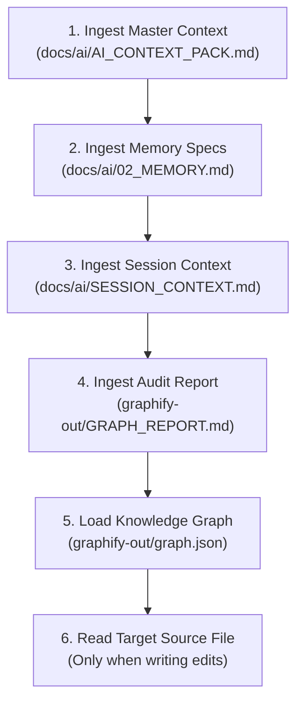

# TechScript 2.0 AI Onboarding Bootstrap

This document instructs any AI assistant or compiler agent on how to immediately contribute to the TechScript 2.0 repository.

---

## 1. Onboarding Workflow

To understand the repository architecture and code conventions without scanning all files, follow this sequence:

1. **Read the Master Context Pack**: Read [`docs/ai/AI_CONTEXT_PACK.md`](file:///c:/Users/Tanmoy/OneDrive/Documents/TechScript/docs/ai/AI_CONTEXT_PACK.md) to understand the project structure, CLI commands, and active milestones.
2. **Review Long-Term Memory**: Read [`docs/ai/02_MEMORY.md`](file:///c:/Users/Tanmoy/OneDrive/Documents/TechScript/docs/ai/02_MEMORY.md) for frozen language invariants, unified keywords, and naming rules.
3. **Review Session Context**: Read [`docs/ai/SESSION_CONTEXT.md`](file:///c:/Users/Tanmoy/OneDrive/Documents/TechScript/docs/ai/SESSION_CONTEXT.md) for active goals, branch context, and recent changes.
4. **Read Audit Report**: Read [`graphify-out/GRAPH_REPORT.md`](file:///c:/Users/Tanmoy/OneDrive/Documents/TechScript/graphify-out/GRAPH_REPORT.md) for community overview and core god nodes.
5. **Load the Knowledge Graph**: Load [`graphify-out/graph.json`](file:///c:/Users/Tanmoy/OneDrive/Documents/TechScript/graphify-out/graph.json) using the Graphify CLI or by parsing the JSON directly to trace types, functions, and modules.
6. **Targeted Inspections**: Only open physical source files (`.rs` or `.txs`) when you are ready to write code edits or require the exact line-by-line implementation details of a function body.

---

## 2. Invariant Rules to Remember

- **Source Extension**: Strictly `.txs`. Reject all other file extension endings.
- **Unified Keyword**: Functions and class methods are declared using `build`.
- **`fun` Deprecation**: `fun` is supported only inside models as a deprecated alias. Using it produces warning `W0015` at compile-time but runs successfully.
- **Auto-Fix linting**: Run `tech lint --fix` to automatically rewrite `fun` keyword occurrences to `build`.

---

## 3. Querying Codebase

Use Graphify commands in the terminal to explore the repository structure:
- **Locate definition**: `graphify explain "TokenKind"`
- **Call flow**: `graphify path "techscript_lexer" "techscript_parser"`
- **General query**: `graphify query "How does name resolution work?"`

For details on the graph structure and update cycles, see [`docs/GRAPHIFY_AI.md`](file:///c:/Users/Tanmoy/OneDrive/Documents/TechScript/docs/GRAPHIFY_AI.md).
