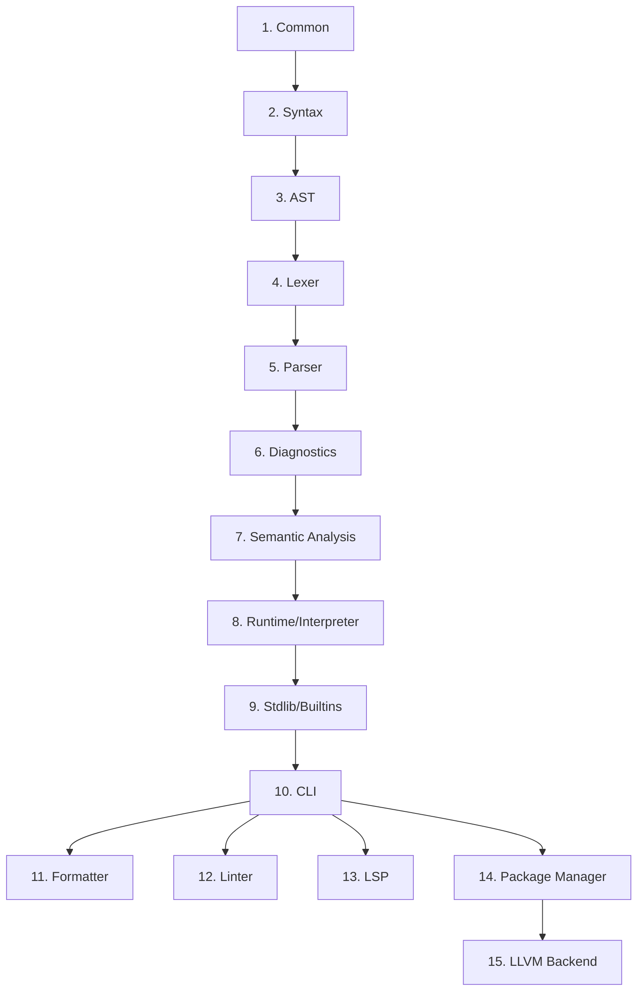

# TechScript 2.0 Implementation Sequence

This document defines the sequential order of development required to transform the skeletal architecture into a fully operational compiler and tooling ecosystem.

## Sequence Details

1. **Common (`compiler/common`)**
   - Implements baseline primitives: `Span` offsets, `NodeId` sequences, source map references, and `Ident` tokens.

2. **Syntax (`compiler/syntax`)**
   - Implements full keyword tables (31 active keywords, 10 future reserved keywords), operator definition registers, and Pratt parser operator precedence structures.

3. **AST (`compiler/ast`)**
   - Builds program statement and expression AST nodes, serializable metadata attributes, and AST visitor interface traits.

4. **Lexer (`compiler/lexer`)**
   - Configures Logos DFA lexer rules, comments stripping, decimal/hexadecimal scanner routines, and f-string interpolation scopes.

5. **Parser (`compiler/parser`)**
   - Implements a recursive descent statement parser and Pratt expression parser, checking precedence mappings and statement termination rules.

6. **Diagnostics (`compiler/errors`)**
   - Defines unified error code registers (`E0001` - `E9999`) and warning codes, implementing terminal-rendering formatting systems.

7. **Semantic Analysis (`compiler/semantic`)**
   - Implements scope hoisting, name shadowing checks, duplicate validation passes, constant assignment constraints, and warnings for deprecated aliases (like `fun`).

8. **Runtime (`runtime/gc`, `runtime/vm`, `runtime/interpreter`)**
   - Implements tree-walking evaluator stack frames, variable environment stores, exception-throwing capture loops, and a generational mark-and-sweep collector.

9. **Stdlib (`stdlib`, `runtime/builtins`)**
   - Registers native builtin functions (`say`, `ask`, `len`) and standard library modules (`io`, `math`, `string`, `file`, `web`).

10. **CLI (`cli`)**
    - Build Clap-based single executable (`tech`) with subcommands: `run`, `repl`, `check`, `fmt`, `lint`, `test`, `new`, `version`.

11. **Formatter (`tools/formatter`)**
    - Implements standard layout generator and in-place code style writers (`tech fmt`).

12. **Linter (`tools/linter`)**
    - Configures naming standard conventions, dead code detectors, and automatic migration for deprecated constructs (`tech lint --fix`).

13. **LSP (`tools/lsp`)**
    - Implements tower-lsp server interface for IDE diagnostics, syntax highlighting, definition lookups, and auto-completions.

14. **Package Manager (`tools/package-manager`)**
    - Implements dependency solver graphs, semantic version matching, and remote index registry clients (`tech install`).

15. **LLVM Backend**
    - High-performance native compiler target converting checked AST programs into binary code.
