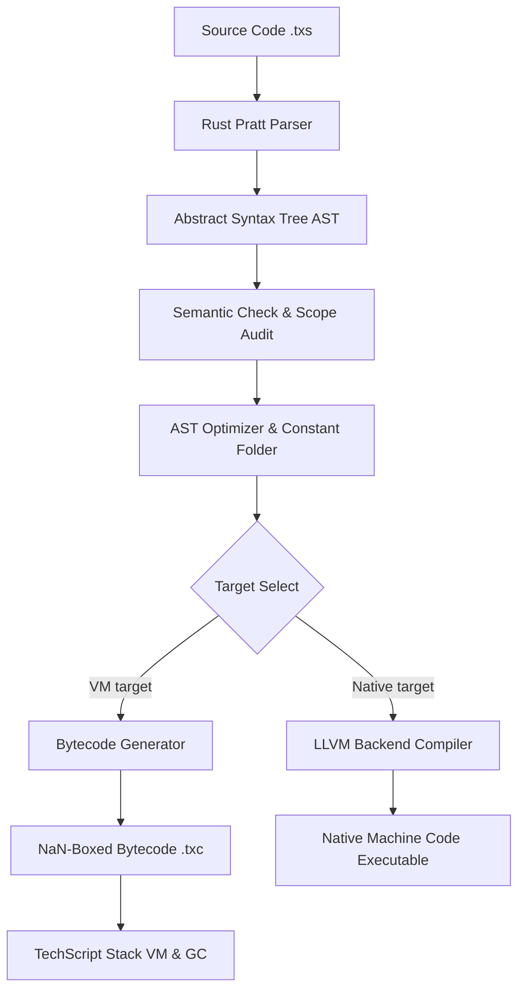

<!-- SEO: TechScript — Plain English programming language, Rust compiler, bytecode VM, LLVM backend, open source, developer tools, compiler design, virtual machine design -->

<div align="center">


<br/>

<br/>

# TechScript

**The plain-English programming language. Zero symbols. Zero overhead.**

[](https://github.com/Tcode-Motion/techscript/actions)
[](LICENSE)
[](https://github.com/Tcode-Motion/techscript/releases)
[](https://github.com/Tcode-Motion/techscript/releases)
[](https://www.rust-lang.org/)
[](https://github.com/Tcode-Motion/techscript/releases)
[](docs/index.md)
[](https://github.com/Tcode-Motion/techscript/issues)
[](https://github.com/Tcode-Motion/techscript/stargazers)
[](https://github.com/Tcode-Motion/techscript/network/members)

</div>

---

## 📖 Introduction

**TechScript** is a general-purpose, human-first programming language designed to eliminate the syntax overhead of traditional coding. Instead of semicolons, curly braces, and cryptic symbol operators, TechScript uses a clean, plain-English keyword grammar. 

Under the hood, TechScript is built with **Rust**, compiling code into highly optimized bytecode executed on a stack-based Virtual Machine (VM) with zero-overhead memory safety. It also supports compiling directly to native machine code via an LLVM backend.

---

## ⚡ Why TechScript?

### 1. Philosophy: Speak to Humans First
Coding should be readable. Traditional code requires developers to constantly verify bracket matching and semicolon placements. TechScript replaces this with clean, English-like grammar blocks that end with the `end` keyword.

### 2. High-Performance Runtime
TechScript does not trade performance for readability. By utilizing:
* **NaN-boxed value representation** for optimized stack allocation.
* **A cycle-detecting Garbage Collector** backed by Automatic Reference Counting (ARC).
* **An LLVM-based native code compiler**.

It achieves execution speeds close to native C/Rust.

### 3. Syntax Comparison

| Concept | TechScript 2.0 | JavaScript | Python |
|:---|:---|:---|:---|
| **Function** | `do add(a, b) send a + b end` | `function add(a, b) { return a + b; }` | `def add(a, b): return a + b` |
| **Loop** | `loop 5 say "Hi" end` | `for (let i=0; i<5; i++) { console.log("Hi"); }` | `for _ in range(5): print("Hi")` |
| **Condition** | `when x > 10 say "Yes" else say "No" end` | `if (x > 10) { console.log("Yes"); } else { ... }` | `if x > 10: print("Yes") else: print("No")` |
| **Object** | `class Dog do init(n) self.n = n end end` | `class Dog { constructor(n) { this.n = n; } }` | `class Dog: def __init__(self, n): self.n = n` |

---

## 🚀 Ecosystem Features

### 💻 TechScript Studio IDE
TechScript ships with a dedicated cyberpunk-aesthetic IDE built using `egui` and `egui_dock`. It allows developers to view live AST and VM bytecode instructions side-by-side as they edit.

### 🌐 Web Builder (`use web`)
Compile entire websites from single TechScript files without writing HTML or CSS:
```txs
use web
page = WebPage("Welcome")
page.body([
    page.h1("Hello World!"),
    page.p("Built using TechScript.")
])
page.run()
```

### 🎨 Canvas 2D Rendering (`use canvas`)
Draw graphics directly on the screen:
```txs
use canvas
canvas.init(800, 600)
canvas.draw_rect(10, 10, 100, 100, "#0DF28B")
```

### 🤖 Gemini AI Module (`use ai`)
Integrate LLM support natively in three lines of code:
```txs
use ai
model = ai.load("gemini-2.5")
response = ai.prompt(model, "Explain programming compiler pipeline")
say response
```

### 🛠️ Unified Toolchain
The `tsc` binary compiles everything:
* `tsc fmt` - Auto-formats source files.
* `tsc lint` - Analyzes safety traps and warns on deprecated syntax.
* `tsc test` - Executes built-in unit tests.
* `tsc package` - Fetches dependencies and publishes modules to the registry.

---

## 📐 Architecture Overview



---

## 📦 Installation

### 🪟 Windows Setup
1. Go to the [Releases](https://github.com/Tcode-Motion/techscript/releases) page on GitHub.
2. Download **`TechScript_Setup.exe`** (or `TechScript_Portable.zip` for a zero-install portable version).
3. Run the installer to configure your environment:
   * Installs the native Rust compiler (`tsc`) and VM (`tsvm`).
   * Automatically adds `tsc` to your system environment `PATH`.
   * Configures file associations for `.txs` source scripts.

### 🐧 Linux / 🍎 macOS Setup
Execute the official one-liner in your terminal to download and configure the native binary:
```bash
curl -fsSL https://raw.githubusercontent.com/Tcode-Motion/techscript/main/scripts/install.sh | bash
```

### 🤖 Android (Termux) Setup
Run these commands in Termux to download and configure TechScript natively on Android:
```bash
pkg update
pkg install curl
curl -fsSL https://raw.githubusercontent.com/Tcode-Motion/techscript/main/scripts/install.sh | bash
```

---

## 🚀 Quick Start

1. Scaffold a new project:
   ```bash
   tsc new hello_world
   ```
2. Navigate into the project:
   ```bash
   cd hello_world
   ```
3. Compile and execute:
   ```bash
   tsc run
   ```

---

## 🔗 Links & Social Media

* **Official Website**: [https://techscript.is-a.dev](https://techscript.is-a.dev)
* **GitHub Repository**: [https://github.com/Tcode-Motion/techscript](https://github.com/Tcode-Motion/techscript)
* **GitHub Discussions**: [https://github.com/Tcode-Motion/techscript/discussions](https://github.com/Tcode-Motion/techscript/discussions)
* **YouTube Channel**: [@tcodemotin on YouTube](https://www.youtube.com/@tcodemotin)
* **Author Profile**: [@Tcode-Motion on GitHub](https://github.com/Tcode-Motion)
* **Discord Community**: [Join Discord (Community Chat)](https://discord.gg/tRtNbuDUr)

---

## 🤝 Contributing
Contributions are highly welcome! Review our [Contributing Guidelines](.github/CONTRIBUTING.md) to set up your Rust environment and start hacking on the compiler.

---

## 🎯 Roadmap
See the detailed development phases in [Roadmap](docs/Roadmap.md).

---

## 🙏 Credits & Acknowledgements
* Built by **[Tanmoy Majumder](https://github.com/Tcode-Motion)** (independent developer, West Bengal, India).
* Inspired by Rust's zero-overhead safety, Zig's compile-time features, and Python's clean readability.

---

## 📄 License
MIT License. See [LICENSE](LICENSE) for details.
