# TechScript

TechScript is a human-readable programming language with a Rust compiler, a bytecode virtual machine, native compilation support, and an integrated developer toolchain.

The language uses explicit English-like keywords for blocks and control flow. The toolchain includes a compiler driver, formatter, linter, language server, package manager, testing support, and standard-library modules for common application tasks.

**Current line:** TechScript 2.0.x
**License:** [MIT](LICENSE)
**Maintainer:** [Tcode-Motion](https://github.com/Tcode-Motion)

[Releases](https://github.com/Tcode-Motion/techscript/releases) | [Documentation](docs/index.md) | [Issue tracker](https://github.com/Tcode-Motion/techscript/issues) | [Discussions](https://github.com/Tcode-Motion/techscript/discussions)

## Contents

- [Overview](#overview)
- [Language at a glance](#language-at-a-glance)
- [How the toolchain works](#how-the-toolchain-works)
- [Installation](#installation)
- [First program](#first-program)
- [CLI](#cli)
- [Standard library](#standard-library)
- [Examples](#examples)
- [Editor support](#editor-support)
- [Documentation](#documentation)
- [Repository layout](#repository-layout)
- [Development](#development)
- [Project policies](#project-policies)
- [License](#license)

## Overview

TechScript is designed for readable scripts and structured applications. Its source files use the `.txs` extension and are processed by the `tsc` command-line driver.

The 2.0 language line provides:

- English-like block keywords such as `do`, `when`, `loop`, `repeat`, `try`, `catch`, and `end`.
- Functions, classes, structs, enums, traits, interfaces, modules, pattern matching, and generics.
- Synchronous, asynchronous, and parallel execution constructs.
- A standard library for files, JSON, HTTP, databases, collections, cryptography, graphics, web workflows, and more.
- A formatter, linter, migration tool, REPL, package manager, language server, and test runner.

## Language at a glance

```txs
const limit = 5

do classify(value)
    when value > limit
        send "large"
    else
        send "small"
    end
end

for value in [1, 3, 8]
    say classify(value)
end
```

Canonical 2.0 syntax uses `null`, `$"..."` interpolation, `loop` for counted loops, and `repeat` for condition-controlled loops. Legacy aliases remain available during the 2.x line and can be migrated with `tsc migrate`.

## How the toolchain works

The following diagram describes the complete path from a `.txs` source file to execution or a native executable. Each stage has a defined responsibility: source text is tokenized, parsed into an AST, validated semantically, optimized, lowered to IR, and then sent to the selected backend.

```mermaid
flowchart LR
    source[TechScript source\n.txs file] --> driver[tsc compiler driver]
    driver --> lexer[Lexer\nTokens and spans]
    lexer --> parser[Parser\nExpressions and statements]
    parser --> ast[Abstract syntax tree\nAST]
    ast --> semantic[Semantic analysis\nNames, scopes, types, capabilities]
    semantic --> optimizer[Optimizer\nConstant folding and simplification]
    optimizer --> ir[Intermediate representation\nIR lowering]
    ir --> target{Select target}

    target -->|run or build| bytecode[Bytecode compiler]
    bytecode --> artifact[Bytecode artifact\n.txc]
    artifact --> vm[Stack virtual machine]
    vm --> runtime[Runtime and standard library]
    runtime --> program[Program output]

    target -->|native backend| llvm[LLVM backend]
    llvm --> native[Standalone native executable]
    native --> program

    driver -.-> tools[Formatter, linter, REPL, tests, LSP, package manager]
    tools -.-> source
```



The repository also contains a tree-walking interpreter for development and compatibility workflows. The VM and native backend are the primary execution targets exposed by the compiler architecture.

## Installation

### Windows

Download the latest Windows package from the [GitHub Releases](https://github.com/Tcode-Motion/techscript/releases) page. For detailed setup steps, see the [installation guide](docs/getting-started/installation.md).

### Linux and macOS

Use the installer script:

```bash
curl -fsSL https://raw.githubusercontent.com/Tcode-Motion/techscript/main/scripts/install.sh | bash
```

Or build from source:

```bash
git clone https://github.com/Tcode-Motion/techscript.git
cd techscript
cargo build --release
```

### Python installer

The optional Python wrapper downloads the matching native release package:

```bash
pip install techscript-lang
techscript install
```

After installation, verify the CLI:

```bash
tsc version
```

## First program

Create `hello.txs`:

```txs
say "Hello, TechScript"
```

Run it with:

```bash
tsc run hello.txs
```

For a guided introduction, read [Getting Started](docs/getting-started/getting-started.md) and the [language overview](docs/language/overview.md).

## CLI

Run `tsc --help` for the complete command list. The main commands are:

| Command | Purpose |
| --- | --- |
| `tsc run` | Compile and execute a source file. |
| `tsc build` | Build a project or package. |
| `tsc check` | Validate source without executing it. |
| `tsc fmt` | Format TechScript source. |
| `tsc lint` | Report lint and compatibility issues. |
| `tsc lint --fix` | Apply safe automated lint fixes. |
| `tsc migrate` | Migrate legacy 1.x syntax to the 2.0 form. |
| `tsc test` | Run project tests. |
| `tsc repl` | Start the interactive REPL. |
| `tsc new` | Create a new project. |
| `tsc install` | Install a package dependency. |
| `tsc publish` | Publish a package. |
| `tsc doctor` | Inspect the local toolchain and project environment. |
| `tsc dump-ast` | Inspect the parsed AST. |
| `tsc dump-ir` | Inspect lowered intermediate representation. |
| `tsc dump-bytecode` | Inspect generated VM bytecode. |
| `tsc emit-llvm` | Emit LLVM intermediate representation. |

## Standard library

The standard library is implemented in the `stdlib/` workspace crate and exposed through modules including:

| Area | Modules |
| --- | --- |
| Core | `collections`, `math`, `random`, `datetime`, `path`, `env` |
| Data | `json`, `csv`, `xml`, `yaml`, `ini`, `encoding`, `compress` |
| Files and systems | `file`, `os`, `process`, `io`, `logging`, `config` |
| Network and services | `http`, `net`, `dns`, `ftp`, `oauth`, `email` |
| Databases | `sqlite`, `database`, `mysql`, `postgres`, `mongodb`, `redis` |
| Applications | `canvas`, `graphics`, `charts`, `pdf`, `excel`, `word`, `web` |
| Development | `testing`, `debug`, `benchmark`, `profiler`, `mock` |

See the [standard library reference](docs/reference/StdlibReference.md), [web guide](docs/WebGuide.md), and [canvas guide](docs/CanvasGuide.md) for module details.

## Examples

Runnable examples are organized under [`examples/`](examples). Useful starting points include:

- [Hello World](examples/hello_world)
- [Calculator](examples/calculator)
- [Collections](examples/collections)
- [Database](examples/database)
- [Error handling](examples/error_handling)
- [JSON parser](examples/json_parser)
- [Web API](examples/web_api)
- [Todo CLI](examples/todo_cli)
- [Testing](examples/testing)

Run an example from the repository root:

```bash
tsc run examples/hello_world/hello.txs
```

The [examples guide](docs/guides/ExamplesGuide.md) explains how examples are structured and verified.

## Editor support

The official [TechScript VS Code extension](https://marketplace.visualstudio.com/items?itemName=tanmoy.techscript) provides syntax highlighting and editor integration. The extension is also available through [Open VSX](https://open-vsx.org/extension/Tcode-Motion/techscript).

The language server is implemented in [`tools/lsp/`](tools/lsp). Formatter and linter implementation is in [`tools/formatter/`](tools/formatter) and [`tools/linter/`](tools/linter).

## Documentation

- [Documentation portal](docs/index.md)
- [Installation guide](docs/getting-started/installation.md)
- [Getting Started guide](docs/getting-started/getting-started.md)
- [Language overview](docs/language/overview.md)
- [Syntax guide](docs/SyntaxGuide.md)
- [Compiler architecture](docs/compiler/architecture.md)
- [Virtual machine specification](docs/compiler/vm.md)
- [CLI reference](docs/tooling/cli.md)
- [Formatter reference](docs/tooling/formatter.md)
- [Package manager reference](docs/tooling/package-manager.md)
- [Standard library reference](docs/reference/StdlibReference.md)
- [Migration guide](docs/MigrationGuide.md)
- [Release notes](docs/ReleaseNotes.md)
- [Roadmap](docs/Roadmap.md)
- [Supported versions](docs/SUPPORTED_VERSIONS.md)

## Repository layout

```text
compiler/       Lexer, parser, AST, semantic analysis, IR, optimizer, and backends
runtime/        Interpreter, VM, runtime services, garbage collection, and builtins
stdlib/         Standard-library modules
cli/            The tsc compiler driver
tools/          Formatter, linter, LSP, package manager, and packager
docs/           User guides, specifications, and project documentation
examples/       Runnable TechScript programs
editors/        Editor integrations
installer/      Installer configuration
scripts/        Installation and maintenance scripts
```

## Development

Prerequisites are Rust stable, Git, and the platform dependencies required by optional LLVM features. Build and test the workspace with:

```bash
cargo fmt --all -- --check
cargo build --workspace
cargo test --workspace
```

Before opening a pull request, read the [contribution guide](CONTRIBUTING.md), follow the [code of conduct](CODE_OF_CONDUCT.md), and review the [security policy](SECURITY.md).

## Project policies

- [Contributing](CONTRIBUTING.md): development setup, branch rules, testing, commits, and pull requests.
- [Code of Conduct](CODE_OF_CONDUCT.md): community standards and reporting process.
- [Security Policy](SECURITY.md): supported versions and private vulnerability reporting.
- [License](LICENSE): MIT license terms.
- [Issue tracker](https://github.com/Tcode-Motion/techscript/issues): bug reports and actionable tasks.
- [Feature requests](https://github.com/Tcode-Motion/techscript/issues/new?template=feature_request.md): proposals for new functionality.
- [Bug reports](https://github.com/Tcode-Motion/techscript/issues/new?template=bug_report.md): reproducible defects.
- [Questions](https://github.com/Tcode-Motion/techscript/issues/new?template=question.md): usage and documentation questions.
- [Discussions](https://github.com/Tcode-Motion/techscript/discussions): design and community conversations.

## License

TechScript is distributed under the [MIT License](LICENSE). Third-party components are listed in [THIRD_PARTY_LICENSES.md](THIRD_PARTY_LICENSES.md).
