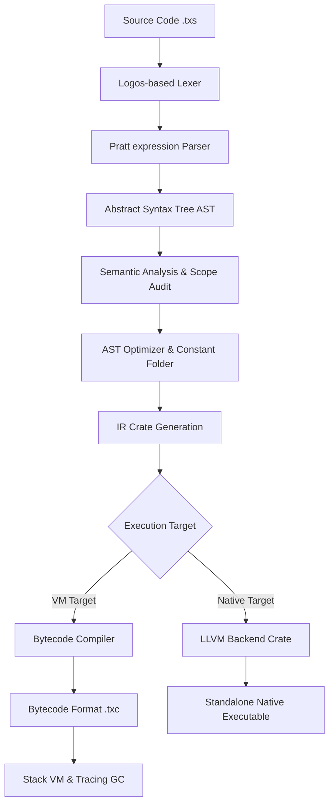

<!-- SEO: TechScript — Plain English programming language, Rust compiler, bytecode VM, LLVM backend, open source, developer tools, compiler design, virtual machine design -->

<div align="center">


<br/>

<br/>

# TechScript 2.0

**The plain-English programming language. Zero symbols. Zero overhead.**

[](https://github.com/Tcode-Motion/techscript/actions)
[](LICENSE)
[](https://github.com/Tcode-Motion/techscript/releases)
[](https://github.com/Tcode-Motion/techscript/releases)
[](https://www.rust-lang.org/)
[](https://marketplace.visualstudio.com/items?itemName=tanmoy.techscript)
[](https://open-vsx.org/extension/Tcode-Motion/techscript)
[](https://pypi.org/project/techscript/)
[](docs/index.md)

</div>

---

## 📌 Table of Contents
1. [What is TechScript?](#-what-is-techscript)
2. [Why Choose It?](#-why-choose-it)
3. [Key Differentiators](#-key-differentiators)
4. [Syntax at a Glance](#-syntax-at-a-glance)
5. [Architecture Design](#-architecture-design)
6. [Installation](#-installation)
7. [Quick Start](#-quick-start)
8. [Language Guide](#-language-guide)
9. [Standard Library & Modules](#-standard-library--modules)
10. [CLI Commands](#-cli-commands)
11. [Examples](#-examples)
12. [Editor & IDE Support](#-editor--ide-support)
13. [Documentation Portal](#-documentation-portal)
14. [Roadmap](#-roadmap)
15. [Repo Structure](#-repo-structure)
16. [Contributing](#-contributing)
17. [Links & Social Media](#-links--social-media)
18. [License](#-license)

---

## 📖 What is TechScript?

**TechScript** is a general-purpose, human-first programming language designed to eliminate the syntax clutter of traditional coding. Instead of curly braces, semicolons, and cryptic operator symbols, TechScript uses a clean, keyword-based English grammar. 

Under the hood, TechScript is built in **Rust** for safety and speed. It compiles source files into highly optimized bytecode executed on a custom stack-based Virtual Machine (VM) with NaN-boxed values and a tracing garbage collector, or can generate native code via an LLVM backend.

---

## ⚡ Why Choose It?

- **Zero Clutter**: Replace symbols like `{`, `}`, `(`, `)`, `;`, `&&`, and `||` with clear keywords like `do`, `end`, `when`, `else`, `and`, and `or`.
- **Ecosystem Ready**: Runs everywhere (Windows, Linux, macOS, Android/Termux) and comes with full LSP support, linting, formatting, and packaging.
- **Top Performance**: Powered by a custom stack-based VM written in Rust. Features compile-time constant folding and AST simplifications.

---

## 📦 Key Differentiators

| Traditional Languages | TechScript's Answer | Benefit |
|---|---|---|
| Syntax clutter (`{}`, `()`, `;`) | Plain-English block keywords (`do`/`end`, `when`) | Fewer syntax errors and high readability |
| Bloated build dependency chains | Single toolchain executable (`tsc`) | Instant setups with formatting & testing |
| Heavy memory overhead | Lightweight custom NaN-boxed stack VM | High performance and small footprint |

---

## ✒️ Syntax at a Glance

Here is a side-by-side comparison of TechScript 2.0 with JavaScript and Python:

| Feature | TechScript | JavaScript | Python |
|---|---|---|---|
| **Variable** | `x = 10` | `let x = 10;` | `x = 10` |
| **Constant** | `const PI = 3.14159` | `const PI = 3.14159;` | `PI = 3.14159` *(convention)* |
| **Function** | `do greet(name)`<br>&nbsp;&nbsp;&nbsp;&nbsp;`send "Hi " + name`<br>`end` | `function greet(name) {`<br>&nbsp;&nbsp;&nbsp;&nbsp;`return "Hi " + name;`<br>`}` | `def greet(name):`<br>&nbsp;&nbsp;&nbsp;&nbsp;`return "Hi " + name` |
| **Condition** | `when x > 5`<br>&nbsp;&nbsp;&nbsp;&nbsp;`say "Big"`<br>`else`<br>&nbsp;&nbsp;&nbsp;&nbsp;`say "Small"`<br>`end` | `if (x > 5) {`<br>&nbsp;&nbsp;&nbsp;&nbsp;`console.log("Big");`<br>`} else {`<br>&nbsp;&nbsp;&nbsp;&nbsp;`console.log("Small");`<br>`}` | `if x > 5:`<br>&nbsp;&nbsp;&nbsp;&nbsp;`print("Big")`<br>`else:`<br>&nbsp;&nbsp;&nbsp;&nbsp;`print("Small")` |
| **For Loop** | `for x in list`<br>&nbsp;&nbsp;&nbsp;&nbsp;`say x`<br>`end` | `for (let x of list) {`<br>&nbsp;&nbsp;&nbsp;&nbsp;`console.log(x);`<br>`}` | `for x in list:`<br>&nbsp;&nbsp;&nbsp;&nbsp;`print(x)` |
| **Try / Catch** | `try`<br>&nbsp;&nbsp;&nbsp;&nbsp;`res = divide(10, 0)`<br>`catch error`<br>&nbsp;&nbsp;&nbsp;&nbsp;`say error`<br>`end` | `try {`<br>&nbsp;&nbsp;&nbsp;&nbsp;`let res = divide(10, 0);`<br>`} catch (error) {`<br>&nbsp;&nbsp;&nbsp;&nbsp;`console.error(error);`<br>`}` | `try:`<br>&nbsp;&nbsp;&nbsp;&nbsp;`res = divide(10, 0)`<br>`except Exception as error:`<br>&nbsp;&nbsp;&nbsp;&nbsp;`print(error)` |

---

## 📐 Architecture Design

The TechScript compiler driver (`tsc`) processes source files through a strict pipeline:



*The `tsc` driver tokenizes the program, builds an AST, checks lexical scopes and types, runs constant folding, and compiles the result into bytecode for the VM or leverages LLVM to emit native machine code.*

---

## 📦 Installation

### 1. 🪟 Windows Setup
1. Go to the [Releases](https://github.com/Tcode-Motion/techscript/releases) page on GitHub.
2. Download **`TechScript_Setup.exe`** (or `TechScript_Portable.zip` for a zero-install portable version).
3. Run the installer to configure your environment:
   * Installs the native compiler (`tsc`) and VM.
   * Automatically adds `tsc` to your system environment `PATH`.
   * Configures file associations for `.txs` scripts.

### 2. 🐧 Linux / 🍎 macOS Setup (Shell Script)
```bash
curl -fsSL https://raw.githubusercontent.com/Tcode-Motion/techscript/main/scripts/install.sh | bash
```

### 3. 🤖 Android (Termux) Setup
**Recommended Method (Shell script):**
```bash
pkg update
pkg install curl
curl -fsSL https://raw.githubusercontent.com/Tcode-Motion/techscript/main/scripts/install.sh | bash
```
**Alternative Method (pip — Not Recommended):**
```bash
pkg update
pkg install python
pip install techscript
techscript install
```
*(Note: Python installations in Termux may require the `--break-system-packages` flag under PEP 668).*

### 4. 🐍 Via pip (All Platforms - Not Recommended)
```bash
pip install techscript       # or: pip install techscript-lang
techscript install
```
The PyPI package auto-detects your OS/architecture and downloads the correct native binary from GitHub Releases.

> **Homebrew** (`brew install techscript`), **Winget**, and **Scoop** support coming soon!

---

## 🚀 Quick Start

Once TechScript is installed, you can write and execute your first script in under 10 seconds:

1. **Create and Enter a Project Directory**:
   ```bash
   mkdir hello_world
   cd hello_world
   ```
2. **Create a Script File**:
   Create a new file named `hello.txs` and add:
   ```txs
   say "Hello, World! 🌍"
   ```
3. **Compile and Run**:
   Run the file using the `tsc` compiler driver:
   ```bash
   tsc run hello.txs
   ```

---

## 📘 Language Guide

TechScript's syntax builds from simple assignments to full structured programs:

1. **Variables**: Assigned dynamically. No variable keywords required.
   ```txs
   message = "Hello TechScript"
   ```
2. **Conditionals**: Expressed via `when`/`else` blocks.
   ```txs
   when status == "active"
       say "Running"
   end
   ```
3. **Loops**: Multi-form `for` ranges or collection iterators.
   ```txs
   for i in 0..5
       say i
   end
   ```
4. **Functions**: Declared with `do` block and returns with `send`.
   ```txs
   do square(n)
       send n * n
   end
   ```

For detailed guides, see the [Language Guide](docs/LanguageGuide.md) and the [Syntax Guide](docs/SyntaxGuide.md).

---

## 📚 Standard Library & Modules

TechScript features a self-contained, native standard library:

| Module | Description | Guide Link |
|---|---|---|
| `math` | Square root, trigonometry, and basic math operations | [Stdlib Reference](docs/StdlibReference.md) |
| `collections` | Operations for pushing to lists or reading map keys | [Stdlib Reference](docs/StdlibReference.md) |
| `file` | File writing, reading, and removal utilities | [Stdlib Reference](docs/StdlibReference.md) |
| `json` | Encoding maps/lists to JSON strings and decoding them | [Stdlib Reference](docs/StdlibReference.md) |
| `http` | HTTP client GET and POST utilities | [Stdlib Reference](docs/StdlibReference.md) |
| `sqlite` | Local relational database connector | [Stdlib Reference](docs/StdlibReference.md) |
| `canvas` | 2D vector viewport shapes and text drawing | [Canvas Guide](docs/CanvasGuide.md) |
| `time` | Clock, scheduling, and thread sleep functions | [Stdlib Reference](docs/StdlibReference.md) |
| `thread` | Native OS thread spawner and thread join interfaces | [Stdlib Reference](docs/StdlibReference.md) |
| `ai` | Seamless Gemini prompt and text generation functions | [Stdlib Reference](docs/StdlibReference.md) |
| `testing` | Assertion macros for unit testing suite | [Stdlib Reference](docs/StdlibReference.md) |

---

## 🛠️ CLI Commands

Run these subcommands via the unified `tsc` compiler driver:

| Subcommand | Description |
|---|---|
| `run` | Compiles and executes a single `.txs` script |
| `build` | Builds the workspace project matching `package.toml` |
| `check` | Checks the workspace for compile-time errors |
| `fmt` | Standardizes codebase layouts using `tsfmt` |
| `lint` | Evaluates safety traps and warns on deprecated patterns |
| `migrate` | Translates legacy v1.x scripts to v2.0 keywords |
| `clean` | Deletes compiled target caches and logs |
| `new` | Scaffolds a new workspace project |
| `test` | Locates and executes all `#[test]` unit tests |
| `repl` | Launches the interactive shell REPL |
| `publish` | Submits the module package to the package registry |
| `install` | Installs a library dependency |
| `uninstall` | Removes an installed package |
| `update` | Updates workspace packages to their latest versions |
| `doctor` | Scans workspace paths and toolchain installations |
| `dump-ast` | Outputs the AST representation in JSON/text format |
| `dump-ir` | Outputs the Intermediate Representation |
| `dump-bytecode` | Outputs the compiled virtual machine bytecode |
| `emit-llvm` | Generates LLVM IR representation |
| `emit-asm` | Generates assembly representation |
| `benchmark` | Executes automated platform runtime benchmarks |

---

## 🚀 Examples

Find runnable examples in the [`examples/`](examples) folder:

| Directory | Script | Description | Run Command |
|---|---|---|---|
| [ai](examples/ai) | `prompt.txs` | Prompting Gemini AI model natively via the standard library | `tsc run examples/ai/prompt.txs` |
| [async](examples/async) | `async.txs` | Concurrent event loop with `async` subroutines and `await` | `tsc run examples/async/async.txs` |
| [calculator](examples/calculator) | `calculator.txs` | Standard math functions and basic error throwing | `tsc run examples/calculator/calculator.txs` |
| [canvas](examples/canvas) | `draw.txs` | Drawing rects, circles, text inside a viewport | `tsc run examples/canvas/draw.txs` |
| [collections](examples/collections) | `collections.txs` | Manipulating and iterating over lists and maps | `tsc run examples/collections/collections.txs` |
| [database](examples/database) | `db.txs` | Dynamic SQL schema setup and querying with SQLite | `tsc run examples/database/db.txs` |
| [enums](examples/enums) | `enums.txs` | Declaring and pattern matching enum types | `tsc run examples/enums/enums.txs` |
| [error_handling](examples/error_handling) | `errors.txs` | Exception handlers using `try`, `catch`, and `throw` | `tsc run examples/error_handling/errors.txs` |
| [file_reader](examples/file_reader) | `reader.txs` | Writing, reading, and deleting files using the `file` module | `tsc run examples/file_reader/reader.txs` |
| [generics](examples/generics) | `generics.txs` | Dynamic functions and dynamically-typed structs/boxes | `tsc run examples/generics/generics.txs` |
| [guess_number](examples/guess_number) | `guess.txs` | Simulates a guess-the-number game loop | `tsc run examples/guess_number/guess.txs` |
| [hello_world](examples/hello_world) | `hello.txs` | Classic Hello World script printing text | `tsc run examples/hello_world/hello.txs` |
| [http_server](examples/http_server) | `server.txs` | Simulated HTTP Server endpoints mock | `tsc run examples/http_server/server.txs` |
| [json_parser](examples/json_parser) | `parser.txs` | Parsing JSON string to map structure and vice-versa | `tsc run examples/json_parser/parser.txs` |
| [modules](examples/modules) | `main.txs` | Standard library imports and custom module scope | `tsc run examples/modules/main.txs` |
| [oop](examples/oop) | `oop.txs` | Structural Object-Oriented programming using mapping definitions | `tsc run examples/oop/oop.txs` |
| [testing](examples/testing) | `unit_test.txs` | Declaring assertions using the built-in testing harness | `tsc run examples/testing/unit_test.txs` |
| [threads](examples/threads) | `threads.txs` | Spawning and joining OS threads via thread module | `tsc run examples/threads/threads.txs` |
| [todo_cli](examples/todo_cli) | `todo.txs` | Comprehensive lists/maps workflow for tasks | `tsc run examples/todo_cli/todo.txs` |
| [web_api](examples/web_api) | `web_api.txs` | Standard HTTP client request and response retrieval | `tsc run examples/web_api/web_api.txs` |

---

## 💻 Editor & IDE Support

Official support is available for **Visual Studio Code**:

1. Open the VS Code Extensions pane (`Ctrl+Shift+X`).
2. Search for **"TechScript 2.0"** (published by `tanmoy`).
3. Click **Install**.
4. *(Optional)* Select **Preferences → File Icon Theme → TechScript Icon Theme** to enable custom project file icons.

*Install links:*
- **[VS Code Marketplace](https://marketplace.visualstudio.com/items?itemName=tanmoy.techscript)**
- **[Open VSX Registry](https://open-vsx.org/extension/Tcode-Motion/techscript)**

---

## 📖 Documentation Portal

Browse detailed guides in the [`docs/`](docs) folder:

| Document | Description |
|---|---|
| [API Reference](docs/APIReference.md) | In-depth compiler API design specifications |
| [Best Practices](docs/BestPractices.md) | Guidelines for coding layout and memory conventions |
| [Canvas Guide](docs/CanvasGuide.md) | Methods and viewport parameters for shapes drawing |
| [Compiler Architecture](docs/CompilerArchitecture.md) | Pipeline description from Lexer to optimization phases |
| [DSL Guide](docs/DSLGuide.md) | Designing Domain-Specific layout submodules |
| [Examples Guide](docs/ExamplesGuide.md) | Standard running process for bundled projects |
| [FAQ](docs/FAQ.md) | Common troubleshooting and engine setup questions |
| [Installation Guide](docs/Installation.md) | Complete environment configuration guidelines |
| [Language Guide](docs/LanguageGuide.md) | Syntax specifications for statements and variables |
| [Migration Guide](docs/MigrationGuide.md) | Moving codebase parameters from legacy v1.x configurations |
| [Performance Reference](docs/Performance.md) | VM execution benchmarks and compile flag details |
| [Release Notes](docs/ReleaseNotes.md) | Historical logs of compiled target stable versions |
| [Roadmap](docs/Roadmap.md) | Milestones and future compiler targets |
| [Stdlib Reference](docs/StdlibReference.md) | Comprehensive standard library module interface list |
| [Syntax Guide](docs/SyntaxGuide.md) | Cheatsheet for variables, loops, control blocks |
| [Web Guide](docs/WebGuide.md) | Native website compile-generation parameters |

---

## 🗺️ Roadmap

- [x] Pratt parser for expressions.
- [x] Custom event loop with `async` and `await`.
- [x] Bundled compiler tools (`fmt`, `lint`, `test`).
- [ ] Complete LLVM code generation backend for static binaries.
- [ ] Add debugger and tracing memory profiler in standard tools.
- [ ] Formally verify core standard libraries.

---

## 📂 Repo Structure

An overview of the TechScript workspace directories:

```
techscript/
├── .devcontainer/       # Dev Container definitions
├── .github/             # GitHub templates and workflows
├── .vscode/             # Editor settings
├── assets/              # Logos and graphics
├── benchmarks/          # Performance benchmarks
├── cli/                 # Crate for the `tsc` compiler driver CLI
├── compiler/            # Crate subfolders for language compiler phases
│   ├── ast/             # Abstract Syntax Tree representation
│   ├── bytecode/        # Bytecode generation definitions
│   ├── common/          # Shared utilities and spans
│   ├── errors/          # Custom diagnostic engine and error codes
│   ├── ir/              # Intermediate Representation (IR) generation
│   ├── lexer/           # Logos-based lexer
│   ├── llvm_backend/    # LLVM native compilation module
│   ├── module_resolver/ # Module imports resolver
│   ├── optimizer/       # Constant folding and AST simplifications
│   ├── parser/          # Pratt expression and statement parser
│   ├── semantic/        # Symbol table, scopes, and semantic checks
│   └── syntax/          # Token kind and keyword definitions
├── docs/                # Language documentation and guides
├── editors/             # VS Code extension source and VSIX packages
├── examples/            # Sample projects and code snippets
├── installer/           # Script files for compiling installer executables
├── licenses/            # Licenses of standard library dependencies
├── runtime/             # Crate subfolders for program execution
│   ├── builtins/        # Standard library module implementations
│   ├── gc/              # NaN-boxed VM Garbage Collector
│   ├── interpreter/     # Tree-walk AST execution engine
│   ├── native_runtime/  # Runtime libraries for LLVM executables
│   ├── runtime/         # VM execution context and states
│   └── vm/              # Stack-based Bytecode Virtual Machine (VM)
├── scripts/             # Utility and platform installation scripts
├── stdlib/              # Standard library header definitions
├── templates/           # New project templates
├── third_party/         # Extracted third-party sources
└── tools/               # Ecosystem tools
    ├── formatter/       # Formatter engine (`tsfmt`)
    ├── linter/          # Linter analyzer (`tslint`)
    ├── lsp/             # Language Server (`techscript-lsp`)
    ├── package-manager/ # Package manager client (`tspm`)
    └── packager/        # Source code packager
```

---

## 🤝 Contributing

Contributions are welcome! Please read the [Contributing Guidelines](.github/CONTRIBUTING.md) to set up your local development environment and run tests:

```bash
cargo build
cargo test
```

---

## 🔗 Links & Social Media

* **Official Website**: [techscript.is-a.dev](https://techscript.is-a.dev)
* **GitHub Repository**: [Tcode-Motion/techscript](https://github.com/Tcode-Motion/techscript)
* **GitHub Discussions**: [Tcode-Motion/techscript/discussions](https://github.com/Tcode-Motion/techscript/discussions)
* **Discord Community**: [Join Discord (Community Chat)](https://discord.gg/tRtNbuDUr)

---

## 📄 License

TechScript is released under the **MIT License**. See [LICENSE](LICENSE) for details.
