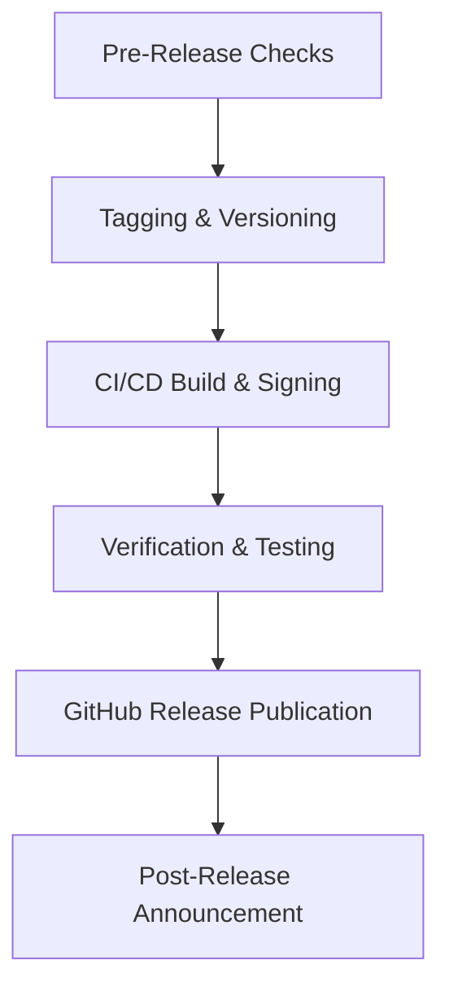

# TechScript Release Process Guide

This document describes the workflow, checklist, and responsibilities for releasing new versions of TechScript. TechScript follows Semantic Versioning (see [VERSIONING.md](VERSIONING.md)).

---

## Release Roles & Responsibilities

* **Release Manager**: Coordinates dates, reviews blockers, performs testing, tags releases, and runs the packaging/publishing pipeline.
* **Maintainers**: Approve pull requests, ensure CI status is green, and contribute to the release notes.

---

## Release Pipeline Stages



### 1. Pre-Release Checks
Before triggering a release, the Release Manager must ensure:
- [ ] The `main` branch is fully stable.
- [ ] All unit and integration tests pass successfully locally and on CI.
- [ ] All documentation matches the syntax and features of the incoming version.
- [ ] Cargo dependencies are up to date and audit/vulnerability checks pass.
- [ ] The `CHANGELOG.md` has been updated with a list of user-facing changes since the last release.

### 2. Tagging & Versioning
Releases are marked with git tags in the format `v*.*.*`.
1. Update version numbers in:
   - All `Cargo.toml` files in the workspace crates.
   - Installer configurations.
   - Documentation version headers.
2. Commit version bumps:
   ```bash
   git commit -am "chore: bump version to 0.1.0"
   ```
3. Tag the commit:
   ```bash
   git tag -a v0.1.0 -m "Release v0.1.0 (Alpha)"
   ```
4. Push the tag to GitHub:
   ```bash
   git push origin main --tags
   ```

### 3. CI/CD Build & Packaging
Once the tag is pushed:
* The `.github/workflows/release.yml` GitHub Action triggers automatically.
* It builds binaries for:
  - Windows x64 (Standalone executable and Installer)
  - macOS x64/arm64
  - Linux x86_64
* Artifacts are packaged, signed, and uploaded to the draft GitHub Release.

### 4. Verification & Testing
Before publishing the draft release:
- [ ] Download the Windows Installer and verify setup completes with PATH updates.
- [ ] Double-click a `.txs` file to test explorer association.
- [ ] Open the REPL using `tech repl`.
- [ ] Run example scripts to ensure they compile and run correctly on the VM.

### 5. Publishing the Release
1. Copy notes from `CHANGELOG.md` or use the format in `RELEASE_NOTES_TEMPLATE.md`.
2. Format the GitHub Release description.
3. Select "Pre-release" if the version is an alpha or beta (e.g., `v0.1.0` or `v0.5.0`).
4. Publish the Release.

---

## Rollback & Hotfix Procedure

In case of a critical bug identified immediately post-release:
1. Revert the offending commit on the `main` branch.
2. Publish a patch release immediately (e.g., `v0.1.1`).
3. If necessary, yank/delete the broken release or mark it with a warning in the release description.
