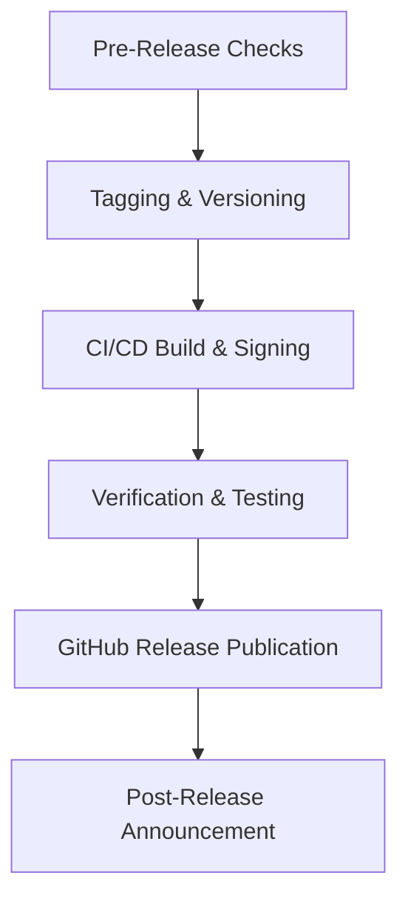

# TechScript Release Process Guide

This document describes the workflow, checklist, and responsibilities for releasing new versions of TechScript. TechScript follows Semantic Versioning (see [VERSIONING.md](VERSIONING.md)).

---

## Release Roles & Responsibilities

* **Release Manager**: Coordinates dates, reviews blockers, performs testing, tags releases, and runs the packaging/publishing pipeline.
* **Maintainers**: Approve pull requests, ensure CI status is green, and contribute to the release notes.

---

## Release Pipeline Stages



### 1. Pre-Release Checks
Before triggering a release, the Release Manager must ensure:
- [ ] The `main` branch is fully stable.
- [ ] All unit and integration tests pass successfully locally and on CI.
- [ ] All documentation matches the syntax and features of the incoming version.
- [ ] Cargo dependencies are up to date and audit/vulnerability checks pass.
- [ ] The `CHANGELOG.md` has been updated with a list of user-facing changes since the last release.

### 2. Tagging & Versioning
Releases are marked with git tags in the format `v*.*.*` (standard) or `v*.*.*.*` (release revision).
1. For a normal SemVer release, update all `Cargo.toml` package versions, installer configuration, and documentation version headers.
2. For a release revision such as `v2.0.0.1`, keep workspace Cargo packages at `2.0.0`; update the installer and release-facing documentation to the revision identifier.
3. Commit version and documentation changes:
   ```bash
   git commit -am "chore: bump version to 2.0.0.1"
   ```
4. Tag the commit:
   ```bash
   git tag -a v2.0.0.1 -m "Release v2.0.0.1"
   ```
5. Push the tag to GitHub:
   ```bash
   git push origin main --tags
   ```

### 3. CI/CD Build & Packaging
Once the tag is pushed:
* The `.github/workflows/release.yml` GitHub Action triggers automatically.
* It builds binaries for:
  - Windows x64 (Standalone executable and Installer)
  - macOS x64/arm64
   - Linux x86_64
* Artifacts are packaged and uploaded to the published GitHub Release.

### 4. Verification & Testing
Before publishing the release:
- [ ] Download the Windows Installer and verify setup completes with PATH updates.
- [ ] Double-click a `.txs` file to test explorer association.
- [ ] Open the REPL using `tech repl`.
- [ ] Run example scripts to ensure they compile and run correctly on the VM.

### 5. Publishing the Release
1. Use `docs/ReleaseNotes.md` as the GitHub Release description.
2. Select "Pre-release" only for alpha, beta, or release-candidate tags.
3. Publish the Release after all build artifacts finish successfully.

---

## Rollback & Hotfix Procedure

In case of a critical bug identified immediately post-release:
1. Revert the offending commit on the `main` branch.
2. Publish a patch release immediately (e.g., `v0.1.1`).
3. If necessary, yank/delete the broken release or mark it with a warning in the release description.
