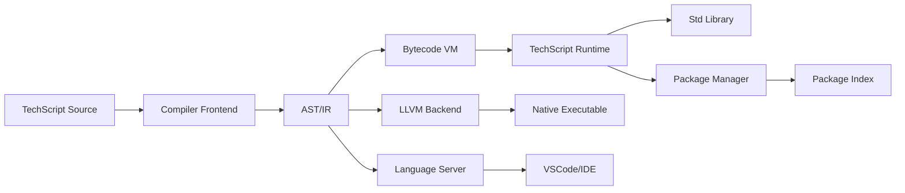

# Executive Summary  
TechScript aims to be a **beginner-friendly, full-stack scripting language** with English-like syntax and built‑in web capabilities (e.g. page-building APIs).  This report defines TechScript’s vision, use cases, language design (syntax, semantics, typing, concurrency, error model), and the minimal v1 feature set.  It then lays out a **Product Requirements Document (PRD)** and **Technical Requirements Document (TRD)** covering architecture, memory/performance targets, security, and interoperability.  We compare implementation options (Rust, C, Go, Python) and toolchains (LLVM, Cranelift, parser generators).  The compiler architecture is outlined with a Mermaid flowchart.  A phased roadmap (Interpreter → VM → native → self-hosting) is presented, with versioned milestones.  We also detail developer roles, testing/CI strategy, LSP/IDE support, package management design, and resource estimates.  Tables compare languages, VM vs native, GC strategies, and a prioritized deliverables checklist.  Finally, we give an **8‑week starter plan** for development.  All claims are cited from authoritative sources where possible.

## Vision & Use Cases  
TechScript’s **vision** is a *“simple, friendly programming language”* (as described on PyPI) that reads like English and lets users build web and desktop apps easily.  Key target use cases include:  
- **Educational Coding:** Teach programming fundamentals with natural syntax (e.g. `make x = ask "Name?"`).  
- **Rapid Web Development:** Provide built-in “page” APIs so even novices can generate web pages without HTML/CSS (e.g. `page.h1("Title")`).  
- **General Scripting:** Automate tasks (file I/O, math, loops) with clear keywords (`say`, `make`, `when`, `each`, `build`, etc.).  
- **Interactive Learning:** REPL support (`tech repl` command) to experiment with code live.  
- **Cross‑Platform Apps:** Run on Windows, Linux, macOS (and later mobile/desktop via GUI APIs).  
- **Data & AI Prototyping:** Integration with Python libraries or web APIs (future goal).  

These use cases emphasize *ease of use*, *readability*, and *productivity*, sacrificing minimal performance (see below).  In short, TechScript targets beginners and rapid prototypers who want a powerful yet accessible scripting experience.

## Language Goals

### Syntax and Semantics  
TechScript’s syntax is **English-like and high-level**.  It uses keywords instead of symbols (e.g. `make`, `say`, `when`, `each`, `build`, `model`, `attempt`, `web`).  Blocks use braces `{ }` (for loops, conditionals, functions) to structure code.  Examples from the current version include: 
```
// Variable and input:
make name = ask "What is your name?"
say f"Hello {name}!"
// Conditional:
when age > 18 { say "Adult"; } else { say "Minor"; }
// Loop:
each i in 1..10 { say i; }
// Function:
build greet(name) { say f"Hello {name}!"; }
// Class:
model Dog {
  make name = "Fido"
  fun bark() { say f"{self.name} says woof!"; }
}
// Error handling:
attempt { runRiskyOperation() } catch err { say f"Error: {err}"; }
```
Key semantic features: dynamic variable binding, first-class functions (`build`), objects/models, string interpolation (`f"..."`), and built‑in constructs for common tasks.  Control flow is expression‐oriented (no need for explicit `return` keywords in simple cases).  The language currently uses **dynamic typing** (like Python), meaning variables can hold any type and types are checked at runtime.  Concurrency (parallelism) is *not yet introduced* in v1; future versions may add `async/await` or `go`/`spawn`-style constructs.  The error model includes built‑in try/catch (`attempt/catch`) for exceptions (as shown above) and should produce clear error messages to beginners.

### Typing and Error Model  
TechScript will use **dynamic typing** initially, prioritizing simplicity over performance.  All variables and function arguments are untyped, with type errors caught at runtime (e.g. misuse of a function).  This matches the “Python-like simplicity” of current TechScript.  If needed, optional type annotations could be added later.  The exception model will handle run‑time errors via constructs like `attempt { ... } catch err { ... }`.  The compiler/interpreter should provide **helpful error messages** (line/column info, context).  

### Concurrency and Other Goals  
No specific concurrency model is planned for v1; the focus is sequential execution.  However, we should design with future **thread-safety** in mind.  Future goals may include asynchronous I/O or parallel constructs if demand arises.  Other long-term features might include modules, package imports, and a standard library (e.g. math, file I/O, web requests).  

### Minimal Viable Feature Set (v1)  
Version 1.0 of TechScript should include just enough to be usable:  

- **Basic Syntax:** Variables (`make`), printing (`say`), input (`ask`), arithmetic, booleans, strings, and f-strings.  
- **Control Flow:** Conditionals (`when`/`else`), loops (`each i in X..Y`), and a `repeat N` loop.  
- **Functions:** Define and call functions (`build name(args) { ... }`).  
- **Error Handling:** Try/catch with `attempt/catch`.  
- **Classes/Objects:** Basic `model` with fields and methods (optional for v1, since more complex).  
- **Simple Standard Library:** Enough built-in functions to support above (math ops, string formatting) and minimal `file` and `web` modules for I/O.  
- **Web Page API:** If “build websites” is a core selling point, include basic DOM-like calls (`page.h1`, `page.div`, `page.style`, etc.).  Otherwise, this can come in v1.1.  
- **Interactive REPL:** A REPL loop (`tech repl`) for testing code.  
- **CLI Tool:** `tech run file.ts` to execute a script, with a REPL prompt.  

Any features beyond this (GUI, concurrency, heavy optimization) can be slated for later versions.

## Product Requirements (PRD)

- **Objective:** Create a new version of TechScript that is robust, user-friendly, and independent of Python. The language should enable non-expert users to write programs in plain-English style, while supporting web and general app development.  
- **Stakeholders:** Tech enthusiasts, students/educators, developers seeking rapid prototyping tools, and the open-source community (new contributors).  
- **User Stories:**  
  - *As a new programmer*, I want to write `say "Hello"` to print text, so I can learn programming easily.  
  - *As a web builder*, I want to call `page.h1("Title")` in TechScript, so I can generate a web page without HTML.  
  - *As an installer*, I want a single `tech` binary, so TechScript runs independently on any OS (no Python needed).  
  - *As a contributor*, I want clear documentation and a modular codebase (lexer, parser, runtime), so I can extend the language.  

- **Product Features:** English-like syntax, robust standard library (web, math, I/O), cross-platform CLI tools, VSCode integration, package manager, and thorough documentation.  
- **Success Metrics:** Ease-of-use (survey new learners), performance benchmarks (compiled code should beat Python baseline), adoption (GitHub stars, PyPI downloads), and community contributions.

- **Constraints:**  
  - Must run on major OSes (Windows, macOS, Linux).  
  - Low friction for users: no heavy dependencies (except the runtime).  
  - Security and stability (no memory safety bugs).  

- **Assumptions:** No strict memory or performance targets beyond "reasonable for desktop scripting"; we assume modern PCs/phones, and that raw performance is less critical than usability. 

## Technical Requirements (TRD)

- **Architecture Overview:** TechScript will follow a standard compiler/interpreter pipeline: Source code → *Lexer* → Tokens → *Parser* → AST → *Semantic Analysis* → Intermediate Representation (IR) → *Optimizer* → *Code Generator* → Executable/Bytecode.  The system will consist of:  
  - **Front-end:** Lexer and parser (from a formal grammar), AST construction, semantic/type checking.  
  - **Intermediate:** An IR or AST that supports codegen to different backends.  
  - **Back-end:** Code generator to (a) bytecode VM or (b) native code via LLVM/Cranelift.  
  - **Runtime:** A minimal runtime library (memory management, built-ins, a garbage collector or memory model).  
  - **Developer Tools:** CLI tool (`tech`), REPL, LSP server for IDEs, and a package manager.  
  - **Modules:** Organize code into modules (lexer/parser/AST, codegen, VM, stdlib, CLI, LSP).

- **Memory/Performance:** Without specific constraints, target running on typical developer hardware (e.g. 8 GB RAM, multicore CPU). Initial interpreter should handle small scripts in <100 MB RAM; later compiled versions should use less memory per process. Aim for compiled TechScript programs to perform *at least* on par with similar scripting languages.  
- **Security:** Memory safety is paramount—**choose or design a runtime that avoids manual memory bugs**. Rust is a strong choice here (see *Implementation Languages* below). If using C or C++, rigorous static analysis/ASAN should be applied. Prevent code-injection and sandbox untrusted code (if a requirement). Use modern security practices (no fixed-size buffers, sanitize web inputs, etc.). TechScript’s security model will be comparable to other managed languages (e.g. Python/Go). Note that the current Python version had a crash; the new design should avoid that by using a safe language and thorough testing.  

- **Dependencies & Interoperability:**  
  - **Library Dependencies:** Use established parser/lexer libraries where possible. For example, Rust’s `pest` or `nom`, Go’s parser generators, or C’s Flex/Bison.  
  - **Interoperability:** Allow calling external libraries if needed. With Rust or C, FFI can link existing C libraries. If a Python compatibility mode is desired, embedding a Python interpreter (via PyO3 in Rust) could be added later.  
  - **Web Interop:** The runtime can generate HTML/CSS/JS or even serve web endpoints; however, it’s primarily a scripting language, not a web server. Interop with JavaScript (e.g. via WebAssembly) could be a future goal.  
  - **Platform:** Output native binaries on desktop, or compile to WebAssembly for the browser if needed (Rust excels at WebAssembly targets).  

- **Toolchain:**  
  - **Compiler Backend:** Recommended to use **LLVM** for maximum performance and platform support. LLVM IR allows powerful optimizations and reuse of its C and C++ codegen paths. An alternative is **Cranelift** (JIT-focused, faster compile times) if rapid iteration is needed, though it has fewer optimizations.  
  - **Parser/Grammar:** Define a formal grammar (PEG or LL(k)) and generate a parser. For example, Rust’s `pest` or `lalrpop`, or ANTLR for multi-language targets. This automates lexical analysis and parsing.  
  - **Build System:** Use Cargo (for Rust) or make/CMake (for C) for builds. CI with GitHub Actions for testing on each commit.  
  - **LSP:** Implement a Language Server (e.g. with Tower-LSP in Rust) to provide editor features.  
  - **VM (optional):** If a bytecode VM is chosen, decide on GC strategy (below).  

- **Architecture Diagram:**  
```mermaid
flowchart LR
    A["Source Code"] --> B(Lexer: Tokens)
    B --> C(Parser: AST)
    C --> D["Semantic Analyzer: Checked AST"]
    D --> E[IR/Bytecode Generation]
    E --> F["Optimizer (optional)"]
    F --> G{Code Generation Path}
    G --> H[Bytecode VM (Interpreter/VM)] 
    G --> I[LLVM/Native Code Generator → Executable]
    H --> End["Output Program (Bytecode)"]
    I --> End["Output Program (Native)"]
```
Each box is a compiler phase; the backend splits into either an interpreter/VM or native compilation path.  This modular design allows incremental development (e.g. start with the VM path for v1, add native codegen later).

## Memory & Performance Requirements  
We assume **modern development machines** (multi-core, ~8 GB RAM) as a baseline. No strict embedded or real-time constraints are specified. v1 (interpreted) should start up quickly and handle scripts under, say, 50 MB memory. v2 (bytecode VM) should improve speed and moderate memory (perhaps 10–100 MB per process). Eventually native-compiled programs should aim for low overhead (similar to Rust/C++ binaries). Initial performance target: *comparable to Python or JavaScript for simple tasks*.  Use profiling to identify bottlenecks.  

For memory management, the default is to **minimize memory leaks and fragmentation**. A garbage collector (GC) will likely be needed for dynamic allocations (objects, strings, etc.), unless using ownership (Rust) eliminates most leaks. Potential GC strategies: reference counting (with cycle handling), or a simple mark-and-sweep/boehm GC. We will analyze GC trade-offs later.

## Security Considerations  
- **Memory Safety:** Avoid buffer overflows, use-after-free, and other vulnerabilities. Rust inherently prevents these at compile time; if using C/C++, apply tools like AddressSanitizer.  
- **Injection Risks:** Since TechScript handles web output, ensure HTML and script outputs are escaped or sanitized to prevent XSS when embedding user content.  
- **Sandboxing:** If untrusted code execution is a goal, isolate the runtime (e.g. OS containers, limited syscalls).  
- **Dependencies:** Vet any third-party libraries for vulnerabilities (use tools like Safety for Python, cargo audit for Rust). TechScript’s PyPI page shows “no vulnerabilities found” in current code, but this will need to be repeated for the new code.  
- **Authentication/Crypto:** If not in scope for v1, skip, but future web features should consider HTTPS, CORS, etc.  
- **Overall:** Follow OWASP and CERT guidelines for language runtimes.

## Dependency & Interoperability Strategy  
- **Dependencies:** Keep external dependencies minimal for core. Use robust, high-quality libraries: e.g. `pest` or `nom` (Rust) for parsing, LLVM for codegen, popular JSON/HTTP libraries if needed.  
- **Module System:** Design a module/package system early. Users should `import foo;` or similar. A standard library (“stdlib”) will be bundled with the runtime.  
- **Foreign Function Interface (FFI):**  
  - If Rust: leverage `extern "C"` and `bindgen` to call C libraries. Potential to embed Python with `PyO3` if needed (but that reintroduces Python dependency).  
  - If Go: Cgo allows C calls, but Go lacks easy embedding of Python.  
  - If C: use `dlopen` and function pointers.  
- **Interop Examples:** Users could call OS APIs or libraries (e.g. networking, graphics) through a plugin mechanism in v2+.  
- **Binary Distribution:** Produce a standalone binary (statically linked) so TechScript runs without requiring a separate runtime installation.

## Implementation Language Trade-offs

| Language | Performance | Memory Safety | Ecosystem/Tooling | Developer Productivity | Notes |
|----------|-------------|---------------|-------------------|------------------------|-------|
| **Rust** | Very high (comparable to C)**** | Automatic (borrow checker, no GC) | Excellent (crates, LLVM backend), modern tooling | Moderate (steeper learning curve, but safe) | Strong choice for safety & speed; Cargo simplifies builds. |
| **C**   | Very high | Manual (prone to errors) | Mature (many libs, compilers), needs lexer/parser tools | Lower (manual memory management, security reviews needed) | C yields fastest runtime but highest risk. C+Flex/Bison is classic compiler approach. |
| **Go**  | Moderate-high (GC overhead) | Automatic (GC) | Good (concurrency support, static binaries), growing ecosystem | High (simple syntax, fast development) | Concurrency (goroutines) built-in, but GC may pause. Not traditionally used for compilers, but okay for interpreter/VM. |
| **Python** | Low (interpreted) | Automatic (ref-counting) | Very high (libraries, prototyping) | Very high (ease of coding) | Current TechScript is Python-based; great for prototyping but slow. New design aims to leave Python. |

**Citations:** Rust’s philosophy is “memory safety without garbage collection”, preventing null-deref and data races that plague C/C++. Python’s dynamic nature makes it easy to write code, but at a substantial performance cost. In summary: Rust offers the best speed and safety (trusted by systems projects), C offers raw speed but no safety, Go offers ease and concurrency at some performance cost, and Python offers ease at cost of speed.

## Recommended Toolchain  
- **Parser/Grammar:** Use a modern parser generator. In Rust: `pest` or `lalrpop`; in Go: `goyacc` or parser combinators; in C: `Flex/Bison`. This automates lexing/parsing.  
- **Compiler IR/Backend:** LLVM is recommended for native codegen. LLVM IR gives cross-platform code and optimization. For JIT or quick builds, consider **Cranelift** or **Wasm** as alternatives (lower optimization, faster compile).  
- **Bytecode VM:** If building a VM, one can design a simple stack-based bytecode (like Python) or reuse an existing VM (e.g. WASM runtime).  
- **GC/Memory Model:** Options include Rust’s ownership (no GC), reference counting, or a tracing GC. Rust’s model (if we write in Rust) means no GC and few surprises. If using a GC language (Go), rely on its built-in GC.  
- **Build/CI:** GitHub Actions for continuous integration (unit tests on each commit). Use code coverage and fuzzing tests (e.g. AFL, or property testing) to ensure robustness.  
- **IDE Support:** Leverage VSCode extension and implement LSP. For example, a Rust-based LSP can be built on the “languageserver” crate.  
- **Version Control:** Host on GitHub/GitLab to attract open-source contributions.  

## Architecture Diagrams  

**Compiler Pipeline:** The Mermaid flowchart above illustrates the main compilation stages.  Notably, we plan a hybrid approach: v1 may start as an **interpreter/transpiler** (translating TechScript to C or Python) for speed of development, then add a *bytecode* stage, and finally *native* codegen (LLVM).  

**Module Interaction:**  

- **Compiler Frontend:** produces an AST/IR.  
- **Backend Paths:** either execute in a Bytecode VM (D1→E) or compile to native (D2→G).  
- **Runtime/StdLib:** Provides built-in functions and memory management.  
- **LSP/Editor:** The language server communicates with IDE for intellisense.  
- **Package Manager:** Manages libraries; connects to an online registry.

## Phased Roadmap  

We propose incremental, versioned milestones:

- **v1.0 (Interpreter, Q4 2026):** Build the basic interpreter in Rust (or chosen language) that can run TechScript code. Implement core syntax (vars, control flow, functions). *Citing strategy:* Begin by transpiling to an existing language or building a simple interpreter.  
- **v1.1 (Bytecode VM, Q1 2027):** Implement a bytecode compiler and VM for faster execution. This leverages a standard compiler backend approach. Add key library modules (web API, file I/O).  
- **v1.2 (Tools & Stability, Q2 2027):** Develop the VSCode extension and LSP support. Release initial docs and tests. Stabilize syntax and error messages.  
- **v2.0 (Native Compiler, Q3 2027):** Integrate LLVM backend (or native codegen) for high-performance builds. Optimize critical library routines.  
- **v2.1 (Ecosystem, Q4 2027):** Launch the TechScript package manager (e.g. `techpm`). Build community repositories.  
- **v3.0 (Self-Hosting, 2028):** Rewrite the compiler in TechScript itself, achieving self-hosting. At this point, the language is mature and can bootstrap itself. Provide advanced features (async I/O, concurrency).  

```mermaid
flowchart LR
    A[Interpreter (v1.0)] --> B[Bytecode VM & StdLib (v1.x)]
    B --> C[Native Compiler (v2.0)]
    C --> D[Self-Hosting (v3.0)]
```
Each arrow indicates progression to the next major phase.

## Developer Roles & Resources  
Building TechScript will likely require a small team:  
- **Language Designer:** Defines syntax/semantics and documentation.  
- **Compiler Engineers (2+):** Implement the frontend (lexer/parser), IR, and backend (bytecode/LLVM).  
- **Library Developers:** Write and maintain the standard library (web APIs, utils).  
- **Tooling/DevOps:** Setup CI/CD, testing frameworks, package index.  
- **IDE/LSP Engineer:** Develop LSP server and maintain the VSCode extension.  
- **Quality Assurance:** Write tests (unit, integration, fuzzing) and perform code reviews.  

Early on, a 3-4 person core team (mix of compiler and full-stack devs) could kick off the project. Over time, community contributors can add libraries, docs, and platform ports.

## Testing & CI Strategy  
- **Unit Tests:** Each compiler module (lexer, parser, VM) should have thorough tests covering edge cases.  
- **Language Tests:** A corpus of TechScript scripts (hello world, algorithmic snippets, web demos) to verify correctness.  
- **Fuzz Testing:** Use input fuzzers (e.g. AFL, Honggfuzz) on the parser and VM to find crashes.  
- **Continuous Integration:** Automate builds on GitHub Actions for all platforms. Run linting, formatting (e.g. `rustfmt`), and tests on every commit.  
- **Static Analysis:** Tools like Clippy (Rust) or Coverity to catch common bugs.  
- **Code Reviews:** All changes peer-reviewed for quality and security.  

This ensures stability and helps prevent regressions (key after the original code loss).

## Editor Integration (LSP) & VSCode Extension  
We plan a Language Server Protocol implementation so editors can provide autocomplete, go-to-definition, hover docs, and linting. The existing VSCode extension (syntax highlighting, runner) will be updated:  
- **Syntax highlighting:** Adapt to new grammar.  
- **Snippets:** Keep or improve code snippets for common patterns.  
- **LSP Features:** Implement using a Rust or Go LSP library (e.g. `rust-analyzer` style or VSCode Node LSP). The LSP lets any editor (VSCode, Vim, etc.) use TechScript services via JSON-RPC.  

We will maintain the extension on the VSCode Marketplace and support `tech run` integration, REPL, and debugging hooks.

## Package Manager Design  
TechScript needs a package manager (like pip, npm, cargo) for libraries. Key points:  
- **Repository Index:** A central registry (e.g. `registry.techscript.org`) or use GitHub.  
- **Commands:** `tech install foo`, `tech publish`.  
- **Versioning:** Use semantic versioning (vMAJOR.MINOR.PATCH) for packages.  
- **Dependencies:** Support dependency graphs and vendoring.  
- **Lock File:** Track exact versions for reproducible builds (optional v2 feature).  
- **Distribution:** Packages are plain TechScript code or compiled libs (like shared objects for FFI).  

Design the spec early so core developers can import standard libraries with ease.

## Estimated Effort & Requirements  
- **Initial Development:** Assuming 3 developers full-time, v1 (interpreter) may take ~3–4 months. Bytecode VM and tools another 3 months. Native backend and self-hosting add another 6–9 months. In total, this could be ~1–2 developer-years. (For reference, historical compilers like FORTRAN I took ~3 years with a team, though modern tools speed it up.)  
- **Code Size:** Expect on the order of 50–200K lines of code for a full compiler+runtime (most languages’ compilers fall in this range).  
- **Hardware:** Development on any standard PC (4–8 cores, 16 GB RAM). Compiling TechScript itself might require additional RAM (LLVM can use ~4–8 GB for heavy optimization), but not abnormal. The runtime should run on devices with as little as 256 MB for simple scripts (no special GPU needed).  
- **Build/Runtime Memory:** The compiled `tech` binary should fit in <50 MB. Runtime memory per process should scale with workload (string buffers, objects) but aim for small-footprint scripts to use <50 MB RAM.

## Migration from Current Python-based TechScript  
To transition from the old TechScript (Python) to the new runtime:  
- **Syntax Compatibility:** Maintain the same surface syntax and keywords, so existing scripts run without change.  
- **Semantics Testing:** Create test suites from the old implementation to verify the new one behaves identically.  
- **Gradual Deprecation:** Announce that Python-mode is legacy; encourage users to upgrade.  
- **Bootstrapping:** In v1, the new compiler could accept Python/TechScript code directly. Eventually retire the Python codebase entirely once the Rust/C version is stable.  

This ensures a smooth migration for users and reuse of existing community code.

## Implementation Language/VM vs. Native/GC Tables  

**Implementation Language Comparison:**

| Language | Speed | Safety | Ease of Use | Ecosystem | Notes |
|---|---|---|---|---|---|
| **Rust** | Very fast | Memory-safe (no nulls, no data races) | Moderate (steep learning, but expressive) | Excellent (crates, LLVM) | Best for performance/safety; recommended. |
| **C** | Very fast | Unsafe (manual malloc/free) | Hard (pointer bugs) | Mature (lots of legacy code) | Risky due to bugs; only use with many safeguards. |
| **Go** | Fast (GC overhead) | Memory-safe (GC, no pointer arithmetic) | Easy (simple syntax) | Good (concurrency, static binaries) | Good for quick tools, but not typical for compilers. |
| **Python** | Slow (interpreter) | Safe (GC, dynamic) | Very easy | Massive (PyPI ecosystem) | Currently used for prototype; too slow for final runtime. |

**VM vs. Native Compilation:**

| Strategy | Pros | Cons |
|---|---|---|
| **Transpile to C/JS** | Very quick to implement; leverages existing compilers and libs | Dependent on external toolchain; performance limited by target language. |
| **Bytecode VM** | Portable (write once, run on any platform); allows JIT/optimizations; simpler than full native | Slower than native; need to implement/maintain VM and GC. |
| **Native (LLVM)** | Best raw performance; small runtime; direct hardware access | Hardest to implement correctly; longer compile times. |

**Garbage Collection Strategies:**

| GC Strategy | Description | Pros | Cons |
|---|---|---|---|
| **Manual (no GC)** | Developers manage memory (like Rust’s ownership) | Zero runtime overhead; deterministic | Complex ownership rules; steep learning (but Rust handles it). |
| **Reference Counting** | Each object has a counter; delete when 0 | Simple concept; deterministic destruction | Overhead on each reference; cycles must be handled separately (cycle collector). |
| **Tracing GC (Mark-Sweep)** | Periodically traverse live objects and reclaim rest | Handles cycles automatically; frees developer from manual memory | Pause times; possibly non-deterministic. |
| **Generational GC** | Optimizes by assuming most objects die young (used by Go, Java) | Reduces pause times; efficient for typical workloads | More complex to implement (young/old generations). |

*Note:* Rust’s ownership model effectively gives “no GC” behavior. If we use Rust, we may skip a traditional GC. If we use Go, we inherit Go’s GC. If using a bytecode VM (like Python), a tracing GC might be added.

## Deliverables Checklist  
- [ ] **Grammar Specification:** Formal grammar for TechScript syntax (for parser generator).  
- [ ] **Language Reference / Spec:** Document describing syntax, semantics, built-in types and functions.  
- [ ] **Technical Design Docs:** PRD, TRD, architecture diagrams (this document).  
- [ ] **Prototype Interpreter:** Initial implementation (possibly transpiling to C/Python).  
- [ ] **Lexer/Parser:** Generated from grammar (e.g. with pest or Flex).  
- [ ] **AST & IR:** Data structures for parsed code.  
- [ ] **Runtime & StdLib:** Core library modules and built-ins.  
- [ ] **Bytecode VM:** Design and implementation for performance.  
- [ ] **Native Codegen:** Integration with LLVM/Cranelift for v2.  
- [ ] **VSCode/LSP:** Extension update and language server.  
- [ ] **Testing Suite:** Unit tests for each compiler stage, example programs, fuzz tests.  
- [ ] **CI/CD Pipeline:** Automated builds and tests on commit (GitHub Actions).  
- [ ] **Package Manager:** Basic package index and CLI.  
- [ ] **Documentation:** Tutorials, API docs, installation guides.

## 8-Week Starter Plan  

**Week 1–2:** Define the **formal grammar** (BNF) and write a spec. Set up the repository and development environment. Choose implementation language (recommend Rust) and basic build system. Begin a simple lexer (using a generator or regex-based).  
**Week 3–4:** Develop the **parser** and AST structures. Implement parsing for core constructs (variables, expressions, `say`, `ask`). Start on a REPL/CLI scaffold. Write tests for lexer/parser on small code snippets.  
**Week 5:** Implement the execution engine: either an interpreter loop or a transpiler to a host language. Make `say`, arithmetic, and basic control flow (`when`/`each`) work. Continuously test with simple “Hello world” programs.  
**Week 6:** Add **functions (`build`), error handling (`attempt/catch`), and the standard library skeleton**. Build more tests (recursive functions, nested loops).  
**Week 7:** Integrate basic **web APIs**: e.g. define `page.h1()` and `page.run()`. Test generating a simple web page. Ensure the runtime can emit HTML/CSS.  
**Week 8:** Polish the interpreter, fix bugs, and prepare v1.0 alpha. Write documentation for the prototype, and begin work on the VSCode syntax highlighting file. Plan the next phase (bytecode VM design).  

By following this schedule, the team will have a functional language interpreter within two months, enabling user testing and community feedback.

