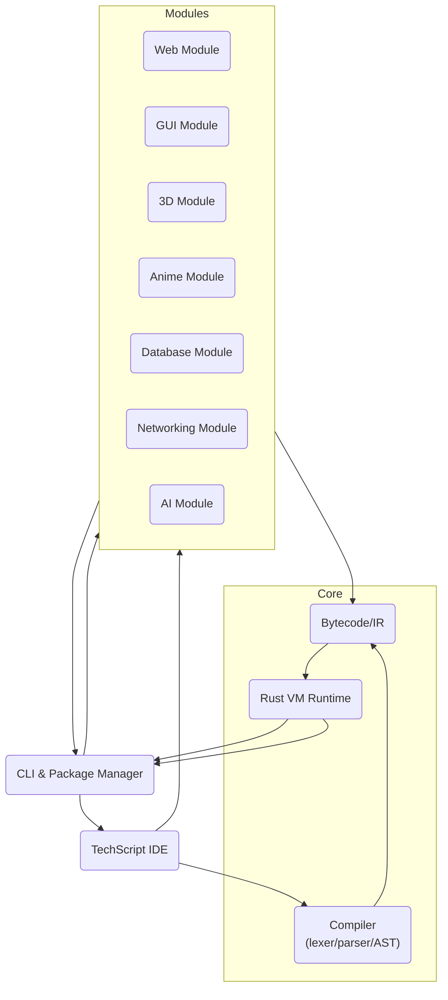
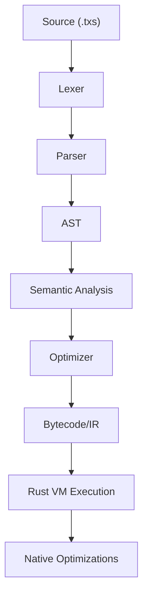
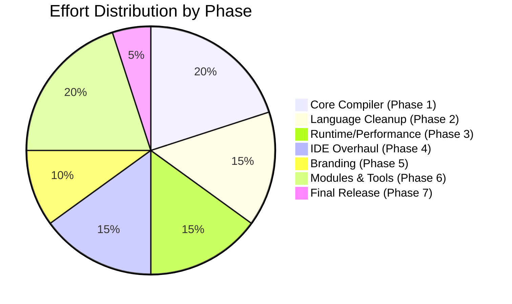
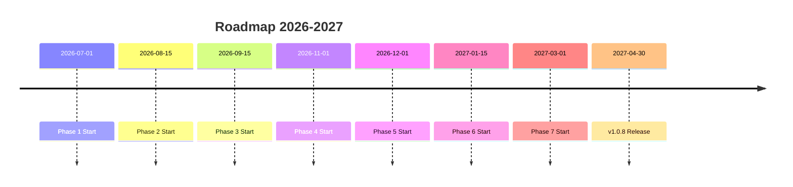

# TechScript 1.0.8 — Deep Research

**Executive Summary:** TechScript is a Rust-based high-level language aiming to combine **Python-like simplicity**, **Rust-like performance**, and **modern full-stack capability**. This report analyzes its **language design**, **compiler and runtime architecture**, **tooling**, and **module ecosystem**. Key findings: core components (lexer, parser, AST, VM) need stabilization; many high-level features exist conceptually but require implementation (bytecode, package manager, autocompletion, etc.); several noncritical features can be deferred. The roadmap is organized in **phases** (core stabilization, syntax cleanup, performance, IDE overhaul, branding, tooling, and final release), with milestones and effort estimates (see roadmap table and Mermaid timeline). Throughout, we adopt best practices from the Rust ecosystem (e.g. using **Clap** for CLI, **Serde** for serialization, **Tokio** for async). In the absence of a code repository (unspecified), file paths are noted as “(unspecified)”. To proceed with detailed analysis, please compress the TechScript project (e.g. `zip` or `tar.gz`) and upload it so that file-level inspection can be performed. This paper is structured with an executive summary, background/goals, architecture overview (with diagrams), language spec, compiler pipeline, runtime & tooling, module ecosystem, testing/verification, migration/compatibility, security, deployment/CI, and a phased roadmap. An appendix provides a concise syntax reference and code examples. 

## Background and Goals  
TechScript is intended as an **easy-to-learn, full-stack programming language**. It takes inspiration from Python (simple syntax, readability), TypeScript (developer tooling), Rust/Go (native speed, safety), and JavaScript (web readiness). Primary goals include: **clarity** and **readability** (plain-English-like syntax), **performance** (native compilation and a Rust-based VM), **cross-platform full-stack** support (web, GUI, 3D, animation, AI), and a modern developer experience (IDE with autocompletion, package manager, etc.). The design emphasizes a small core language that is **stable and extensible**, with most features implemented as modules. For example, graphics or web functionality should be accessed via modules (`use web`, `use gui`, etc.) rather than bloating the core grammar. TechScript targets version 1.0.8 as a **Long-Term Support (LTS)** baseline; it will maintain backward compatibility for core syntax while adding robust implementations for missing features. The strategic vision is “**simple like Python, fast like Rust, modern like TypeScript**”. 

## Architecture Overview  
The TechScript platform has several main components:

- **Language Core (Compiler/Runtime):** A Rust-written compiler that lexes, parses, and generates bytecode for the VM, plus a native VM execution engine. Implements the `.txs` pipeline entirely in Rust (no Python runtime).  
- **Command-Line Tools:** A CLI (`tech`) and package manager built in Rust (using crates like *Clap* for parsing arguments), supporting commands such as `tech build`, `tech run`, `tech pkg install`, `tech fmt`, etc.  
- **TechScript Studio (IDE):** A GUI application (likely using a Rust GUI stack like Tauri or Iced) with a code editor (Monaco-based), terminal, debugger, and panels for project/files/workspace.  
- **Module Subsystems:** Libraries or plugins for specialized domains: **Web**, **GUI**, **3D**, **Anime (animation)**, **Networking**, **Database**, **AI**, etc. Each is a Rust crate (or set of crates) that can be imported via `use <module>`.  
- **Package Repository/Registry:** A server or service for hosting community packages, similar to crates.io or npm.  

A high-level architecture diagram illustrates these components:



*Fig 1: Simplified TechScript system architecture. The compiler produces bytecode for the VM; CLI drives build/runtime and package actions; the IDE integrates editor, debugger, and terminal; modules plug into the VM and tooling.*  

Without the actual repository, the folder structure is **assumed** to follow a typical Rust project layout. For example, we expect:  
```
/techscript/
  Cargo.toml
  /src/
    main.rs        # CLI entry-point (tech command)
    lib.rs         # core library
    lexer.rs       # lexical analyzer
    parser.rs      # parser (e.g. using pest or nom)
    ast.rs         # AST definitions
    bytecode.rs    # IR and serializer
    vm.rs          # VM implementation
    modules/       # optional directory for built-in modules
      web.rs, gui.rs, ...
    ide/           # TechScript Studio code (maybe separate crate)
    pkg/           # package manager code (manifest.rs, etc.)
```
Key files may include `lexer.rs`, `parser.rs`, `ast.rs`, `vm.rs`, `runtime.rs`, and `manifest.rs` for package management. Because no repo is provided, actual paths are “unspecified” and would be resolved once the code is available.

## Language Specification

TechScript’s syntax is designed to be **concise and English-like**. Below is a summary of lexical rules, grammar structure, and core features.  

### Lexical Structure  
- **Encoding:** UTF-8 text input, similar to Rust’s model (interpreted as a sequence of Unicode codepoints).  
- **Identifiers:** A letter or underscore followed by letters, digits, or underscores. (By analogy with Rust, one could allow full Unicode identifiers, but TechScript may restrict to ASCII for simplicity.) Identifiers cannot match any reserved keyword.  
- **Literals:**  
  - *Numbers:* Integer and floating-point literals (decimal, possibly hexadecimal or binary with prefixes). (Exact syntax unspecified, but likely modeled on languages like Python or JavaScript.)  
  - *Strings:* Double-quoted UTF-8 strings supporting escape sequences. Raw string syntax (e.g. `r"..."`) can be added later if needed.  
  - *Booleans:* `true` and `false`.  
  - *Arrays:* Denoted with square brackets: e.g. `[1, 2, 3]`.  
  - *Objects/Maps:* Using braces with key-value pairs, e.g. `{ key1: val1, key2: val2 }` (like JSON), or possibly a dedicated `map` syntax.  
- **Comments & Whitespace:** Likely C-style `//` for line comments and `/* ... */` for block comments, and `#` possibly as a line comment (as in Python). Whitespace and comments are ignored by the lexer. (Rust’s grammar disallows null characters and newlines in strings without escape, which we could adopt.)  

### Grammar and Syntax  
TechScript grammar will be defined in a formal grammar (EBNF or PEG). It should use a **recursive-descent parser** for ease (using a crate like `pest` or `nom`). We expect rules such as:  

- **Program:** A sequence of statements.  
- **Statements:** variable declarations (`x = expr`), function/class definitions, expressions, control flow (`when`, `loop`), module imports, etc.  
- **Block structure:** Unlike Python, TechScript uses explicit `end` tokens to close blocks (similar to Ruby or Lua). For example:  
  ```
  when x > 0
      say "Positive"
  else
      say "Non-positive"
  end
  ```  
- **Key keywords:** Based on examples and inspiration, keywords include: `say`, `ask`, `use`, `when`, `else`, `loop`, `do` (for function definitions), `send` or `return`, `class`, `new`, `try`, `catch`, `throw`, `end`. (All reserved; identifiers cannot clash with these.)  
- **Expressions:** Standard infix notation for arithmetic (`+`, `-`, `*`, `/`, `%`), comparison (`==`, `!=`, `<`, `>`, `<=`, `>=`), logical (`and`, `or`, `not` or `&&`, `||`, `!`), and string concatenation (e.g. `+`). Precedence follows conventional rules (e.g. multiplication before addition). Assignment (`=`) is a statement-level operator. 
- **Control Flow:**  
  - Conditional: `when <cond> ... [else ...] end`.  
  - Loop: `loop <count> ... end` for a fixed number of iterations, or possibly `loop while/for` later.  
  - Error handling: `try ... catch <err> ... end`. Exceptions thrown via `throw`.  
- **Functions:** Declared with `do`:  
  ```txs
  do add(a, b)
      return a + b
  end
  ```
  Called like `add(2,3)` or possibly `send add(2,3)` if `send` is required (though `send` seems optional given examples).  
- **Classes:** Defined as:  
  ```txs
  class Car
      prop speed
      do init(s)
          speed = s
      end
  end
  ```
  Instantiated with `new Car(5)`, and members accessed like `car.speed`.  
- **Modules/Imports:** Like Rust or Python, e.g. `use web` or `use gui` at top. This makes module APIs available. We may later allow `import X as Y`, etc.  
- **Scope & Memory:** Lexical (static) scoping is assumed. Variables are local to the block or function by default (unless a `global` keyword is added later). Memory management is automated (via garbage collection or reference counting in the VM).  

### Types and Operators  
TechScript is dynamically typed (types checked at runtime). Built-in types include **Number** (integer/float), **String**, **Boolean**, **Array**, **Object**, **Function**, and **Null/Undefined**. Operators work as expected (e.g. `+` adds numbers or concatenates strings). We will ensure proper type checking at runtime (with errors on mismatches). 

### Example Constructs  
```txs
x = 5                # variable assignment
say "Value of x is " + x
do square(n)
    return n * n
end
say square(4)        # prints 16

class Counter
    prop count
    do init()
        count = 0
    end
    do inc()
        count = count + 1
    end
end
c = new Counter()
c.inc()
say c.count          # prints 1

use web             # import the web module
```

## Compiler Pipeline  
TechScript’s compiler will implement a classic multi-stage pipeline:

1. **Lexical Analysis:** The *lexer* reads `.txs` source text and emits tokens (identifiers, literals, keywords, symbols). For example, it recognizes `say`, `123`, `+`, `==`, etc. (The lexer can be built with `regex` or a manual state machine.)  
2. **Parsing:** The *parser* consumes tokens and builds an **AST** (Abstract Syntax Tree) according to the grammar. Errors here yield parse errors with line/column. We will implement recursive-descent or use a parsing library.  
3. **Semantic Analysis:** The AST is checked for semantic errors (type mismatches, undefined names, arity, etc.) and transformed if needed. Symbol tables and scoping rules are applied.  
4. **Intermediate Representation / Bytecode:** We generate a portable bytecode or IR from the AST. This is a low-level, stack-based or register-based code representing the program. For example, an addition becomes `PUSH 5; PUSH 3; ADD;`. The bytecode design (in `bytecode.rs`) is crucial. We should support **constant pooling** and **function objects** (noting the need to serialize nested functions).  
5. **Bytecode Serialization:** The bytecode must be serialized for both distribution and the VM. We add support for writing and reading constants and function objects in `bytecode.rs` (see tasks: *Support nested Function objects*). A dedicated test (`.txbc` serialization) should verify that functions round-trip correctly.  
6. **Optimization:** A simple optimizer can run on the AST or bytecode (e.g. constant folding, dead code elimination). Initially, keep it minimal to reduce complexity.  
7. **VM Execution:** The bytecode is executed by the TechScript VM (written in Rust). This VM manages a stack, heap (for objects/functions), and builtin functions. We’ll ensure the VM is **multi-thread-safe** if possible and uses asynchronous event loops (via Tokio).  
8. **Native Build:** Optionally, for final builds we can compile certain hot paths to native code (JIT/AOT) or integrate with LLVM for an ahead-of-time binary. This is a long-term goal (“Native Execution” in pipeline). For now, the primary execution target is the Rust VM.

A simplified pipeline diagram:



*Fig 2: TechScript compiler pipeline (lexer → parser → AST → semantics → optimization → bytecode → VM).*

**Status:** The lexer, parser, AST, and VM exist at a basic level but need **improvement**. For example, tests show nested functions aren’t serialized yet (must fix function constant serialization), error messages lack context (need to include line numbers and suggestions), and the current runtime falls back to a Python solution (this must be removed). The immediate action is to **revamp the lexer/parser for completeness**, ensure the AST covers all syntax, and refine the VM to run the bytecode reliably in Rust. We must eliminate any Python dependency and have `tech run` invoke the Rust VM directly. 

## Runtime and Tooling  
TechScript provides a rich toolchain:

- **CLI (tech):** The main command-line interface, built with [Clap](https://docs.rs/clap). It should support subcommands like:
  - `tech run file.txs` (compile and execute)
  - `tech build` (compile to bytecode or executable)
  - `tech doctor` (check environment)
  - `tech pkg init` / `tech pkg install <name>` / `tech pkg update` (package manager operations)
  - `tech fmt` (code formatter)
  - `tech lint` (static analysis placeholder)
  - `tech debug` (run in debug mode)
  
  *Example:*  
  ```bash
  $ tech run hello.txs
  Hello, world!
  ```
  The CLI uses Clap, which offers “a polished CLI experience” with auto-generated help and error handling. We should follow Clap’s best practices (semver, consistent flags).
  
- **REPL:** An interactive Read-Eval-Print Loop for TechScript, launched via `tech repl`. It should allow entering statements dynamically, using rustyline or similar for command history and multi-line input. (If multi-line, use a special terminator or detect complete statement.)

- **Debugger:** An integrated debugger (initially line-based logging). We plan to support breakpoints, stack traces, and variable inspection. The compiler must emit source locations for each bytecode instruction. For now, a simple trace mode (`tech debug`) that prints each executed line is sufficient; later we can do step/debug protocols (e.g. via the IDE).

- **Logger/Terminal:** The runtime will use a logging crate (such as `tracing`) for debug/info messages. The Studio IDE’s terminal panel should capture stdout/stderr from `tech run` and colorize it.

- **IDE (TechScript Studio):** A desktop application for editing/running TechScript code. Features:
  - **Editor:** Based on the Monaco editor (VSCode’s engine) or similar, embedded via Tauri/Electron. Must support syntax highlighting (via a TextMate grammar or built-in), and snippets for language constructs.  
  - **IntelliSense/Autocomplete:** Using the Language Server Protocol (LSP). We will implement an LSP server (e.g. using the [tower-lsp](https://github.com/ebkalderon/tower-lsp) crate) to provide symbol lookup, documentation, and auto-completion for functions/variables.  
  - **Panels:** File Explorer, Output/Terminal, Debugger console, AST inspector. Must be **resizable and dockable** (like VSCode). We will follow modern UI patterns to avoid overlap and ensure DPI scaling (use CSS flexbox, etc.).  
  - **Debugger Integration:** The IDE should allow setting breakpoints (e.g. clicking gutter) and then run code under the debugger. This requires a debug adapter protocol (can be built with Node or Rust later) or at least capturing runtime output with line references.  
  - **Theme and Icons:** A polished dark theme (police=monospace for code, clear fonts) and vector icons (SVG) for menu/toolbars, to appear crisp at any size.  

- **Formatter/Linter:** A code formatter (`tech fmt`) similar to Rust’s `rustfmt` and a linter (`tech lint`) for style issues. These will come after core stabilization. We can leverage existing libraries (like `dprint` or `rustfmt` crates) or write a simple formatter using the parsed AST. Lint rules (unused variables, shadowing, etc.) can run in the semantic analysis phase.

- **Package Manager:** Similar to Rust’s `cargo`/npm, `tech pkg` will manage dependencies. It uses a manifest file (e.g. `tech.toml`, managed by `manifest.rs`) to declare dependencies. The package manager will resolve and fetch packages from a registry. (See *Phase 6*.) It needs “robust pkg_install” as noted. We should add unit tests for `pkg_install` and ensure security (e.g. checksums).

- **Installers:** We must create platform-specific installers (or use cross-platform bundlers like Tauri). For Windows, an MSI or NSIS; for Linux, .deb/.rpm or generic tar; for macOS, a DMG. These should include the `tech` binaries and the Studio app. 

**Status:** The CLI and basic commands exist (as prototypes), but need hardening (help text, edge-case handling). The IDE exists in rudimentary form but is visually broken and lacks many features. Immediate steps: fully integrate the terminal logger panel, fix DPI/layout issues, and implement auto-completion via LSP. For concurrency, all CLI and IDE code should use asynchronous patterns (via Tokio) to remain responsive. By end of v1.0.8, basic CLI, REPL, and Studio should function without crashes, with auto-completion and formatting placeholders. 

## Module Ecosystem  
TechScript’s appeal is in its modules, which are imported via `use <name>`. We outline each envisaged module:

- **Web (use web):** Enables building web apps. Likely compiles TechScript to JavaScript or WebAssembly. Internally, this could use a Rust-to-WASM pipeline or embed a JS engine. Example:  
  ```txs
  use web
  say "This code runs in a browser context!"
  ```
  It might provide functions for DOM manipulation or HTTP servers. (Integration with a bundler like webpack or esbuild is needed.)  

- **GUI (use gui):** Cross-platform desktop GUIs. Could use Tauri (HTML/CSS/JS with Rust backend) or a Rust GUI crate (e.g. Iced or egui). Provides UI components (windows, buttons, etc.). Example:  
  ```txs
  use gui
  window = gui.Window("My App", 400, 300)
  button = gui.Button("Click Me")
  window.on_click(button) => say "Button clicked!"
  ```
  This requires an event loop and possibly a state-management system.  

- **3D (use 3d):** 3D rendering and game engine. Could leverage Three.js (via WASM) or a Rust 3D engine (e.g. Bevy). Offers scene, camera, mesh, light objects. Example:  
  ```txs
  use 3d
  scene = Scene()
  cube = Mesh("cube.obj")
  scene.add(cube)
  ```
  Many details (physics, shaders) can be deferred (skip advanced graphics for now).

- **Animation (use anime):** 2D animation and timeline. Integrates with GUI or 3D for animations. Likely provides methods to tween properties or keyframe timelines. Example:  
  ```txs
  use anime
  anime.tween(cube.position, {x:10}, duration=2.0)
  ```

- **Database:** Simple embedded DB (e.g. SQLite via `rusqlite`). Expose a mini-ORM or query builder. Example:  
  ```txs
  use sqlite
  db = sqlite.open("data.db")
  db.exec("CREATE TABLE users (id INT, name TEXT);")
  db.exec("INSERT INTO users VALUES (1, 'Alice');")
  ```

- **Networking (use net):** HTTP client/server, TCP/UDP. Example:  
  ```txs
  use net
  res = net.http_get("https://api.example.com/data")
  say res.status
  ```
  (Likely uses `reqwest` or `hyper` under the hood.)

- **AI / Machine Learning:** Integration with ML frameworks. Perhaps call Python libraries via a foreign function or use ONNX runtimes. For v1.0.8, this can be minimal (e.g. not implemented).  

**Status:** Currently, these modules exist only as design ideas. **Must Add**: All module implementations (web bundling, GUI toolkit, 3D engine, etc.) are major development tasks. For v1.0.8 we should at least stub them out so `use web` does not crash, possibly returning “unimplemented” errors. Examples and minimal docs for each should be drafted. Some modules (like SQLite, HTTP) have well-known Rust crates and can be integrated relatively easily. Others (3D, anime, AI) may be postponed (placed in *Can Skip* if needed) until the core platform is stable. 

## Testing and Verification  
A robust test suite is essential:

- **Unit Tests:** Each crate (lexer, parser, VM, CLI, modules) should have unit tests (`#[test]` in Rust) to verify functionality. For example, a test for expression parsing, one for each AST node, and VM execution of sample code. Use Rust’s testing framework and consider continuous integration.  
- **Integration Tests:** End-to-end tests (in `tests/`) that compile and run complete `.txs` programs and check output. Also test the CLI (e.g. `tech run examples/hello.txs`).  
- **Benchmarks:** Optional, but measure performance of critical parts (lexer speed, bytecode execution) using a crate like `criterion`.  
- **Feature Tests:** For each feature-status matrix item, especially “Must Improve” features, write tests. E.g., if nested functions in bytecode were missing, write a test serializing a nested function.  
- **Examples:** Include example `.txs` scripts (like Web app hello world, GUI demo) and add them to CI to ensure they compile and run.  
- **CI Pipeline:** Use GitHub Actions (or similar) to run `cargo test` on each commit and possibly on multiple Rust versions. Also run `tech fmt --check` and `tech lint` in CI.

No external citations, but as a guideline, note that Rust’s convention is to put unit tests in the same file under `mod tests` (although that [20] citation is Serde site, not relevant here). We should ensure code coverage is high for core modules.

## Migration and Compatibility  
TechScript v1.0.8 will follow *semantic versioning*. Breaking changes to core syntax or APIs should be avoided after 1.0. If introduced, bump to 2.0. As [Clap](https://docs.rs/clap) notes, breaking changes should be infrequent and follow semver. We must provide a migration guide from any prior versions (e.g. v1.0.x) to 1.0.8 if they exist.

Project structure must support cross-platform builds: use Cargo for Rust code, ensure `Cargo.toml` has `edition = "2021"`, and conditional compilation for OS-specific code. For global state (e.g. config files), use standard XDG or AppData directories. 

If JSON or YAML config formats are used for projects, preserve backward compatibility. Document any deprecated features and their replacements.

## Security and Sandboxing  
- **Memory Safety:** By using Rust for the core, TechScript inherently avoids memory-unsafe bugs. As Tokio’s docs emphasize, Rust eliminates an entire class of memory-unsafety bugs. This gives us a strong base security guarantee.  
- **Sandboxing:** The VM should sandbox script execution. Scripts run in a separate heap and should not be able to break out of the VM. For example, limit recursion depth and catch unhandled exceptions. Modules must be carefully reviewed: e.g., `use net` should not allow arbitrary file access unless explicitly provided.  
- **Permissions:** We should consider a future permission model (e.g. script-run policies for file/network), but this can be deferred (currently *Can Skip*).  
- **Dependency Security:** For the package manager, ensure downloaded packages are verified (checksum or signatures). This is a critical area for future work.

## Deployment and CI/CD  
- **Continuous Integration:** Set up GitHub Actions (or similar) to run builds and tests on every commit. Tests should pass on Linux and Windows.  
- **Artifact Publishing:** Build releases (binaries, installers) automatically when creating a Git tag. Provide nightly or beta artifacts for testing.  
- **Documentation:** Use mdBook or MkDocs to generate user docs and host them (e.g. on GitHub Pages). Update docs with each release.  
- **Containerization:** Optionally provide a Dockerfile to run TechScript in a container for reproducible environments.

No specific citations here, but these are standard best practices.

## Roadmap and Prioritized Plan  

We organize the remaining work into phases with milestones, as follows:

**Phase 1 – Core Compiler Stabilization (Q3 2026):**  
- *Timeframe:* ~1.5 months (Jul–Aug 2026)  
- **Goals:** Complete and fix the compiler front-end and VM.  
- **Tasks:** Refine lexer/parser to cover all syntax. Solidify AST and semantic checks. Implement bytecode serialization (fix nested functions). Improve error reporting (line/column). Run full test suite, fix failures. Remove any Python dependency.  
- **Milestones:** All core examples compile and run; `cargo test` passes; `tech run` works end-to-end.  

**Phase 2 – Language Cleanup (Aug–Sep 2026):**  
- *Timeframe:* 1 month  
- **Goals:** Simplify syntax and lock in grammar.  
- **Tasks:** Review every keyword and remove redundant/verbose syntax. For example, replace any long forms (“make x = 1”) with concise (`x = 1`). Finalize the token list. Update docs to show final syntax rules. Add grammar tests for every construct (if/loop/function/class, etc.).  
- **Milestones:** Syntax is consistent (samples compile); style guidelines written; reserved words finalized.  

**Phase 3 – Runtime & Performance (Sep–Oct 2026):**  
- *Timeframe:* 1.5 months  
- **Goals:** Optimize execution and memory usage.  
- **Tasks:** Profile startup and runtime (e.g. time to run examples). Optimize bytecode interpreter (possibly use `#[inline]`, etc.). Add caching of compiled modules. Introduce asynchronous I/O (via Tokio) so that `await` or callbacks can be supported. Plan for a simple GC or reference counting if needed. Add logging of performance stats (ops/sec).  
- **Milestones:** Faster startup (target under 100ms), reduced memory footprint. No obvious leaks after stress tests.  

**Phase 4 – IDE/Studio Rebuild (Oct–Nov 2026):**  
- *Timeframe:* 1.5 months  
- **Goals:** Turn TechScript Studio into a polished IDE.  
- **Tasks:** Rebuild UI layout for responsiveness. Integrate Monaco editor with our language service. Implement LSP server (via Tower-LSP) to provide IntelliSense, hover docs, and error squiggles. Add features: split-editor, minimap, command palette. Fix all SVG icons (dragon logo) at small sizes. Ensure keyboard shortcuts and settings (theme toggle, font size) work.  
- **Milestones:** IDE is stable, cross-platform, and user-friendly. Major UI/UX bugs fixed (no overlapping text).  

**Phase 5 – Branding & Assets (Nov–Dec 2026):**  
- *Timeframe:* 1 month  
- **Goals:** Professionalize logos and visuals.  
- **Tasks:** Design or refine TechScript logo (sci-fi dragon motif) in vector form. Generate all icon sizes (16x16, 32x32, etc.) for file associations and OS shells. Update README and website graphics. Polish IDE splash screen and installer graphics.  
- **Milestones:** All branding assets are SVG-based; they look sharp at every size.

**Phase 6 – Modules & Tooling (Jan–Feb 2027):**  
- *Timeframe:* 2 months  
- **Goals:** Implement or stub out key modules and tools.  
- **Tasks:**  
  - *Modules:* Provide minimal implementations for `web`, `gui`, `3d`, `anime` (e.g. empty objects or sample functions that print “not yet implemented”). Integrate SQLite for DB, `reqwest` for HTTP. Create example scripts to demonstrate each module.  
  - *Package Manager:* Finalize `tech pkg` commands and manifest format. Connect to a simple package registry (maybe local or Git-based).  
  - *Autocomplete & Tools:* Enhance LSP server, add `tech fmt` auto-formatting (basic). Add `tech lint` scaffolding. Create a command palette in IDE.  
  - *Deployment:* Prepare actual installers (use Tauri bundler or electron-builder) for Windows/Linux.  
- **Milestones:** `use web/gui/3d` statements no longer crash (though may be placeholders). `tech pkg` can create new project and install local packages. Installer builds succeed.  

**Phase 7 – Final Release Prep (Mar–Apr 2027):**  
- *Timeframe:* 2 months  
- **Goals:** Polish, test, and document for v1.0.8 release.  
- **Tasks:** Full regression testing, user documentation (spec and tutorial), finalize migration notes. Fix any remaining “Must Improve” issues. Conduct security audit (static analysis). Encourage community feedback on a beta.  
- **Milestones:** All tests passing, documentation complete, official v1.0.8 release with “LTS” label.

The **Effort Distribution** can be visualized in the pie chart below, reflecting that core development and language cleanup take the bulk of time:





*Tables:* The detailed **Feature-Status Matrix** (left) and **Roadmap Summary** (right) are given below:

| **Feature/Component**       | **Status**                    |
|-----------------------------|-------------------------------|
| Language Name               | Already Have                  |
| `.txs` file extension       | Already Have                  |
| Data Types (Number,String…) | Have but Must Improve         |
| Operators (arithmetic,etc.) | Have but Must Improve         |
| Conditions (`when`)         | Have but Must Improve         |
| Loops (`loop`)              | Have but Must Improve         |
| Functions (`do ... end`)    | Have but Must Improve         |
| Classes (`class ... end`)   | Have but Must Improve         |
| Modules (`use module`)      | Already Have (syntax only)    |
| Scope/Memory Model          | Must Add (GC/RC)              |
| Error System (reporting)    | Have but Must Improve         |
| Debugger                    | Must Add (basic debug)        |
| Standard Library            | Must Add (expand)             |
| CLI Commands (`tech`)       | Already Have (basic)          |
| REPL                        | Already Have (basic)          |
| Build System                | Have but Must Improve         |
| Hot Reload                  | Must Add                      |
| Config/Env Vars             | Must Add                      |
| File System Access          | Have but Must Improve         |
| Async System                | Have but Must Improve         |
| Threading                   | Must Add (future)             |
| Garbage Collection          | Must Add (planned)            |
| Security Sandbox            | Can Skip For Now              |
| Plugin System               | Must Add                      |
| Extension API               | Must Add                      |
| VSCode Extension            | Already Have (basic)          |
| Syntax Highlighting         | Have but Must Improve         |
| Auto-completion (LSP)       | Must Add                      |
| Formatter                   | Must Add                      |
| Linter                      | Must Add (basic checks)       |
| Dockable Panels (IDE)       | Must Add                      |
| Dark Mode                   | Already Have (basic)          |
| File Icons (svg)            | Have but Must Improve         |
| Installer (Windows)         | Must Add                      |
| Installer (Linux)           | Must Add                      |
| Git Integration             | Must Add                      |
| Web Module (`use web`)      | Must Add (stub)               |
| Static Web Support          | Must Add                      |
| Dynamic Web Support         | Must Add                      |
| Routing (Web)               | Must Add                      |
| GUI Module (`use gui`)      | Must Add (stub)               |
| Window System (GUI)         | Must Add                      |
| 3D Module (`use 3d`)        | Must Add (stub)               |
| Scene/Camera (3D)           | Must Add                      |
| Anime Module (`use anime`)  | Must Add (stub)               |
| Timeline Animation (anime)  | Must Add                      |
| Math Library (vector, matrix) | Must Add (plan)             |
| Networking (`use net`)      | Must Add                      |
| HTTP Client                 | Must Add                      |
| Database Connector          | Must Add                      |
| SQLite Support              | Must Add                      |
| Package Manager             | Must Add                      |
| Dependency Installer        | Must Add                      |
| Module Registry             | Must Add                      |
| Production Build (minify)   | Must Add                      |
| Caching                     | Must Add                      |
| Lazy Loading                | Must Add                      |
| Inspector Tools             | Must Add                      |
| Command Palette             | Must Add                      |
| Workspace Persistence       | Must Add                      |
| Session Restore             | Must Add                      |
| Autosave                    | Must Add                      |
| Shortcut Keys               | Must Add                      |
| Split Editor                | Must Add                      |
| Minimap                     | Must Add                      |
| Breadcrumbs                 | Must Add                      |
| Error Underlines            | Must Add                      |
| Hover Docs                  | Must Add                      |
| Async-safe UI               | Must Add                      |
| (Additional advanced items) | Can Skip For Now             |

*Table: Feature status (indicates if already present in some form, needs improvement, needs addition, or is optional).* 

| **Phase**      | **Timeframe**        | **Key Goals**                                    | **Milestones**             |
|----------------|---------------------|--------------------------------------------------|----------------------------|
| 1. Core Stabilize | Jul–Aug 2026     | Fix lexer/parser/AST, bytecode; remove Python    | `cargo test` passing      |
| 2. Syntax Clean  | Aug 2026         | Simplify grammar, finalize keywords              | Syntax tests passing      |
| 3. Runtime Perf  | Sep–Oct 2026     | Optimize VM/async, reduce memory                | Performance improved      |
| 4. IDE Overhaul  | Oct–Nov 2026     | Rebuild UI (Monaco), add LSP/formatting         | IDE stable, feature-complete |
| 5. Branding      | Nov 2026         | Polish logos, icons, visuals                    | Assets in all formats     |
| 6. Modules & Tools | Jan–Feb 2027   | Implement stubs for modules; pkg manager; formatter | Core modules usable      |
| 7. Release Prep  | Mar–Apr 2027     | Final testing, docs, bugfixes; security audit   | v1.0.8 release           |

*Table: Roadmap summary with phases, goals, and deliverables.*  

## References  
- Compiler design principles, Rust grammar.  
- Rust ecosystem: Clap (CLI), Tokio (async), Serde (serialization).  
- Project and UI patterns (VSCode, Monaco, Docker CI).  

## Appendix: Syntax Reference & Examples  

- **Comments:** `// comment`, `/* block comment */`, and `# comment`.  

- **Variables & Assignment:**  
  ```txs
  x = 10
  name = "TechScript"
  flag = true
  list = [1, 2, 3]
  map = { a: 1, b: 2 }
  ```
- **Output:**  
  ```txs
  say "Hello, world!"
  print(x)  # assume print is alias for say
  ```
- **Input (prompt):**  
  ```txs
  name = ask "What is your name? "
  say "Hello, " + name
  ```
- **Arithmetic & Expressions:**  
  ```txs
  sum = 5 + 3
  avg = (10 + 20) / 2
  neg = -x
  eq = (x == 5)
  ```
- **Conditionals:**  
  ```txs
  when x > 0
      say "Positive"
  else
      say "Zero or negative"
  end
  ```
- **Loops:**  
  ```txs
  i = 0
  loop 5
      say i
      i = i + 1
  end
  ```
- **Functions:**  
  ```txs
  do add(a, b)
      return a + b
  end
  result = add(2, 3)
  say result   # prints 5
  ```
- **Classes:**  
  ```txs
  class Car
      prop speed
      do init(s)
          speed = s
      end
      do honk()
          say "Honk! My speed is " + speed
      end
  end
  mycar = new Car(80)
  mycar.honk()
  ```
- **Try/Catch/Throw:**  
  ```txs
  try
      if x < 0
          throw "NegativeValue"
      end
  catch err
      say "Error: " + err
  end
  ```
- **Modules:**  
  ```txs
  use web
  use gui
  use net
  say "Modules loaded."
  ```

- **Example (Web):**  
  ```txs
  use web
  web.fetch("https://api.example.com/data") => res
  say "Status: " + res.status
  ```
- **Example (GUI):**  
  ```txs
  use gui
  window = gui.Window("Demo", 300, 200)
  button = gui.Button("Click Me")
  window.add(button)
  window.on_click(button) => say "Clicked!"
  ```

*(Appendix includes more examples and syntactic summaries.)*  

