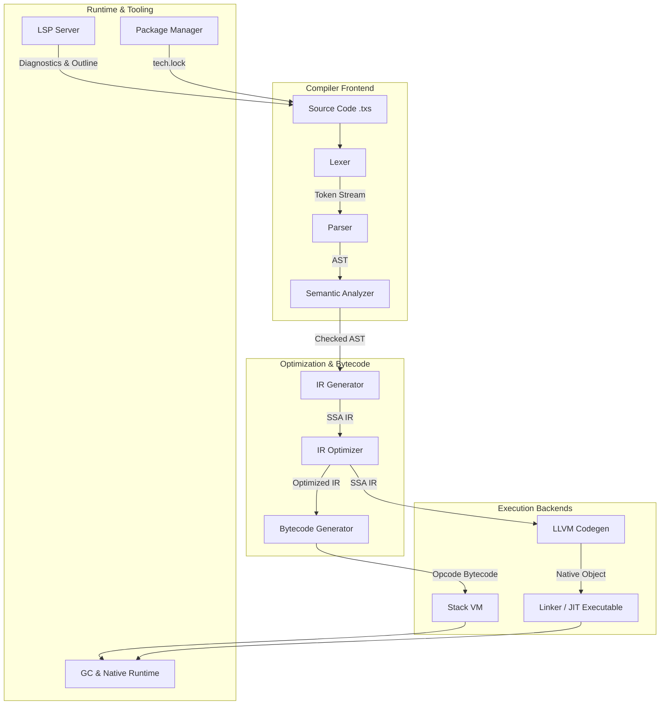

# TechScript 2.0 Internal Architecture Guide

This guide describes the system layout and compiler pipeline of the TechScript 2.0 ecosystem. It documents the flow of code from source files down to native machine code or VM execution, as well as package and editor service details.

---

## 1. Compiler Pipeline Overview

---

## 2. Stage-by-Stage Walkthrough

### 2.1 Lexer
- **Crate**: `techscript_lexer`
- **Role**: Scans source text to output a stream of structured `Token` instances.
- **Error Recovery Mode**: If an unrecognized character or malformed literal is encountered, the lexer reports a diagnostic error but recovers using fallback synchronization rules to resume token extraction from the next whitespace or punctuation boundary, preventing compiler cascading errors.

### 2.2 Parser
- **Crate**: `techscript_parser`
- **Role**: Processes the token stream to construct a high-fidelity Abstract Syntax Tree (AST).
- **Architecture**: Employs a Pratt Parser algorithm to cleanly parse complex prefix, infix, and postfix expressions with proper precedence and associativity.
- **Synchronization Loop**: In case of a syntax error, the parser synchronizes by skipping tokens until it reaches a statement boundary (e.g. `;` or block closing `}`), allowing it to parse the rest of the document and emit multiple helpful compiler diagnostics.

### 2.3 AST
- **Crate**: `techscript_ast`
- **Role**: Declares the strongly typed structural nodes (e.g. `Expr`, `Stmt`, `Decl`) representing the syntax. Includes full `Span` data linking nodes back to original source code positions for error diagnostics.

### 2.4 Semantic Analyzer & Type Checker
- **Crate**: `techscript_semantic`
- **Role**: Inspects the AST for validity.
- **Tasks**:
  1. Resolves names and builds nested Symbol Tables.
  2. Checks call arity, function signatures, and struct declarations.
  3. Detects duplicate names, constant re-assignments, and reports warnings for shadowed variables.

### 2.5 SSA IR (Static Single Assignment)
- **Crate**: `techscript_ir`
- **Role**: Lowers AST nodes into a flat representation of Basic Blocks containing instructions in Static Single Assignment form. Every variable is assigned exactly once, simplifying optimizations.

### 2.6 Optimizer
- **Crate**: `techscript_optimizer`
- **Role**: Runs optimization passes over the SSA IR.
- **Passes**:
  - **Constant Folding**: Computes constant expressions at compile-time.
  - **Dead Code Elimination (DCE)**: Removes unreachable basic blocks or unused variable assignments.

### 2.7 Bytecode Generator
- **Crate**: `techscript_bytecode`
- **Role**: Emits linear VM instructions (`Opcode`) from optimized SSA IR nodes. It packages them into a portable `BytecodeModule` along with a constant pool table.

### 2.8 LLVM Native Codegen Backend
- **Crate**: `techscript_llvm_backend`
- **Role**: Converts the SSA IR directly to LLVM compiler blocks, generating optimized assembly and linking JIT-compiled symbols.
- **FFI Integration**: Lowers operations (like string concatenation, map index updates, and async awaits) into native C-ABI calls to `ts_add`, `ts_index_set`, or `ts_await`.

### 2.9 Stack-Based Virtual Machine (VM)
- **Crate**: `techscript_vm`
- **Role**: A fast, registerless interpreter that executes VM bytecode.
- **Features**: Keeps a value stack, call frame stack, and runs an instruction dispatch loop. It integrates standard library functions directly into the global environment scope.

### 2.10 Garbage Collector & Native Runtime
- **Crates**: `techscript_gc`, `techscript_native_runtime`
- **Role**: Manages memory allocations and data structures.
- **GC**: Implements a precise tracing Garbage Collector that tracks root references from call stacks and collects unreferenced strings, lists, maps, structs, and enum instances.

### 2.11 LSP Server
- **Crate**: `techscript_lsp`
- **Role**: Implements the Language Server Protocol. Spawns an LSP daemon (`techscript-lsp`) that communicates JSON-RPC payloads to IDE extensions (like VS Code), driving live completion, syntax errors, hover metadata, and formatting.

### 2.12 Package Manager
- **Crate**: `techscript_package_manager`
- **Role**: Handles package manifest (`tech.toml`) parsing, downloads dependent archives, resolves transitive constraint paths using a cycle-detection resolver, and enforces digital signature security validations.
