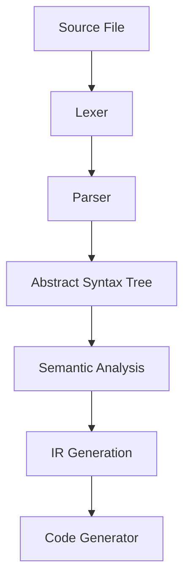

# Compiler Architecture

This document describes the compilation pipeline of the TechScript 2.0 compiler.

---

## 🗺️ Pipeline Stages

### 1. Lexer (`compiler/lexer`)
Scans the source character stream and generates tokens using the `logos` Rust library. Whitespace is ignored except when separating keywords or within string literals.

### 2. Parser (`compiler/parser`)
Implements a top-down operator precedence (**Pratt Parser**) for parsing expressions cleanly. This avoids deeply nested recursive grammar structures and cleanly parses operator precedence.

### 3. Abstract Syntax Tree (`compiler/ast`)
The parsing phase outputs an AST containing nodes representing program statements, expressions, loops, and definitions. Every node holds source code locations (`Span`) for error attribution.

### 4. Semantic Analyzer (`compiler/semantic`)
Validates program semantics prior to runtime:
* **Scope Resolution**: Ensures variables are defined in the current block or enclosing parents.
* **Constant Verification**: Fails compilation if code attempts to reassign a constant.
* **OOP checks**: Verifies subclasses inherit from valid models, and trait contracts are fully implemented.

### 5. IR & Code Generation (`compiler/ir`, `compiler/bytecode`, `compiler/llvm_backend`)
Translates optimized AST structures into:
* **Bytecode Instructions**: 8-bit opcodes for the Virtual Machine (VM).
* **LLVM IR**: Compiled into platform-specific machine code.
