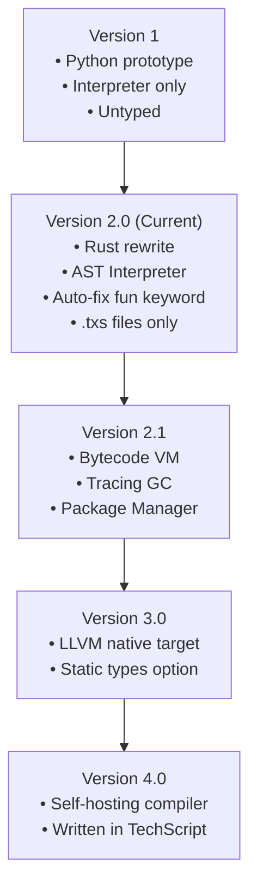

# 00 — PROJECT

> **Target Audience**: AI Assistants / Compiler Agents
> **Purpose**: High-level overview of TechScript 2.0
> **Parent Link**: [INDEX](./12_index.md)
> **Child Links**: [CONTEXT](./01_context.md) · [MEMORY](./02_memory.md)

---

## 1. Project Identity

- **Name**: TechScript
- **Version**: 2.0.0
- **File Extension**: `.txs` (strictly enforced, frozen)
- **Implementation Language**: Rust
- **Paradigm**: Dynamically typed scripting language with English-like syntax.
- **Stage**: Pre-implementation (system design complete).

---

## 2. Core Vision & Philosophy

- **English-Like Syntax**: Maximize code readability by using natural keywords (`make`, `say`, `when`, `each`, `build`) in place of symbolic control flow.
- **Progressive Complexity**: Zero-friction starter setup for beginners (untyped, sequential). Advanced constructs (static type annotations, concurrency) are optional additions in later minor versions.
- **Self-Contained Tooling**: Distributed as a single compiled binary (`tech`) containing compiler frontend, AST interpreter, linter, formatter, and testing suite. Zero runtime dependencies.

---

## 3. High-Level Evolution

---

## 4. Current Repository Progress

| Subsystem | Crate Name | Status | Milestone |
|---|---|---|---|
| Diagnostics | `techscript_errors` | Design complete | M1 |
| Lexer | `techscript_lexer` | Design complete | M1 |
| Parser | `techscript_parser` | Design complete | M2 |
| AST | `techscript_ast` | Design complete | M3 |
| Semantic Analyzer | `techscript_sema` | Design complete | M4 |
| Interpreter | `techscript_interpreter` | Design complete | M5 |
| CLI / Core | `techscript_cli` | Design complete | M6 |
| Tools | `techscript_lsp` | Design complete | M6 |
