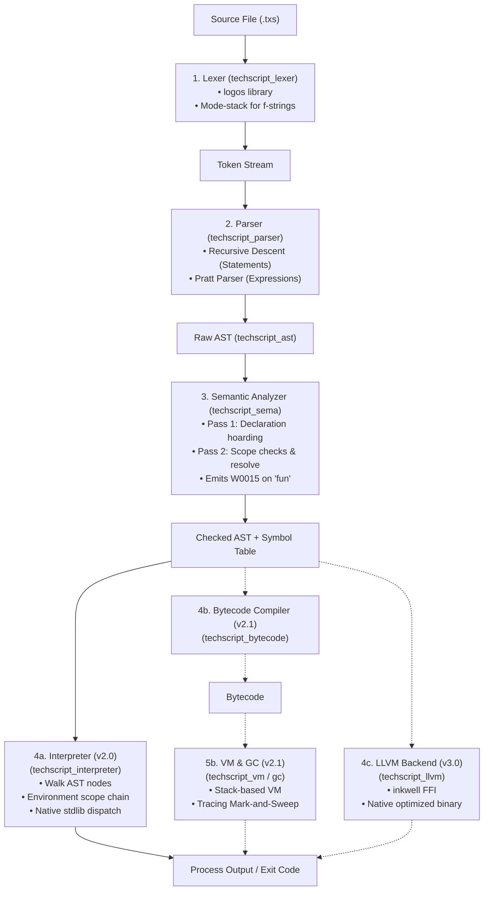
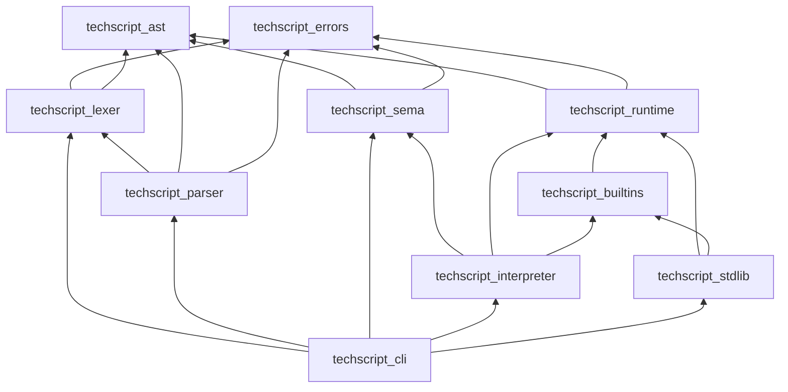

# 04 — ARCHITECTURE

> **Target Audience**: AI Assistants / Compiler Agents
> **Purpose**: Technical architecture overview of the compiler and runtime
> **Parent Link**: [RULES](./03_rules.md)
> **Child Links**: [LANGUAGE](./05_language.md) · [REPOSITORY](./08_repository.md)

---

## 1. System Pipeline

---

## 2. Shared Data Structures

### 2.1 AST (techscript_ast)
- Represents syntactic constructs. Contains `Statement`, `Expression`, and `Declaration` enum nodes.
- Each node carries a `Span` (source coordinates) and a unique auto-incremented `NodeId`.
- Includes the `Visitor` trait for traversal.

### 2.2 Symbol Table
- Constructed by the Semantic Analyzer.
- Maps `NodeId` references to `Symbol` structures (tracks variables, functions, models, scopes).

---

## 3. Execution Engines

### 3.1 AST Interpreter (v2.0)
- Directly executes Checked AST nodes.
- Environment structures manage variable storage using a vector of scope HashMaps.
- Scopes are pushed on blocks and popped on exit.
- Simple call stack keeps frames for tracing runtime errors.

### 3.2 Bytecode VM (v2.1 - Planned)
- Compiles AST to stack instructions (e.g. `PUSH_INT`, `ADD`, `STORE_LOCAL`).
- Replaces Environment HashMaps with fast index-based slot tables.
- A tracing GC manages allocations.

### 3.3 LLVM Native Compiler (v3.0 - Planned)
- Lowers AST nodes directly to LLVM IR.
- Applies LLVM optimization passes to output native executables.

---

## 4. Subsystem Dependency Graph

- `techscript_errors` is the foundational dependency.
- `techscript_ast` is shared across all front-end and back-end modules.
- `techscript_cli` forms the final executable integrating all crates.
