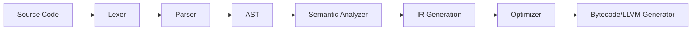

# Compiler Architecture & Pipeline

The TechScript compiler is a highly optimized multi-stage pipeline written entirely in Rust.

---

## 🗺️ Compilation Stages

### 1. Lexer (`compiler/lexer`)
Converts the raw source character stream into a sequence of structured `Token` items. It relies on the fast `logos` crate to scan tokens with minimal allocations.

### 2. Parser (`compiler/parser`)
Takes the token stream and builds an Abstract Syntax Tree (AST). It uses a custom **Pratt Parser** for expression parsing, ensuring clear operator precedence handling without deep recursion stacks.

### 3. AST & Symbol Table (`compiler/ast`)
Stores the parsed representation. It maintains node IDs and spans matching the source code for error reporting.

### 4. Semantic Analyzer (`compiler/semantic`)
Performs scope checks, type resolution, definition tracking, and correctness checks (e.g. validating that constants are not reassigned). It resolves identifiers to their definition locations.

### 5. Intermediate Representation (IR) (`compiler/ir`)
Simplifies the AST into an intermediate representation suitable for optimizations (e.g. dead code elimination, constant folding).

### 6. Optimizer (`compiler/optimizer`)
Performs control-flow graph optimizations on the IR.

### 7. Bytecode Gen / LLVM (`compiler/bytecode` & `compiler/llvm_backend`)
Generates compiled bytecode files (`.txc`) containing instructions for the Virtual Machine, or compiles directly to machine code using LLVM.
