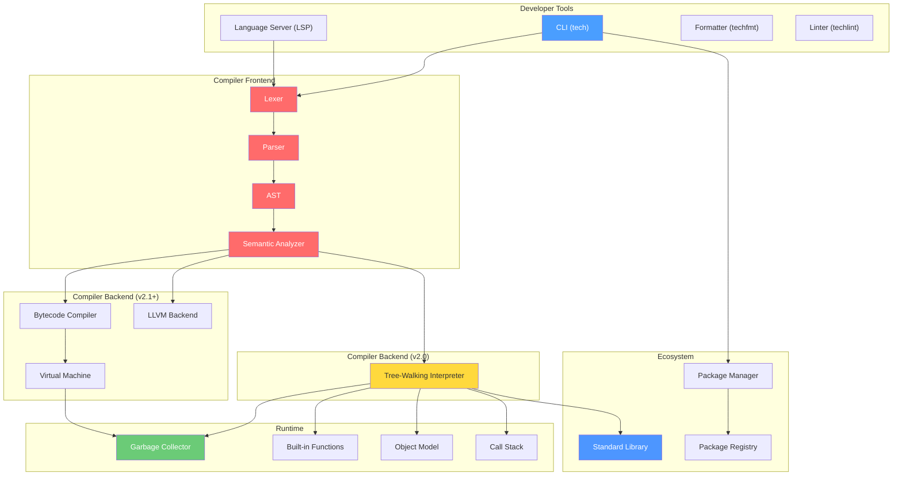
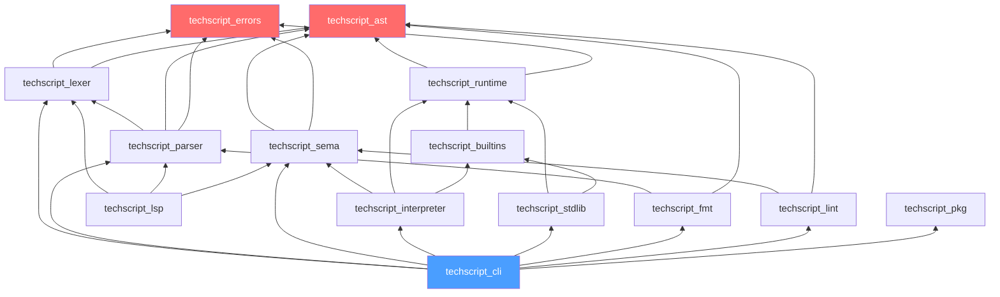
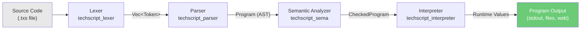
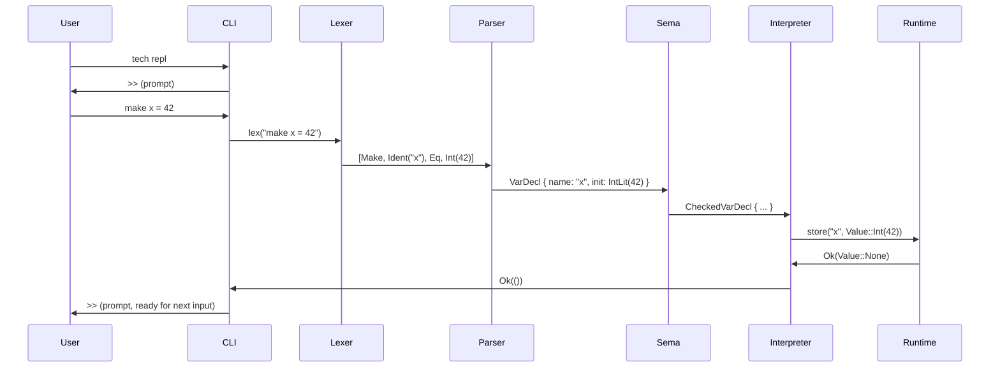
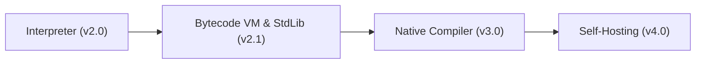

# 00 — TechScript 2.0 Master Architecture

> **Status**: Authoritative Specification
> **Version**: 2.0.0
> **Last Updated**: 2026-07-15
> **Related Documents**: All documents in this suite

---

## Table of Contents

1. [Design Philosophy](#1-design-philosophy)
2. [Engineering Principles](#2-engineering-principles)
3. [System Overview](#3-system-overview)
4. [Subsystem Catalogue](#4-subsystem-catalogue)
5. [Dependency Graph](#5-dependency-graph)
6. [Data Flow](#6-data-flow)
7. [Component Interactions](#7-component-interactions)
8. [Evolutionary Roadmap](#8-evolutionary-roadmap)
9. [Compatibility & Migration Design](#9-compatibility-migration-design)
10. [Document Index](#10-document-index)

---

## 1. Design Philosophy

TechScript 2.0 is governed by five design axioms, maintaining continuity with Version 1 (the Python prototype) while laying the foundation for a production-grade compiled systems ecosystem:

| # | Axiom | Rationale |
|---|---|---|
| 1 | **Readability over brevity** | English-like keywords (`make`, `say`, `when`, `each`, `build`) reduce cognitive load for beginners. Symbols are reserved for operators, not control flow. |
| 2 | **Progressive disclosure** | Version 2.0 remains dynamically typed at its core with no concurrency. Optional static type annotations, async/await, and native concurrency arrive in later versions — never forced on beginners. |
| 3 | **Single-binary distribution** | The `tech` CLI is a self-contained Rust binary. No Python runtime, JVM, or Node.js required at runtime. |
| 4 | **Layered compilation** | The architecture supports multiple backends (interpreter → bytecode VM → LLVM native) behind a single, stable frontend. A new backend never requires grammar or parser changes. |
| 5 | **Safety by default** | Written in Rust. No null pointers, no data races, no manual memory management in the compiler. The runtime uses a tracing garbage collector for TechScript user code. |

---

## 2. Engineering Principles

These principles govern every implementation decision in TechScript 2.0:

1. **Modularity** — Every compiler phase is an independent Rust crate with a clean public API. Crates communicate through well-defined data structures (tokens, AST nodes, IR).
2. **Testability** — Every crate has its own test suite. End-to-end integration tests verify the full pipeline against legacy Version 1 scripts.
3. **Determinism** — Given the same source code, the compiler always produces identical output. No non-deterministic iteration orders.
4. **Error Quality** — Every error has a unique code (e.g., `E0001`), a human-readable message, source location (file, line, column), and a suggested fix.
5. **Extensibility** — Adding a new backend (e.g., WebAssembly) requires implementing a single trait, not modifying the frontend.
6. **Performance Budgets** — The compiler must lex + parse + analyze + interpret a 10,000-line file in under 100ms on a modern machine. The `tech` binary must be under 30 MB.

---

## 3. System Overview

TechScript 2.0 is a monorepo containing a compiler toolchain, runtime, standard library, developer tools, and ecosystem infrastructure.



---

## 4. Subsystem Catalogue

### 4.1 Compiler Frontend

| Subsystem | Crate Name | Purpose | Input | Output |
|---|---|---|---|---|
| **Lexer** | `techscript_lexer` | Converts UTF-8 source text into a token stream | `&str` (source code) | `Vec<Token>` |
| **Parser** | `techscript_parser` | Converts token stream into an Abstract Syntax Tree | `Vec<Token>` | `Program` (AST root) |
| **AST** | `techscript_ast` | Defines all AST node types (shared data structures) | — | — (type definitions only) |
| **Semantic Analyzer** | `techscript_sema` | Validates AST: scope resolution, name resolution, type checking | `Program` (AST) | `CheckedProgram` (annotated AST) |

### 4.2 Compiler Backend

| Subsystem | Crate Name | Purpose | Version |
|---|---|---|---|
| **Interpreter** | `techscript_interpreter` | Tree-walking execution of the checked AST | v2.0 |
| **Bytecode Compiler** | `techscript_bytecode` | Compiles AST to stack-based bytecode | v2.1 |
| **Virtual Machine** | `techscript_vm` | Executes bytecode with GC and built-ins | v2.1 |
| **LLVM Backend** | `techscript_llvm` | Emits LLVM IR for native compilation | v3.0 |

### 4.3 Runtime

| Subsystem | Crate Name | Purpose |
|---|---|---|
| **Runtime Core** | `techscript_runtime` | Object model, call frames, value representation, GC |
| **Built-in Functions** | `techscript_builtins` | `say`, `ask`, `len`, `type_of`, `to_int`, `to_str`, etc. |
| **Standard Library** | `techscript_stdlib` | `io`, `math`, `string`, `file`, `web`, `time`, `random`, `json`, `collections` |

---

## 5. Dependency Graph

The crate dependency graph enforces a strict layered architecture. Higher layers depend on lower layers. No circular dependencies.



---

## 6. Data Flow

### 6.1 Compilation Pipeline (v2.0 — Interpreter)



### 6.2 Data Representations at Each Stage

| Stage | Data Structure | Description |
|---|---|---|
| **Source** | `String` | Raw UTF-8 text from `.txs` file |
| **After Lexer** | `Vec<Token>` | Token kind, lexeme, and `Span` (byte offset, line, column) |
| **After Parser** | `Program` | AST node tree (`Statement`, `Expression`, `Declaration`) |
| **After Semantic Analysis** | `CheckedProgram` | AST annotated with symbol tables, resolved scopes, and deprecation warnings |
| **During Interpretation** | `Value` | Runtime value representation: `Int`, `Float`, `Str`, `Bool`, `None`, `List`, `Map`, `Object`, `Function` |

---

## 7. Component Interactions

### 7.1 REPL Flow



---

## 8. Evolutionary Roadmap

The long-term development stages are outlined as follows:



---

## 9. Compatibility & Migration Design

### 9.1 Compatibility Notes
- **Language Syntax**: TechScript 2.0 maintains 99% syntactic compatibility with Version 1. It preserves all key constructs (`say`, `make`, `when`, `each`, `repeat`, `attempt`/`catch`).
- **File Extension**: The official file extension is frozen as `.txs`. Legacy code using `.tech` or other variants must be renamed to run under the new compiler.
- **Function and Method Unification**: Version 1 used both `build` and `fun` keywords. In 2.0, `build` is the unified, canonical keyword. `fun` is retained as a deprecated alias inside models.

### 9.2 Migration Notes
- To run legacy v1 files under TechScript 2.0, rename files from `.tech` to `.txs`.
- When compiling code containing `fun`, the compiler prints a warning (`W0015` - Deprecated `fun` keyword) indicating the location and suggesting a migration to `build`.
- Run the automatic migrator via the linter CLI:
  ```bash
  tech lint --fix src/
  ```
  This automatically rewrites all deprecated `fun` usages to `build` in `.txs` files.

### 9.3 Rationale
- **Rust Rewrite**: Implementing the compiler and runtime in Rust instead of Python provides type safety, zero-cost abstractions, predictable memory footprint, and eliminates Python startup overhead.
- **Unified Keyword**: Reducing duplication between `fun` and `build` simplifies parser implementation, reduces cognitive overhead for beginners, and resolves token categorization conflicts.
- **Frozen Extension**: `.txs` distinguishes TechScript from other languages, avoids collisions with XML stylesheets (`.xsl`) or general technology names, and provides a clear signal to IDE extensions.

---

## 10. Document Index

| # | Document | Purpose | Key Cross-References |
|---|---|---|---|
| **00** | [Master Architecture](./00_master_architecture.md) | System overview, design philosophy, dependency graph | All documents |
| **01** | [Language Specification v2.0](./01_language_spec_v1.md) | Complete v2.0 language definition | 03 Grammar, 06 Lexer, 12 Stdlib |
| **02** | [Folder Structure](./02_folder_structure.md) | Monorepo layout | 00 Architecture, 16 Coding Standards |
| **03** | [EBNF Grammar](./03_grammar_ebnf.md) | Formal grammar for parser implementation | 01 Language Spec, 05 AST, 07 Parser |
| **04** | [Compiler Architecture](./04_compiler_architecture.md) | Stage-by-stage pipeline design | 00 Architecture, 06 Lexer, 07 Parser, 10 Sema |
| **05** | [AST Design](./05_ast_design.md) | Complete AST node taxonomy | 03 Grammar, 07 Parser, 10 Sema, 11 Interpreter |
| **06** | [Lexer Design](./06_lexer_design.md) | Token types, keyword list, scanning rules | 03 Grammar, 04 Compiler Architecture |
| **07** | [Parser Design](./07_parser_design.md) | Parsing strategy, error recovery | 03 Grammar, 05 AST, 06 Lexer |
| **08** | [Repository Milestones](./08_milestones.md) | GitHub milestones with acceptance criteria | 17 Roadmap, 15 Testing |
| **09** | [Runtime Design](./09_runtime_design.md) | Execution engine, object model, GC, call frames | 05 AST, 11 Interpreter |
| **10** | [Semantic Analysis](./10_semantic_analysis.md) | Scope/name resolution, symbol tables, validation | 05 AST, 09 Runtime, 11 Interpreter |
| **11** | [Interpreter Design](./11_interpreter_design.md) | AST execution strategy | 05 AST, 09 Runtime, 10 Sema |
| **12** | [Standard Library](./12_stdlib_design.md) | Module catalogue, function signatures | 01 Language Spec, 09 Runtime |
| **13** | [CLI Specification](./13_cli_spec.md) | Command definitions, flags, exit codes | 04 Compiler Architecture, 12 Stdlib |
| **14** | [Error Codes](./14_error_codes.md) | Every compiler and runtime error with fix suggestions | All compiler documents |
| **15** | [Testing Strategy](./15_testing.md) | Test types, infrastructure, CI | 16 Coding Standards, 08 Milestones |
| **16** | [Coding Standards](./16_coding_standards.md) | Naming, style, commit format, review checklist | 02 Folder Structure |
| **17** | [Development Roadmap](./17_roadmap.md) | Weekly milestones with dependencies | 08 Milestones |
| **18** | [AI Context](./18_ai_context.md) | Quick-start summary for AI assistants | All documents |
