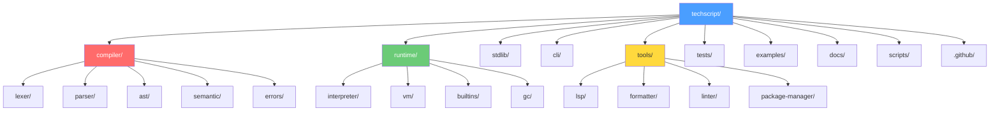

# 02 — TechScript 2.0 Monorepo Folder Structure

> **Status**: Authoritative Specification
> **Version**: 2.0.0
> **Last Updated**: 2026-07-15
> **Related Documents**: [00 Master Architecture](./00_master_architecture.md) · [16 Coding Standards](./16_coding_standards.md)

---

## Repository Structure Diagram



---

## Complete Directory Listing

```
techscript/
├── Cargo.toml                    # Workspace root — defines all member crates
├── Cargo.lock                    # Locked dependency versions (committed)
├── LICENSE                       # MIT or Apache-2.0
├── README.md                     # Project overview, badges, quickstart
├── CONTRIBUTING.md               # Contributor guide
├── CHANGELOG.md                  # Release notes
├── rustfmt.toml                  # Workspace-wide formatting config
├── clippy.toml                   # Workspace-wide linter config
├── deny.toml                     # cargo-deny config
│
├── compiler/
│   ├── ast/
│   │   ├── Cargo.toml            # techscript_ast crate
│   │   └── src/
│   │       ├── lib.rs            # Re-exports
│   │       ├── expr.rs           # Expression AST nodes
│   │       ├── stmt.rs           # Statement AST nodes
│   │       ├── decl.rs           # Declaration AST nodes
│   │       ├── lit.rs            # Literal nodes
│   │       ├── op.rs             # Operator enums
│   │       ├── span.rs           # Source location tracking
│   │       ├── visit.rs          # Visitor trait for AST traversal
│   │       └── pretty.rs         # Debug pretty-printer for AST
│   │
│   ├── errors/
│   │   ├── Cargo.toml            # techscript_errors crate
│   │   └── src/
│   │       ├── lib.rs            # Re-exports
│   │       ├── diagnostic.rs     # Diagnostic struct
│   │       ├── codes.rs          # Error code registry (E0001..E9999)
│   │       ├── report.rs         # Terminal error rendering
│   │       └── source_map.rs     # Maps byte offsets to files
│   │
│   ├── lexer/
│   │   ├── Cargo.toml            # techscript_lexer crate
│   │   └── src/
│   │       ├── lib.rs            # Public API: lex(source) → Vec<Token>
│   │       ├── token.rs          # Token struct and TokenKind
│   │       ├── cursor.rs         # Character-level cursor
│   │       ├── strings.rs        # String and f-string lexing
│   │       ├── numbers.rs        # Number literal lexing
│   │       └── comments.rs       # Comment lexing
│   │
│   ├── parser/
│   │   ├── Cargo.toml            # techscript_parser crate
│   │   └── src/
│   │       ├── lib.rs            # Public API: parse(tokens) → Program
│   │       ├── parser.rs         # Parser state machine
│   │       ├── expr.rs           # Expression parsing
│   │       ├── stmt.rs           # Statement parsing
│   │       ├── decl.rs           # Declaration parsing
│   │       ├── pratt.rs          # Pratt parser binding power
│   │       └── recovery.rs       # Error recovery
│   │
│   └── semantic/
│       ├── Cargo.toml            # techscript_sema crate
│       └── src/
│           ├── lib.rs            # Public API: analyze(program) → CheckedProgram
│           ├── resolver.rs       # Name and scope resolution
│           ├── symbol_table.rs   # Symbol table
│           ├── checker.rs        # Semantic validation rules
│           └── builtins.rs       # Pre-registered built-ins
│
├── runtime/
│   ├── interpreter/
│   │   ├── Cargo.toml            # techscript_interpreter crate
│   │   └── src/
│   │       ├── lib.rs            # Public API: interpret(checked_program)
│   │       ├── evaluator.rs      # Expression evaluation
│   │       ├── executor.rs       # Statement execution
│   │       ├── environment.rs    # Variable storage
│   │       ├── value.rs          # Runtime Value enum
│   │       ├── function.rs       # Function representation
│   │       ├── model.rs          # Model instance representation
│   │       ├── error.rs          # Runtime error types
│   │       └── repl.rs           # REPL loop
│   │
│   ├── builtins/
│   │   ├── Cargo.toml            # techscript_builtins crate
│   │   └── src/
│   │       ├── lib.rs            # Built-in function registry
│   │       ├── io.rs             # say, ask
│   │       ├── conversion.rs     # to_int, to_float, etc.
│   │       ├── introspection.rs  # type_of, len, assert
│   │       └── process.rs        # exit, range
│   │
│   ├── gc/
│   │   ├── Cargo.toml            # techscript_gc crate
│   │   └── src/
│   │       └── lib.rs            # GC interface
│   │
│   └── vm/
│       ├── Cargo.toml            # techscript_vm crate (v2.1)
│       └── src/
│           ├── lib.rs
│           ├── bytecode.rs
│           └── vm.rs
│
├── stdlib/
│   ├── Cargo.toml                # techscript_stdlib crate
│   └── src/
│       ├── lib.rs                # Module registry
│       ├── io.rs                 # Extended I/O
│       ├── math.rs               # Math helpers
│       ├── string.rs             # String helpers
│       ├── file.rs               # File I/O
│       ├── web.rs                # web page API
│       ├── time.rs               # Time helpers
│       ├── random.rs             # RNG helpers
│       ├── json.rs               # JSON helpers
│       └── collections.rs        # collection algorithms
│
├── cli/
│   ├── Cargo.toml                # techscript_cli crate (tech binary)
│   └── src/
│       ├── main.rs               # clap entry point
│       ├── commands/
│       │   ├── mod.rs
│       │   ├── run.rs            # tech run <file.txs>
│       │   ├── repl.rs           # tech repl
│       │   ├── build.rs          # tech build
│       │   ├── fmt.rs            # tech fmt
│       │   ├── lint.rs           # tech lint
│       │   ├── test.rs           # tech test
│       │   ├── new.rs            # tech new
│       │   └── version.rs        # tech version
│       └── config.rs             # tech.toml handler
│
├── tools/
│   ├── lsp/
│   │   ├── Cargo.toml            # techscript_lsp crate
│   │   └── src/
│   │       ├── lib.rs
│   │       ├── autocomplete.rs
│   │       └── diagnostics.rs
│   │
│   ├── formatter/
│   │   ├── Cargo.toml            # techscript_fmt crate
│   │   └── src/
│   │       └── lib.rs
│   │
│   ├── linter/
│   │   ├── Cargo.toml            # techscript_lint crate
│   │   └── src/
│   │       └── lib.rs
│   │
│   └── package-manager/
│       ├── Cargo.toml            # techscript_pkg crate
│       └── src/
│           ├── lib.rs
│           └── resolver.rs
│
├── tests/
│   ├── lexer/                    # Lexer unit/snapshot tests
│   │   ├── keywords.txs
│   │   ├── operators.txs
│   │   └── strings.txs
│   ├── parser/                   # Parser snapshot tests
│   │   ├── expressions.txs
│   │   └── statements.txs
│   ├── interpreter/              # End-to-end interpreter tests
│   │   ├── hello_world.txs
│   │   └── closures.txs
│   ├── semantic/                 # Semantic analysis tests
│   │   └── undefined_var.txs
│   ├── stdlib/                   # Standard library tests
│   └── snapshots/                # Expected output snapshots (.snap)
│
├── examples/
│   ├── hello_world.txs
│   ├── calculator.txs
│   ├── web_page.txs
│   └── README.md
│
├── docs/
│   ├── engineering/              # This documentation suite (00–18)
│   └── user-guide/
│
├── scripts/
│   ├── build.sh
│   ├── test.sh
│   └── release.sh
│
└── .github/
    └── workflows/
        ├── ci.yml
        └── release.yml
```

---

## Cargo Workspace Configuration

```toml
[workspace]
resolver = "2"
members = [
    "compiler/ast",
    "compiler/errors",
    "compiler/lexer",
    "compiler/parser",
    "compiler/semantic",
    "runtime/interpreter",
    "runtime/builtins",
    "runtime/gc",
    "runtime/vm",
    "stdlib",
    "cli",
    "tools/lsp",
    "tools/formatter",
    "tools/linter",
    "tools/package-manager",
]

[workspace.dependencies]
logos = "0.14"
clap = { version = "4", features = ["derive"] }
serde = { version = "1", features = ["derive"] }
serde_json = "1"
anyhow = "1"
thiserror = "2"
tower-lsp = "0.20"
rustyline = "14"
colored = "2"
```

---

## Compatibility & Evolution Analysis

### Compatibility Notes
- **Test File Locations**: All tests in the `tests/` and `examples/` directory have been renamed to use the frozen `.txs` extension instead of `.tech` to preserve the unified extension.
- **Tools**: Formatters (`techscript_fmt`) and Linters (`techscript_lint`) will specifically scan for files matching `*.txs`.

### Migration Notes
- Any automated scripts (e.g. in `scripts/` or `.github/workflows/`) that referenced `.tech` files must be updated to target `.txs`.
- When scaffolding projects using `tech new`, the entry file is automatically generated as `src/main.txs` inside the project folder structure.

### Rationale
- **Crate Independence**: Placing each compiler phase in its own directory within `compiler/` isolates changes. For example, updating the parser to recognize both `build` and `fun` inside models requires changes only within the `compiler/parser` crate.
- **Strict Testing Mapping**: Storing `.txs` snapshot inputs directly under the corresponding compiler stage subdirectory (e.g. `tests/parser/statements.txs`) allows immediate regression validation when modifications are made to grammar files.

### Future Roadmap
- **v2.1**: VM test suites (`tests/vm/`) will be introduced inside `tests/` directory to run compiled bytecode outputs alongside interpreter tests.
- **v3.0**: Native target tests will be compiled and executed directly as standalone binaries during regression checks.
