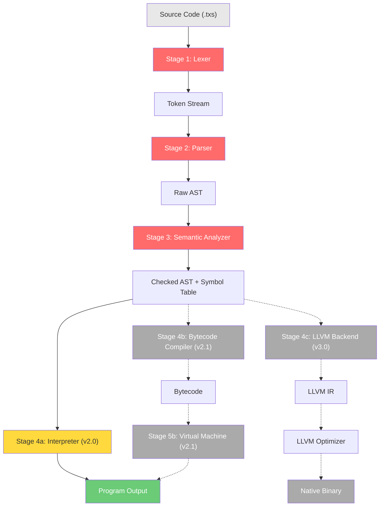

# 04 — TechScript 2.0 Compiler Architecture

> **Status**: Authoritative Specification
> **Version**: 2.0.0
> **Last Updated**: 2026-07-15
> **Related Documents**: [00 Master Architecture](./00_master_architecture.md) · [06 Lexer](./06_lexer_design.md) · [07 Parser](./07_parser_design.md) · [10 Semantic Analysis](./10_semantic_analysis.md) · [11 Interpreter](./11_interpreter_design.md)

---

## 1. Pipeline Overview



Solid lines = v2.0 pipeline (interpreter). Dashed lines = future versions.

---

## 2. Stage 1: Lexer (Lexical Analysis)

**Crate**: `techscript_lexer`
**Input**: `&str` (UTF-8 source code)
**Output**: `Vec<Token>`

### Responsibilities
1. Scan source text character-by-character.
2. Produce tokens containing `TokenKind`, lexeme string slice, and source `Span`.
3. Handle string escapes and f-string interpolation boundaries.
4. Handle nested block comments.
5. Identify newline tokens significant for statement termination.
6. Emit `Fun` tokens and record deprecation triggers.

---

## 3. Stage 2: Parser (Syntactic Analysis)

**Crate**: `techscript_parser`
**Input**: `Vec<Token>`
**Output**: `Program` (AST root node)

### Responsibilities
1. Consume tokens and construct AST nodes.
2. Validate syntactic structure against the [EBNF Grammar](./03_grammar_ebnf.md).
3. Handle operator precedence and associativity via Pratt parsing.
4. Recover from parser errors using panic-mode synchronization.
5. Parse methods declared with either `build` or `fun` keywords.

---

## 4. Stage 3: Semantic Analysis

**Crate**: `techscript_sema`
**Input**: `Program` (raw AST)
**Output**: `CheckedProgram` (annotated AST + `SymbolTable`)

### Responsibilities
1. **Name resolution**: Resolve identifiers to declarations.
2. **Scope analysis**: Enforce lexical scoping, detect duplicates, and flag shadowing.
3. **Keyword warning**: Inspect the AST and emit deprecation warnings (`W0015`) for any method defined with the `fun` keyword.
4. **Validation**: Check function call arity, loop bounds, model declarations, and FFI imports.

---

## 5. Stage 4a: Interpreter (v2.0 Backend)

**Crate**: `techscript_interpreter`
**Input**: `CheckedProgram`
**Output**: Program output side effects and process exit code

### Responsibilities
1. Walk the checked AST and execute nodes sequentially.
2. Maintain runtime Environment scopes.
3. Dispatch methods defined with both `build` and `fun` keywords uniformly.
4. Catch runtime exceptions via `attempt`/`catch`.

---

## 6. Compatibility & Evolution Analysis

### 6.1 Compatibility Notes
- **Source Files**: The compiler toolchain refuses to parse files that do not carry the `.txs` extension.
- **Unified Methods**: The Parser and Semantic Analyzer allow both `do` and `fun` methods. During Semantic Analysis, `fun` usages are recorded in the diagnostics database as warnings, but do not prevent the interpreter stage from running.

### 6.2 Migration Notes
- When running compilation in check mode:
  ```bash
  tech check src/main.txs
  ```
  The compiler prints all diagnostic warnings, including legacy `fun` uses:
  ```
  Warning [TSW1002]: Use of deprecated keyword 'fun'
    --> src/main.txs:12:5
     |
  12 |     fun bark()
     |     ^^^ help: replace 'fun' with 'do'
  ```

### 6.3 Rationale
- **Rust Implementation**: Implementing in Rust ensures memory safety, sub-millisecond startup times, and deterministic performance profile.
- **Frontend/Backend decoupling**: Decoupling the frontend (lexer, parser, sema) from the backend (interpreter, VM, LLVM) guarantees that future VM/LLVM updates require zero parser modifications.

### 6.4 Future Roadmap
- **v2.1**: The Semantic Analyzer will output an intermediate representation (IR) or flat bytecode instructions for the VM backend.
- **v3.0**: The code generator block will swap the VM backend for the LLVM Backend, compiling `.txs` source directly into native machine code.
