# 05 — TechScript 2.0 AST Design

> **Status**: Authoritative Specification
> **Version**: 2.0.0
> **Last Updated**: 2026-07-16
> **Related Documents**: [03 Grammar](./03_grammar_ebnf.md) · [07 Parser](./07_parser_design.md) · [10 Semantic Analysis](./10_semantic_analysis.md) · [11 Interpreter](./11_interpreter_design.md)

---

## 1. AST Node Hierarchy

```mermaid
graph TD
    PROGRAM["Program"] --> STMT["Statement"]
    STMT --> DECL["Declaration"]
    STMT --> EXPR_STMT["ExpressionStatement"]
    STMT --> CTRL["Control Flow"]
    STMT --> IO["I/O Statement"]
    STMT --> ERR_STMT["Error Statement"]
    STMT --> JUMP["Jump Statement"]
    STMT --> IMP["Import Statement"]

    DECL --> VAR["VarDecl"]
    DECL --> CONST["ConstDecl"]
    DECL --> FUNC["FuncDecl"]
    DECL --> STRUCT["StructDecl"]
    DECL --> ENUM["EnumDecl"]
    DECL --> MODEL["ModelDecl"]
    DECL --> EXPORT["ExportDecl"]

    CTRL --> WHEN["WhenStmt / IfStmt"]
    CTRL --> EACH["EachStmt / ForStmt"]
    CTRL --> REPEAT["RepeatStmt"]
    CTRL --> WHILE["WhileStmt"]
    CTRL --> ATTEMPT["AttemptStmt / TryStmt"]

    IO --> SAY["SayStmt"]
    ERR_STMT --> THROW["ThrowStmt"]
    JUMP --> RET["ReturnStmt"]
    JUMP --> BRK["BreakStmt"]
    JUMP --> CONT["ContinueStmt"]

    PROGRAM --> EXPR["Expression"]
    EXPR --> LIT["Literal"]
    EXPR --> BINOP["BinaryExpr"]
    EXPR --> UNOP["UnaryExpr"]
    EXPR --> CALL["CallExpr"]
    EXPR --> MEMBER["MemberExpr"]
    EXPR --> INDEX["IndexExpr"]
    EXPR --> IDENT["IdentExpr"]
    EXPR --> RANGE["RangeExpr"]
    EXPR --> ASK_EXPR["AskExpr"]
    EXPR --> NEW["NewExpr"]
    EXPR --> LAMBDA["LambdaExpr"]
    EXPR --> LIST["ListExpr"]
    EXPR --> MAP_EXPR["MapExpr"]
    EXPR --> FSTR["FStringExpr"]
    EXPR --> GROUP["GroupExpr"]
    EXPR --> ASSIGN["AssignmentExpr"]

    style PROGRAM fill:#4a9eff,color:#fff
    style STMT fill:#ff6b6b,color:#fff
    style EXPR fill:#6bcb77,color:#fff
    style DECL fill:#ffd93d,color:#333
```



---

## 2. Core Types

### 2.1 Span (Source Location)
```rust
/// Byte-offset range in source code. Used by every AST node for error reporting.
#[derive(Debug, Clone, Copy, PartialEq, Eq)]
pub struct Span {
    pub start: usize,  // Inclusive byte offset
    pub end: usize,    // Exclusive byte offset
}
```

### 2.2 Node ID
```rust
/// Unique identifier for each AST node. Used by the semantic analyzer
/// to attach resolved information without mutating the AST.
#[derive(Debug, Clone, Copy, PartialEq, Eq, Hash)]
pub struct NodeId(pub u32);
```

### 2.3 Identifier
```rust
/// A named identifier with source location.
#[derive(Debug, Clone, PartialEq)]
pub struct Ident {
    pub name: String,
    pub span: Span,
}
```

---

## 3. Program (Root Node)

```rust
/// The root of every TechScript AST. Represents a single .txs file.
#[derive(Debug, Clone)]
pub struct Program {
    pub id: NodeId,
    pub statements: Vec<Statement>,
    pub span: Span,
}
```

---

## 4. Statements and Declarations

```rust
#[derive(Debug, Clone)]
pub enum Statement {
    // Declarations
    VarDecl(VarDecl),
    ConstDecl(ConstDecl),
    FuncDecl(FuncDecl),
    StructDecl(StructDecl),
    EnumDecl(EnumDecl),
    ModelDecl(ModelDecl),
    ExportDecl(ExportDecl),

    // Control flow
    If(IfStmt),
    For(ForStmt),
    Repeat(RepeatStmt),
    While(WhileStmt),
    Try(TryStmt),

    // Simple statements
    Say(SayStmt),
    Return(ReturnStmt),
    Throw(ThrowStmt),
    Break(BreakStmt),
    Continue(ContinueStmt),
    Import(ImportStmt),

    // Expression as statement (result discarded)
    Expression(ExpressionStmt),

    // Block
    Block(Block),
}
```

### 4.1 Declarations

```rust
/// make/let/var name[: type] = expression
#[derive(Debug, Clone)]
pub struct VarDecl {
    pub id: NodeId,
    pub pattern: Pattern,
    pub type_ann: Option<TypeSpec>,
    pub initializer: Expression,
    pub span: Span,
}

/// const NAME[: type] = expression
#[derive(Debug, Clone)]
pub struct ConstDecl {
    pub id: NodeId,
    pub pattern: Pattern,
    pub type_ann: Option<TypeSpec>,
    pub initializer: Expression,
    pub span: Span,
}

/// Destructuring Pattern
#[derive(Debug, Clone)]
pub enum Pattern {
    Single(Ident),
    Tuple(Vec<Ident>),
    List(Vec<Ident>),
    Struct(Vec<Ident>),
}

/// Type Signature Specification
#[derive(Debug, Clone)]
pub struct TypeSpec {
    pub name: Ident,
    pub generic_args: Option<Vec<TypeSpec>>,
    pub span: Span,
}

/// build name<T>(params) -> RetType { body }
#[derive(Debug, Clone)]
pub struct FuncDecl {
    pub id: NodeId,
    pub async_kw: bool,
    pub name: Ident,
    pub generic_params: Option<Vec<Ident>>,
    pub params: Vec<Parameter>,
    pub return_type: Option<TypeSpec>,
    pub body: Block,
    pub span: Span,
}

/// A function parameter with optional type annotation and default value
#[derive(Debug, Clone)]
pub struct Parameter {
    pub name: Ident,
    pub type_ann: Option<TypeSpec>,
    pub default: Option<Expression>,
    pub span: Span,
}

/// struct Name { fields }
#[derive(Debug, Clone)]
pub struct StructDecl {
    pub id: NodeId,
    pub name: Ident,
    pub fields: Vec<FieldSpec>,
    pub span: Span,
}

#[derive(Debug, Clone)]
pub struct FieldSpec {
    pub name: Ident,
    pub type_ann: TypeSpec,
    pub span: Span,
}

/// enum Name { variants }
#[derive(Debug, Clone)]
pub struct EnumDecl {
    pub id: NodeId,
    pub name: Ident,
    pub variants: Vec<EnumVariant>,
    pub span: Span,
}

#[derive(Debug, Clone)]
pub struct EnumVariant {
    pub name: Ident,
    pub payload: Option<Vec<TypeSpec>>,
    pub span: Span,
}

/// model Name extends ParentName { fields and methods }
#[derive(Debug, Clone)]
pub struct ModelDecl {
    pub id: NodeId,
    pub name: Ident,
    pub parent: Option<Ident>,
    pub fields: Vec<VarDecl>,
    pub methods: Vec<MethodDecl>,
    pub span: Span,
}

/// The keyword used to declare the method (for compatibility tracking)
#[derive(Debug, Clone, Copy, PartialEq, Eq)]
pub enum MethodKeyword {
    Build, // build
    Fun,   // fun (deprecated)
}

/// build method_name(params) { body } (inside a model)
#[derive(Debug, Clone)]
pub struct MethodDecl {
    pub id: NodeId,
    pub keyword: MethodKeyword,
    pub name: Ident,
    pub generic_params: Option<Vec<Ident>>,
    pub params: Vec<Parameter>,
    pub return_type: Option<TypeSpec>,
    pub body: Block,
    pub span: Span,
}

/// export <declaration>
#[derive(Debug, Clone)]
pub struct ExportDecl {
    pub id: NodeId,
    pub declaration: Box<Statement>,
    pub span: Span,
}
```

---

## 5. Expressions

```rust
#[derive(Debug, Clone)]
pub enum Expression {
    Literal(LiteralExpr),
    Binary(BinaryExpr),
    Unary(UnaryExpr),
    Call(CallExpr),
    Member(MemberExpr),
    Index(IndexExpr),
    Identifier(Ident),
    Range(RangeExpr),
    Ask(AskExpr),
    New(NewExpr),
    Lambda(LambdaExpr),
    List(ListExpr),
    Map(MapExpr),
    FString(FStringExpr),
    Group(Box<Expression>),
    Assignment(AssignmentExpr), // Now an expression
}

/// target assignment_operator expression
#[derive(Debug, Clone)]
pub struct AssignmentExpr {
    pub id: NodeId,
    pub target: Box<Expression>, // Ident, Member, or IndexExpr
    pub op: String,              // "=", "+=", etc.
    pub value: Box<Expression>,
    pub span: Span,
}
```

---

## 6. Compatibility & Evolution Analysis

### 6.1 Compatibility Notes
- **AST Node Retention**: Retaining the `MethodKeyword` variant in `MethodDecl` ensures that the AST preserves the exact syntax used in the source `.txs` file.
- **Unified AST Execution**: For downstream stages (Interpreter, VM), the `MethodKeyword` is ignored, executing methods identically regardless of whether they were declared using `build` or `fun`.

### 6.2 Migration Notes
- Tooling or formatting passes (`tech fmt`) inspect the `keyword` field of `MethodDecl`. If it is `MethodKeyword::Fun`, formatting replaces it with `build` when writing back to the `.txs` file:
  ```rust
  // formatter/src/lib.rs snippet
  fn format_method_decl(&mut self, node: &MethodDecl) {
      self.write("build ");
      self.format_ident(&node.name);
  }
  ```

### 6.3 Rationale
- **Assignment as Expression**: Allowing assignment to be parsed as a right-associative expression simplifies Pratt parsing and permits inline assignment expressions, while maintaining context-free parser simplicity.
- **Generic Angle Brackets**: Utilizing `<...>` for generics matches industry standards and makes integration with syntax highlighting/IDE tools direct. Context-aware parsing is defined to resolve any comparison operator conflicts.
