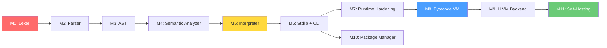

# 08 — TechScript 2.0 Repository Milestones

> **Status**: Authoritative Specification
> **Version**: 2.0.0
> **Last Updated**: 2026-07-15
> **Related Documents**: [17 Roadmap](./17_roadmap.md) · [15 Testing](./15_testing.md) · [00 Master Architecture](./00_master_architecture.md)

---

## Milestone Dependency Graph

---

## Milestone 1 — Lexer

**GitHub Milestone**: `v2.0-lexer`
**Crates**: `techscript_lexer`, `techscript_errors`
**Deliverables**:
- Token enum with 83 token kinds (including `Fun`).
- Validated hexadecimal, binary, octal, float literals with underscores.
- F-string mode stack.
- Unicode support.
- Fully supports `.txs` extension handling.

---

## Milestone 2 — Parser

**GitHub Milestone**: `v2.0-parser`
**Crates**: `techscript_parser`, `techscript_ast`
**Deliverables**:
- AST representation with `MethodDecl` keyword distinction.
- Recursive descent for statements, Pratt parser for expressions.
- Parsing support for both `build` and `fun` inside model blocks.

---

## Milestone 3 — AST Infrastructure

**GitHub Milestone**: `v2.0-ast`
**Crates**: `techscript_ast`
**Deliverables**:
- Unique `NodeId` assignment.
- Source range mapping (`Span`).
- Implementation of the AST Visitor pattern.

---

## Milestone 4 — Semantic Analyzer

**GitHub Milestone**: `v2.0-sema`
**Crates**: `techscript_sema`
**Deliverables**:
- Scope/name resolution.
- Symbol table generation.
- Deprecation warning emitter for `fun` keywords (`W0015`).
- Function parameter/arity validation.

---

## Milestone 5 — Interpreter

**GitHub Milestone**: `v2.0-interpreter`
**Crates**: `techscript_interpreter`, `techscript_builtins`, `techscript_runtime`
**Deliverables**:
- Tree-walking AST execution engine.
- Value representation mapping all v1 primitives.
- Support for `build` and `fun` method executions.
- Stack tracing and `attempt`/`catch` control flow.

---

## Milestone 6 — Standard Library + CLI

**GitHub Milestone**: `v2.0-stdlib-cli`
**Crates**: `techscript_stdlib`, `techscript_cli`
**Deliverables**:
- IO, math, string, file, random, json, collections, and optional web modules.
- Command-line interface with `run`, `repl`, `check`, `fmt`, `lint`, `test`, `version`, `help`, and `new`.
- Auto-fix lint capabilities for rewriting `fun` to `build`.

---

## Milestone 7 — Runtime Hardening

**GitHub Milestone**: `v2.0-hardening`
**Crates**: All frontend & backend crates
**Deliverables**:
- Stack overflow guard checks.
- 10,000+ fuzz inputs tested.
- 100% test pass on Linux, macOS, and Windows.

---

## Milestone 8 — Bytecode VM (Future)

**GitHub Milestone**: `v2.1-vm`
**Crates**: `techscript_bytecode`, `techscript_vm`, `techscript_gc`
**Deliverables**:
- Bytecode instruction set compiler.
- Flat stack-based VM and tracing Garbage Collector.

---

## Milestone 9 — LLVM Backend (Future)

**GitHub Milestone**: `v3.0-llvm`
**Crates**: `techscript_llvm`
**Deliverables**:
- Code generator mapping Checked AST to LLVM IR.
- Standalone optimized native binary compilation.

---

## Milestone 10 — Package Manager (Future)

**GitHub Milestone**: `v3.1-pkg`
**Crates**: `techscript_pkg`
**Deliverables**:
- Dependency resolution for `.txs` modules using a local/remote package index registry.

---

## Milestone 11 — Self-Hosting (Future)

**GitHub Milestone**: `v4.0-self-host`
**Deliverables**:
- Self-hosted compiler written in TechScript, compiling itself into native binary.

---

## Compatibility & Evolution Analysis

### Compatibility Notes
- **Milestone 1–7** form the core of the TechScript 2.0 release, ensuring 100% behavioral parity with Version 1 scripts while transitioning to Rust.
- Legacy files using `.tech` are processed only after a rename step or via custom migration scripts.

### Migration Notes
- Integration tests in Milestone 5 and 6 use `.txs` source inputs from the start.
- Automatic keyword rewrites (from `fun` to `build`) are validated during Milestone 6 (`tech lint --fix`).

### 8.3 Rationale
- Structuring milestones in a step-by-step pipeline sequence (Lexer -> Parser -> AST -> Sema -> Interpreter) allows incremental crate compilation and immediate testing, preventing regressions.

### 8.4 Future Roadmap
- **v2.1**: Milestone 8 transitions execution from tree-walking to optimized stack bytecode.
- **v3.0**: Milestone 9 removes bytecode interpretation, moving directly to LLVM machine compilation.
