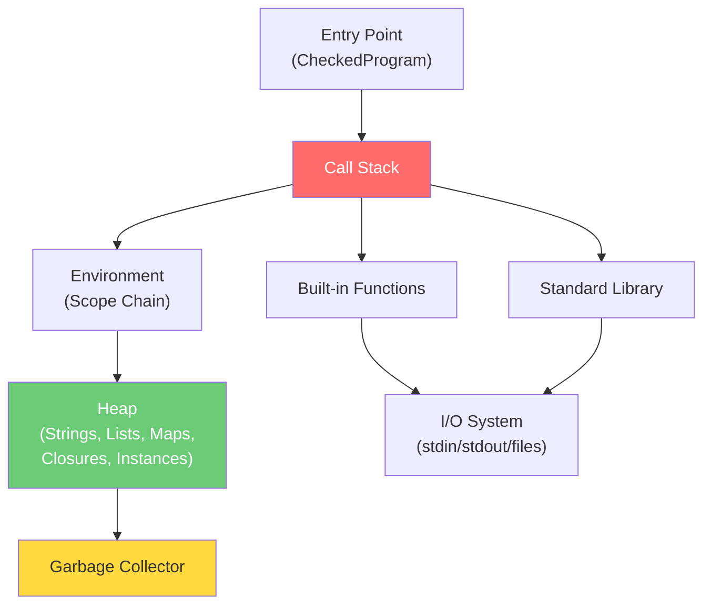

# 09 — TechScript 2.0 Runtime Design

> **Status**: Authoritative Specification
> **Version**: 2.0.0
> **Last Updated**: 2026-07-15
> **Related Documents**: [05 AST Design](./05_ast_design.md) · [11 Interpreter Design](./11_interpreter_design.md) · [12 Stdlib](./12_stdlib_design.md)

---

## 1. Runtime Architecture



---

## 2. Value Representation

```rust
/// Every value in TechScript 2.0 at runtime.
#[derive(Debug, Clone)]
pub enum Value {
    Int(i64),
    Float(f64),
    Str(String),
    Bool(bool),
    None,
    List(Vec<Value>),
    Map(IndexMap<String, Value>),
    Function(Function),
    NativeFunction(NativeFunction),
    Object(Object),
    Range(RangeValue),
}
```

---

## 3. Scope and Call Frame Design

### 3.1 Call Frame

```rust
pub struct CallFrame {
    pub function_name: String,
    pub return_span: Span,
    pub environment: Environment,
}
```

### 3.2 Environment Scopes

```rust
#[derive(Debug, Clone)]
pub struct Environment {
    scopes: Vec<Scope>,
}

#[derive(Debug, Clone)]
pub struct Scope {
    variables: HashMap<String, Value>,
    constants: HashSet<String>,
}
```

---

## 4. Module Loading System

Imports evaluate `.txs` files, reading and compiling them into runtime exported value maps, stored in the module cache.

---

## 5. Startup & Shutdown Sequences

### 5.1 Startup Sequence
1. CLI parses command arguments (e.g., `tech run file.txs`).
2. Source file is read as a UTF-8 string.
3. Lexer compiles source into `Vec<Token>`.
4. Parser constructs AST representation.
5. Semantic Analyzer checks scopes, hoisting functions and models, and outputs diagnostics.
6. If no errors, the global Environment is instantiated.
7. Standard built-ins and core modules are registered.
8. Interpreter begins statement-by-statement execution.

### 5.2 Shutdown Sequence
1. Exit code is captured.
2. Unwritten stdout/stderr streams are flushed.
3. Heap values are dropped (Rust handles resource reclamation).
4. Binary exits returning code to OS.

---

## 6. Compatibility & Evolution Analysis

### 6.1 Compatibility Notes
- **Dynamic Semantics**: The Rust runtime preserves Version 1 dynamic typing rules, float promotion, list append/slice behavior, and map iteration orders.
- **Method Invocation**: Methods are invoked uniformly, whether declared with `build` or `fun`. The runtime does not differentiate between the two keyword bindings.

### 6.2 Migration Notes
- Module imports resolve `.txs` source paths. Legacy `.tech` imports will result in module loading errors (`E0340`).
- Ensure all relative modules are renamed to use the `.txs` extension:
  ```
  // Version 1 (math.tech)
  import math
  
  // Version 2.0 (math.txs)
  import math
  ```

### 6.3 Rationale
- **Preserving Insertion Order in Maps**: Version 1 used Python dictionaries which preserve insertion order. To maintain compatibility, the Rust runtime uses `indexmap::IndexMap` instead of standard `std::collections::HashMap` for map values, guaranteeing matching iteration and conversion outcomes.
- **Automatic Resource cleanup**: Leveraging Rust's RAII (Resource Acquisition Is Initialization) for scoping environments avoids implementing manual reference counting or complex trace sweeps for interpreter values in v2.0.

### 6.4 Future Roadmap
- **v2.1**: A VM bytecode call stack will replace the recursive call frame array, storing stack frames sequentially inside a pre-allocated vector to improve cache locality.
- **v2.1 Tracing GC**: A mark-and-sweep garbage collector will manage values on the heap, resolving circular reference leaks.
