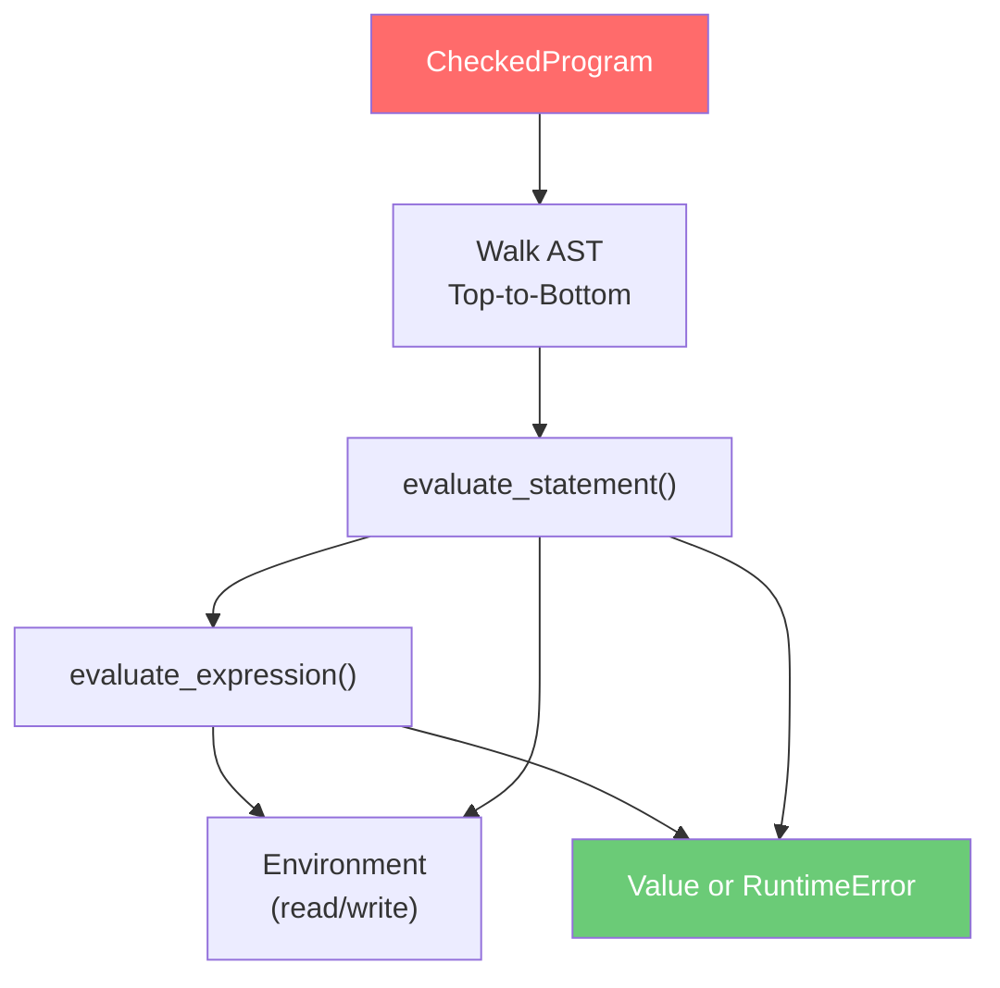

# 11 — TechScript 2.0 Interpreter Design

> **Status**: Authoritative Specification
> **Version**: 2.0.0
> **Last Updated**: 2026-07-15
> **Related Documents**: [05 AST Design](./05_ast_design.md) · [09 Runtime Design](./09_runtime_design.md) · [10 Semantic Analysis](./10_semantic_analysis.md) · [14 Error Codes](./14_error_codes.md)

---

## 1. Execution Model

The interpreter evaluates AST nodes sequentially, using the `CheckedProgram` and `SymbolTable` to resolve scopes.



---

## 2. Expression Evaluation

Expressions are evaluated by type. Sub-expressions (arithmetic, comparison, logic) map to Rust operations on `Value` variants. Logical operators support short-circuiting.

---

## 3. Statement Execution

Statements alter the environment state. Mutable declarations update the innermost environment scope. Jump instructions (`break`, `continue`, `return`) return control signals.

---

## 4. Function & Method Dispatch

Functions evaluate into `Value::Function` closures. When a method is accessed on an instance, the interpreter retrieves the `MethodDecl` AST node and invokes it inside a local scope with `self` bound to the object:

```
execute_method(obj, method_name, args):
    method = obj.methods.get(method_name)
    // Invokes the method body regardless of whether it was defined
    // using 'build' or 'fun' keyword in the source code.
    eval_function_body(method, args, bound_self = obj)
```

---

## 5. Compatibility & Evolution Analysis

### 5.1 Compatibility Notes
- **Unified Dispatch**: The interpreter evaluates both `build` and `fun` method declarations identically. Both compile to standard method bindings at runtime.
- **Dynamic Scoping**: Environment lookup chains match Version 1 scoping rules, preventing binding capture regressions.

### 5.2 Migration Notes
- All modules imported during execution are resolved using `.txs` file extensions.
- If a script relies on importing legacy `.tech` files, rename the files before execution.
- Auto-fixing linter tasks bypass the interpreter, transforming source code files directly.

### 5.3 Rationale
- **Uniform Evaluation**: Handling `build` and `fun` identically in the execution path avoids duplicating frame-pushing logic and simplifies debugging.
- **Zero-allocation Signals**: Using Rust's `Result<T, Signal>` enum for control flow signals (`Break`, `Continue`, `Return`) avoids allocation overhead during loop execution.

### 5.4 Future Roadmap
- **v2.1**: The AST interpreter will be replaced by a flat bytecode execution loop (`techscript_vm`), running VM instructions sequentially.
- **v3.0**: Functions and methods will compile directly to LLVM instructions, removing interpreter frame push overhead.
