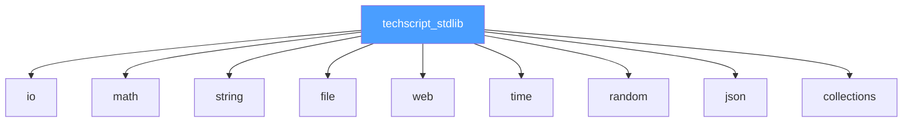

# 12 — TechScript 2.0 Standard Library Specification

> **Status**: Authoritative Specification
> **Version**: 2.0.0
> **Last Updated**: 2026-07-15
> **Related Documents**: [01 Language Spec](./01_language_spec_v1.md) · [09 Runtime Design](./09_runtime_design.md) · [13 CLI Spec](./13_cli_spec.md)

---

## Module System Diagram



---

## 1. Module Specification

### 1.1 `io`
`io.print(val)`, `io.println(val)` (alias: `say`), `io.eprint(val)`, `io.eprintln(val)`, `io.read_line()` (alias: `ask`).

### 1.2 `math`
Constants: `PI`, `E`, `TAU`, `INF`, `NAN`.
Functions: `abs(x)`, `sqrt(x)`, `pow(b, e)`, `sin(x)`, `cos(x)`, `tan(x)`, `floor(x)`, `ceil(x)`, `round(x)`, `min(a, b)`, `max(a, b)`, `clamp(x, min, max)`.

### 1.3 `string`
`upper(s)`, `lower(s)`, `trim(s)`, `split(s, sep)`, `join(list, sep)`, `replace(s, from, to)`, `contains(s, sub)`, `starts_with(s, prefix)`, `ends_with(s, suffix)`, `chars(s)`.

### 1.4 `file`
`read(path)`, `write(path, content)`, `append(path, content)`, `exists(path)`, `delete(path)`, `list_dir(path)`, `size(path)`. All paths target `.txs` files or local project items.

### 1.5 `web` (Optional v2.0)
Page builder API for HTML output.
`web.page()`, `page.title(t)`, `page.h1(t)`, `page.p(t)`, `page.style(css)`, `page.script(js)`, `page.html()`, `page.save(path)`, `page.run()`.

### 1.6 `time`
`now()`, `now_ms()`, `sleep(secs)`, `format(timestamp, fmt)`, `clock()`.

### 1.7 `random`
`random()`, `random_int(min, max)`, `random_choice(list)`, `shuffle(list)`, `seed(n)`.

### 1.8 `json`
`parse(text)`, `stringify(value)`.

### 1.9 `collections`
`sort(list)`, `reverse(list)`, `filter(list, fn)`, `map(list, fn)`, `reduce(list, fn, init)`, `zip(a, b)`, `enumerate(list)`.

---

## 2. Standard Library Examples

Standard library helper methods can be accessed directly on variables:
```
make words = "hello world".split(" ")
make doubles = [1, 2, 3].map(build(x) { return x * 2 })
```

---

## 3. Compatibility & Evolution Analysis

### 3.1 Compatibility Notes
- **API Parity**: Standard library functions match the behavior and arguments of Version 1 APIs.
- **Unified keyword integration**: Standard library methods that accept callback functions (e.g., `collections.map`) are fully compatible with closures defined using both the unified `build` and deprecated `fun` keywords.

### 3.2 Migration Notes
- Standard library file APIs (`file.read`, `file.write`) accept and process paths referencing `.txs` files.
- Example program using `collections`:
  ```
  // Version 2.0 standard library call
  from collections import filter
  make odds = filter([1, 2, 3], build(x) { return x % 2 != 0 })
  ```

### 3.3 Rationale
- **Decoupled stdlib**: The standard library is implemented as a Rust crate (`techscript_stdlib`) separate from the interpreter core. This makes it easy to add new modules without modifying the execution core.
- **Map insertion preservation**: The JSON module maps serialized objects directly to `indexmap::IndexMap`, matching the behavior of Python dictionaries in Version 1.

### 3.4 Future Roadmap
- **v2.1**: Optimize collections implementation using VM bytecode operations to avoid closure scope cloning.
- **v2.2**: Add type signatures to all standard library modules to support static analysis.
