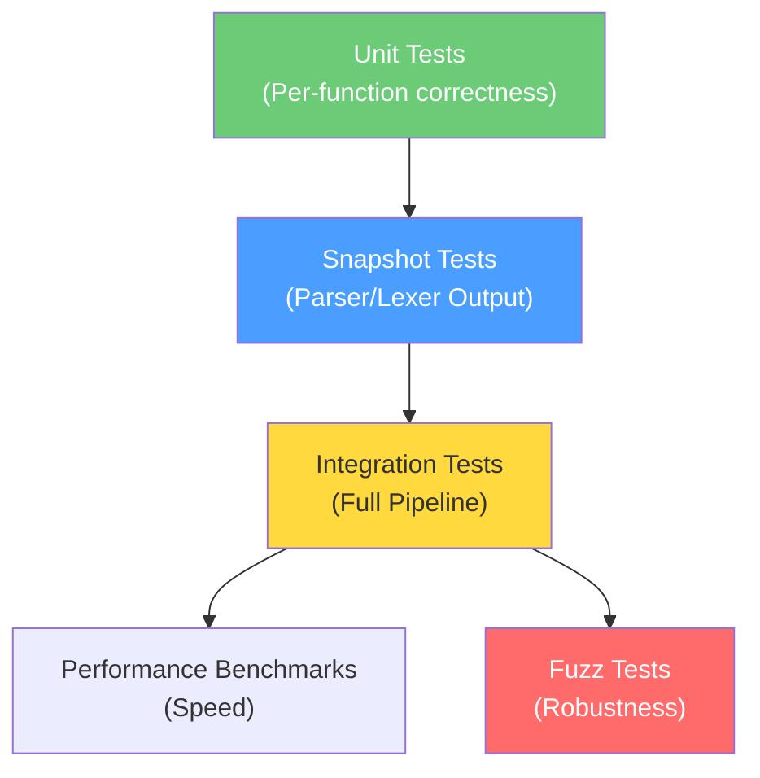

# 15 — TechScript 2.0 Testing Strategy

> **Status**: Authoritative Specification
> **Version**: 2.0.0
> **Last Updated**: 2026-07-15
> **Related Documents**: [16 Coding Standards](./16_coding_standards.md) · [08 Milestones](./08_milestones.md) · [02 Folder Structure](./02_folder_structure.md)

---

## 1. Testing Pyramid



---

## 2. Testing Levels

### 2.1 Unit Tests
Co-located with source code using Rust's `#[cfg(test)]` block. Verifies specific utility functions.

### 2.2 Snapshot Tests
Uses the `insta` crate to record and compare AST outputs. Snapshot inputs reside in `tests/parser/*.txs` and `tests/lexer/*.txs`.

### 2.3 Integration Tests (End-to-End)
Runs full `.txs` files through the compiler frontend and execution engine, validating standard out and error assertions.

Example test case (`tests/interpreter/hello_world.txs`):
```
// test: hello_world
// expect_stdout: Hello, World!
say "Hello, World!"
```

---

## 3. Fuzz Testing & Benchmarking

- **Fuzzing**: Uses `cargo-fuzz` targeting parsing and execution bounds. Runs for 1 hour on each PR and 24 hours weekly on CI.
- **Benchmarks**: Uses `criterion` to prevent performance regressions. Benchmark targets include recursive calculations (`fibonacci.txs`), collection manipulations, and method dispatches.

---

## 4. Compatibility & Evolution Analysis

### 4.1 Compatibility Notes
- **Regression suite**: A dedicated folder (`tests/v1_compat/`) contains original TechScript v1 source code scripts (renamed to `.txs` files). The v2.0 interpreter must execute these scripts with matching outputs.
- **Diagnostics check**: Snapshot tests verify that warning code `W0015` is emitted when parsing methods declared using the `fun` keyword.

### 4.2 Migration Notes
- When porting v1 tests, rename files to end with `.txs`.
- Automate tests execution using cargo commands:
  ```bash
  cargo test --all
  ```
- All test assert errors match the v2.0 code specifications.

### 4.3 Rationale
- **Renaming to `.txs`**: Validating all snapshot and integration test scripts under the `.txs` extension ensures consistent path mapping in linter, formatter, and editor test suites.
- **Rust Integration tests**: Running the full pipeline in integration tests catches name-resolution or scope-binding bugs that unit tests miss.

### 4.4 Future Roadmap
- **v2.1**: VM execution tests will compile `.txs` test files to bytecode and assert matching VM outputs.
- **v3.0**: Native target tests will build executable binaries and run them locally to verify exit codes and side-effects.
