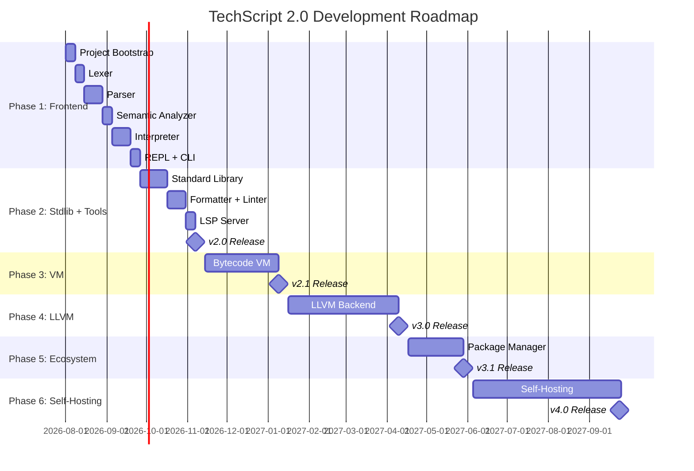

# 17 — TechScript 2.0 Development Roadmap

> **Status**: Authoritative Specification
> **Version**: 2.0.0
> **Last Updated**: 2026-07-15
> **Related Documents**: [08 Milestones](./08_milestones.md) · [00 Master Architecture](./00_master_architecture.md)

---

## Phase 1 — Compiler Frontend (Weeks 1–8)

### Week 1: Project Bootstrap
- Cargo workspace layout in Rust.
- Set up CI pipeline.
- Implement `techscript_errors` diagnostic and span mapping.
- Implement `techscript_ast` structures matching v2.0 design.

### Week 2: Lexer
- Implement `TokenKind` (including deprecated `Fun`).
- Hex/bin/octal literal parsing with underscores.
- F-string mode stack.
- Unicode support and file extension checks.

### Week 3: Parser (Statements)
- Parse variable declarations (`make`, `const`), loops (`each`, `repeat`, `while`), and block statements.
- Parse `attempt`/`catch`/`throw` and module imports.

### Week 4: Parser (Expressions + Functions + Models)
- Pratt parser for expressions.
- Parse `build` function declarations and lambdas.
- Parse `model` declarations containing `build` and deprecated `fun` methods.
- Snapshot tests for grammar structures using `.txs` test files.

### Week 5: Semantic Analyzer
- Lexical Scope Frame stack.
- Hoist declarations in Pass 1.
- Scope checks, duplicate declarations, const assignments, and method keyword validation (`W0015` warnings).

### Week 6: Interpreter (Core)
- Implement `Value` variants and `Environment` variable lookup.
- Expression and statement execution.
- Truthiness, float promotion, and list/map slice/indexing.

### Week 7: Interpreter (Functions + Models + Errors)
- Function call frames, closures, and recursion.
- Instantiation and method invocation.
- `attempt`/`catch`/`throw` exception signals.
- Standard collection methods.

### Week 8: REPL + CLI + Polish
- CLI subcommands (`run`, `repl`, `check`, `fmt`, `lint`, `test`, `new`, `version`, `help`).
- Auto-fixing of deprecated keywords.
- **Release**: `v2.0` interpreter release.

---

## Phase 2 — Standard Library + Tools (Weeks 9–14)
- Weeks 9–10: Implement `math`, `string`, `file` (targeting `.txs` extensions), `time`, `random`, `json`, and `collections` modules.
- Week 11: Implement `web` page-builder standard library module.
- Week 12: Implement `tech fmt` and `tech lint` auto-fix integration.
- Week 13: Implement LSP (Language Server Protocol) with diagnostics, autocomplete, hover details, and go-to-definition.
- Week 14: Hardening, cross-platform validation, and final **v2.0 production release**.

---

## Phase 3 — Bytecode VM (Weeks 15–22)
- Week 15: Design stack bytecode instructions.
- Weeks 16–17: Implement AST-to-bytecode compilation and execution VM.
- Week 18: VM stack frames and value allocations.
- Week 19: Tracing garbage collector implementation.
- Weeks 20–21: Closures, models, and optimization.
- Week 22: **v2.1 release** (Bytecode VM).

---

## Phase 4 — LLVM Backend (Weeks 23–34)
- Weeks 23–24: LLVM bindings using `inkwell`.
- Weeks 25–28: Emit LLVM IR for variables, control flow, functions, and closures.
- Weeks 29–30: GC integration.
- Weeks 31–33: Compiler optimizations (O0, O1, O2).
- Week 34: **v3.0 release** (Native compiler).

---

## Phase 5 — Ecosystem (Weeks 35–40)
- Package manager implementation (`tech install`, `tech publish`).
- **v3.1 release** (Ecosystem package manager).

---

## Phase 6 — Self-Hosting (Weeks 41–56)
- Port frontend (lexer, parser, sema) and VM compiler to TechScript.
- Bootstrapping and validation.
- **v4.0 release** (Self-hosted compiler).

---

## Timeline Summary



---

## Compatibility & Evolution Analysis

### Compatibility Notes
- **Milestone dependencies**: The roadmap prioritizes 100% v1 syntax compatibility inside Phase 1 (weeks 1–8) and Phase 2 (weeks 9–14), validating code logic using v1 test suites before proceeding to VM bytecode compilation.
- Legacy `.tech` imports fail in Week 5 (Semantic Analyzer).

### Migration Notes
- Renaming scripts to `.txs` is required before Week 8 (CLI run commands) or Week 12 (automated format tests).
- Automated formatter tests verify output parity:
  ```bash
  tech fmt tests/ --check
  ```

### Rationale
- **Decoupled execution phases**: Scheduling standard library implementation and formatter/linter tasks after interpreter correctness is verified prevents double-work when refining syntax rules.

### Future Roadmap
- **v2.1**: Week 15 starts bytecode compilation research.
- **v3.0**: Week 23 starts LLVM native IR generation.
