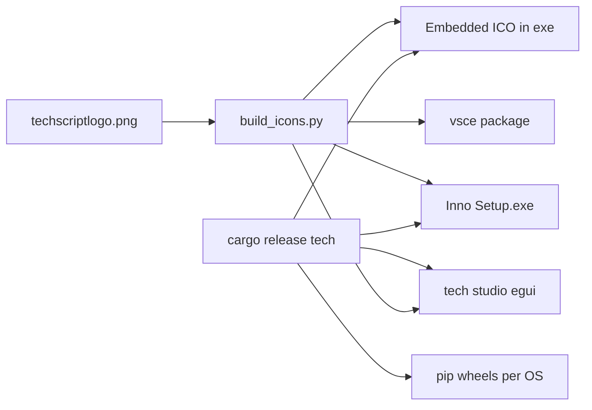

# TechScript v1.0.6 Production Release

## Current state

| Asset | Status |
|-------|--------|
| Rust `tech` binary | Works via [`run.bat`](run.bat) / `cargo build --release` in [`runtime/`](runtime/) |
| CLI subcommands | [`runtime/src/main.rs`](runtime/src/main.rs) — `run`, `build`, `check`, `eval`, `repl`, `new`, `doctor`, `test`, `debug`, `pkg`, `update` |
| VS Code extension | Grammar + snippets only in [`vscode-extension/package.json`](vscode-extension/package.json); **no** Run commands, **no** `iconTheme` wired, icons may be stale |
| Icons | [`scripts/build_icons.py`](scripts/build_icons.py) + [`assets/icons/`](assets/icons/); source logo at [`techscriptlogo.png`](techscriptlogo.png) (not yet the canonical pipeline input) |
| PyPI | [`pyproject.toml`](pyproject.toml) still routes `tech` → **Python** [`src/techscript/cli.py`](src/techscript/cli.py) |
| Installer | Stale PyInstaller specs under `installer_build/` (partially deleted in git); **needs fresh Inno Setup** |
| CI | [`/.github/workflows/ci.yml`](.github/workflows/ci.yml) — test/clippy/smoke only; no release artifacts |

**Build warnings to clear** (user-reported): [`bytecode.rs:60`](runtime/src/bytecode.rs), [`web.rs:110`](runtime/src/modules/web.rs), [`compiler.rs:40`](runtime/src/compiler.rs), [`vm.rs:28`](runtime/src/vm.rs), [`gui.rs:19`](runtime/src/modules/gui.rs).

**REPL polish**: `say "hi"` prints `hi` then `none` — likely trailing `None` from compile epilogue (`emit None` + `Return`) combined with initial stack seed in [`vm.rs:51`](runtime/src/vm.rs); fix by REPL-specific compile (no trailing value) or suppress non-user output after `run_line` in [`repl.rs`](runtime/src/repl.rs). Optional sugar: bare lines like `hi` → treat as `say hi` only when valid expression.

---

## Architecture (release pipeline)



---

## Phase A — Production hygiene (day 1)

1. **Fix all 5 `cargo` warnings** with minimal edits (`_route_path`, remove unused `mut`, `#[allow(dead_code)]` only where fields are reserved for v1.0.7 upvalues).
2. **REPL**: compile REPL snippets without emitting trailing `None`/`Return` print path; optionally map single-token input to `say` when it parses as expression.
3. **CI gate**: add `cargo build --release` + `RUSTFLAGS="-Dwarnings"` (or fix all warnings) to [`.github/workflows/ci.yml`](.github/workflows/ci.yml).

---

## Phase B — Logo / icon pipeline (single source of truth)

Use [`techscriptlogo.png`](techscriptlogo.png) as the **only** source:

```powershell
python scripts/build_icons.py --source techscriptlogo.png
```

Update [`scripts/build_icons.py`](scripts/build_icons.py) default `--source` to repo-root `techscriptlogo.png`.

**Outputs** (regenerate every release):

| Destination | Files |
|-------------|--------|
| [`assets/icons/`](assets/icons/) | `icon-16..512.png`, `icon.ico`, `icon.icns` |
| [`assets/`](assets/) | `logo.png` (512) for README — fix broken `assets/logo.png` reference in [`README.md`](README.md) |
| [`vscode-extension/icons/`](vscode-extension/icons/) | `techscript-logo.png`, `techscript-file.png`, folder defaults |
| Installer / Studio | `installer/assets/wizard.bmp` (scaled banner), window icon |

Add [`scripts/refresh_icons.ps1`](scripts/refresh_icons.ps1) (or extend [`scripts/refresh_icons.bat`](scripts/refresh_icons.bat)) as the one command devs run before release.

---

## Phase C — Branded `tech.exe`

1. Add [`runtime/build.rs`](runtime/build.rs) with [`winres`](https://crates.io/crates/winres) (Windows only) pointing at `../assets/icons/icon.ico`.
2. Embed **version info** (1.0.6, product name TechScript) so Explorer shows proper Properties.
3. Confirm output path used by [`run.bat`](run.bat): `target/x86_64-pc-windows-msvc/release/tech.exe`.

---

## Phase D — Master CLI expansion

Extend [`runtime/src/main.rs`](runtime/src/main.rs) and shared helpers in [`runtime/src/run.rs`](runtime/src/run.rs):

| Behavior | Detail |
|----------|--------|
| `tech` (no args) | Start REPL (Python-like) |
| `tech FILE.txs` | Already implicit run — keep |
| Global flags | `--verbose`, `--no-color`; `doctor --json` |
| New subcommands | `studio` (editor), `install` (PATH + file-type hints), `icons` (invoke icon script path) |
| Aliases | `compile` → `build`; document in `tech --help` grouped sections |
| Branding | REPL banner uses logo path or ASCII; `version` prints build target triple |

Mirror critical flags in Python shim only where needed for parity (`--version`, delegate to binary).

---

## Phase E — VS Code extension (phase 1 of editor)

Update [`vscode-extension/package.json`](vscode-extension/package.json):

1. **Icons** — refresh from pipeline; wire `contributes.iconThemes` → [`icons/techscript-icon-theme.json`](vscode-extension/icons/techscript-icon-theme.json) (file exists but is **not** contributed today).
2. **Commands** — `techscript.run`, `techscript.build`, `techscript.repl`, `techscript.check` calling `tech` via configurable `techscript.techPath` setting (default: `tech` on PATH).
3. **Tasks / launch** — contribute [`tasks.json`](vscode-extension/.vscode/tasks.json) snippets or `configurationDefaults` for Run/Debug.
4. **Language config** — comment toggles, brackets (already in `language-configuration.json`).
5. **Build artifact** — `scripts/package_vsix.ps1` → `vsce package` → `dist/techscript-1.0.6.vsix`.

Optional v1.0.7 (not blocking release): LSP via `tech lsp` subprocess; v1.0.6 uses `tech check` on save via task.

---

## Phase F — TechScript Studio (`tech studio`)

New module [`runtime/src/studio.rs`](runtime/src/studio.rs) using existing **eframe/egui** (already in [`runtime/Cargo.toml`](runtime/Cargo.toml) for GUI module):

- Split UI: **editor** (multiline `TextEdit`) + **output** (read-only log).
- Toolbar: Run, Clear, Open, Save (`.txs`).
- Run path: compile + `VM::run` same as CLI; capture `say`/Print to output pane instead of only stdout where practical.
- Window icon from `assets/icons/icon.ico` / embedded PNG.
- Entry: `tech studio` and optional `tech studio path/to/file.txs`.

This delivers the **IDLE-like** “custom editor + compiler” without a separate Electron app.

---

## Phase G — Windows `TechScript-Setup.exe`

Replace PyInstaller flow with **Inno Setup**:

- New [`installer/techscript.iss`](installer/techscript.iss) + [`scripts/build_installer.ps1`](scripts/build_installer.ps1).
- Installs: `tech.exe`, `examples/`, `assets/icons/`, license, optional “Add to PATH”.
- Registry: integrate logic from [`scripts/register_filetype.ps1`](scripts/register_filetype.ps1) (`.txs` icon + `tech run "%1"`).
- Wizard: `WizardImageFile` / `WizardSmallImageFile` from scaled `techscriptlogo.png`.
- Output: `dist/TechScript-Setup-1.0.6.exe`.

Prerequisite documented: Inno Setup 6 on maintainer machine; CI can build if `ISCC.exe` available.

---

## Phase H — pip package with bundled native binary

**Goal**: `pip install techscript` → `tech` on PATH runs **Rust** binary (no Python required for end users).

### Layout

```
src/techscript/
  __init__.py          # version 1.0.6
  cli.py               # thin launcher → bundled binary or PATH
  _runtime.py          # resolve platform binary path
  bin/
    windows-x86_64/tech.exe
    linux-x86_64/tech
    macos-x86_64/tech   # as CI matrix allows
```

### Build

- New [`scripts/build_wheels.ps1`](scripts/build_wheels.ps1) / [`scripts/build_wheels.sh`](scripts/build_wheels.sh):
  1. `cargo build --release` per target
  2. Copy binary into `src/techscript/bin/<platform>/`
  3. `python -m build` → wheels in `dist/`
- [`pyproject.toml`](pyproject.toml): use `package-data` / `MANIFEST.in` to include `bin/**`; entry point `tech = techscript.cli:main`.
- [`src/techscript/cli.py`](src/techscript/cli.py): `subprocess.run([resolved_tech] + argv)`; env `TECHSCRIPT_RUNTIME=system` to prefer PATH override; `--python-legacy` flag runs old interpreter for parity only.

### CI

Extend workflow with matrix jobs (Windows required first; Linux/macOS when cross-compile/toolchain ready):

- Build binary → wheel → upload artifact
- `twine check` on wheel (publish step manual or on tag)

---

## Phase I — Release orchestration & docs

| Script | Purpose |
|--------|---------|
| [`scripts/release.ps1`](scripts/release.ps1) | icons → cargo release → vsix → installer → wheels |
| Update [`docs/V1.0.6_STATUS.md`](docs/V1.0.6_STATUS.md) Phase 11/13 checkboxes |
| README section: Install via Setup.exe, pip, VS Code, Studio |

**Git tag** `v1.0.6` after local verification:

```powershell
.\run.bat smoke
.\scripts\setup.ps1
.\scripts\release.ps1   # after implemented
```

---

## Verification checklist

- [ ] `cargo build --release` — zero warnings
- [ ] `tech.exe` shows dragon icon in Explorer
- [ ] `pip install dist/*.whl` → `tech run examples\hello.txs`
- [ ] `TechScript-Setup.exe` installs, PATH works, double-click `.txs`
- [ ] VS Code: `.txs` file icon + Run command
- [ ] `tech studio` opens editor, Run prints to output pane
- [ ] REPL: `say "hi"` → single line `hi`

---

## Out of scope (v1.0.7)

- Full LSP / go-to-definition
- String interner, NaN boxing GC
- Marketplace publish (needs your PAT — document in [`vscode-extension/PUBLISHING_GUIDE.md`](vscode-extension/PUBLISHING_GUIDE.md))
- macOS `.pkg` / Linux `.deb` (can follow same Inno/apt pattern later)
